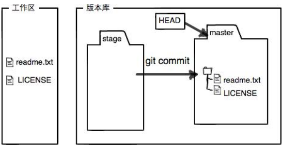

# 介绍

GitHub 是：

1. 为开发者提供Git 仓库的托管服务
2. 分享代码


## GitHub 与Git 的区别：

Git: 开发者将源代码存入名叫"Git仓库" 的资料库中并加以使用

GitHub: 在网络上提供Git 仓库的


GitHub上公开的软件源代码全都由Git 进行管理


# Git

分散型***版本管理***系统

- 记录软件添加或更改源代码的过程
- 回滚到特定阶段

不通过GitHub， 也可以直接向另一个开发者的仓库进行push 和pull


与其他版本管理系统相比，git 跟踪并管理的是修改，而不是文件


## 安装

msysGit


git for windows


git config --global user.name ""

git config --global user.mail ""

git config --global color.ui auto 


## 配置


%homedrive%指操作系统所在盘
%homepath%指\Documents and Settings(user)，这里的user指你的系统用户名


https://www.cnblogs.com/97z4moon/p/14491588.html


不确定是否可用：

https://blog.csdn.net/hakula007/article/details/106665980


# GitHub 用户设置

查看自己的ID

​	使用接口： 后加自己的用户名

https://api.github.com/users/Jones-match


## 配置SSH Key

```
ssh-keygen -t rsa -C "email"
```

```
enter passphrase: ****
```

passphrase 是之后连接GitHub的密码


生成后的密钥放在 ~/.ssh 中

其中id_rsa 是私钥，id_rsa.pub是公钥


## 将公钥设置在自己账户中


然后将id_rsa.pub 中的公钥复制过来即可

在bash 中可以输入命令查看公钥：

```
cat ~/.ssh/id_rsa.pub
```


## 检查是否可以连接到GitHub

```
ssh -T git@github.com
```

### 报错1

ssh: connect to host github.com port 22: Connection timed out

#### 解决方法

```
cd ~/.ssh
vim config
```

在config 中修改信息

```
Host github.com
User git
Hostname ssh.github.com
Port 443
```

:wq 保存后即可

### 报错2

The authenticity of host 'github.com (20.205.243.166)' can't be established.
...
Are you sure you want to continue connecting (yes/no/[fingerprint])? yes
Warning: Permanently added 'github.com' (ED25519) to the list of known hosts.
git@github.com: Permission denied (publickey).


#### 解决方法

在.ssh 目录中还没有config 文件


### 连接成功信息

```
Hi Jones-match! You've successfully authenticated, but GitHub does not provide shell access.
```


# 创建仓库

找到一个合适的位置放置仓库

```
mkdir 自己的名字
cd 过去
```

将当前的这个目录设置成Git 可以管理的仓库

```
git init
```

生成的.git 目录是跟踪仓库的版本信息的

```
ls -ah 可以显示隐藏的文件
```


版本管理只能看到文本信息的修改，不能看到二进制文件具体的修改内容，只能看到二进制文件的文件大小变化

​	word 是一种二进制文件


# 添加文件到库中

git add 文件名（该文件必须在当前目录中）

git commit -m "修改信息说明"


可以使用add 添加多个文件，之后使用一次commit 即可提交多个文件

add 是将文件放入了一个缓冲区，还没有提交


git commit -am ""  可以省略git add 这一步，直接将工作区的修改提交上去


# 查看修改

git status 可以看到什么文件被修改了，以及修改后是否提交了

​		**检查的区域应该是工作区**


git diff  可以看到文件中具体什么内容被修改了


git log  查看修改历史记录(显示时间是从最近到最远)

git log --pretty=oneline 可以看到较为简洁的记录信息


# 回退

git reset --hard HEAD^

git reset --hard 加上commit id     取消回退

git reflog 					记录每一次命令


HEAD 指向的是当前这一个版本


# 工作区和暂存区

工作区：每个目录是一个工作区（比如：learngit)

版本库（Repository)：工作区中的隐藏目录 .git，不算工作区

- 暂存区： stage

- Git自动创建的master分支
- 指向master 的HEAD指针


git add 是将文件加入到暂存区

git commit 是将文件提交到当前分支

​	一次性将暂存区内的所有文件提交到当前分支


git status 时，

没有add 过的新文件

```
Untracked files:
  (use "git add <file>..." to include in what will be committed)
```


使用git add 之后的情况：


使用git commit 提交后，如果工作区没有其他修改，则工作区是干净的

```
$ git status
On branch master
nothing to commit, working tree clean
```




提交后，

```
git diff HEAD -- readme.txt
```

使用该命令可以查看工作区与版本库中的最新版本的区别


每次修改后，如果不使用git add 加入到暂存区，就不会提交本次的修改（如果跟踪的是文件，那么应该是直接提交最新修改后的文件，那么第二次不需要使用git add，就可以交上去，因为这个文件已经加入到暂存一次了，已经在暂存区里面了）


# 取消修改

## 还没有add（撤销的是工作区的修改）

```
git checkout -- readme.txt
```

如果readme.txt 这个文件

1. 还没有提交到暂存区中，就会回退到git版本库中一样的状态

2. 如果已经add 过，就会回到add 那个时间点

    即，回滚到最后一次commit 或 add 

## 已经add 了（撤销的是暂存区的修改）

如果add 过了，使用下面这个命令，可以把暂存区中的修改全部撤销掉，全都**放回工作区**

```
git reset HEAD <file>
```


之后使用git checkout -- readme.txt 取消工作区的修改


## commit 了

还没有把自己的本地版本库推送到远程，是可以**回退到上一个版本** 


# 删除文件

```
rm xxx.txt
```

```
git rm 
```

可以删除版本库中相应的文件，然后git commit 提交修改


```
git checkout -- xxx.txt
```

可以将删除操作取消，恢复到版本库中的最新版本（用版本库中的版本替换工作区的版本）


git checkout -- xxx 是**无法恢复**从未添加到版本库中的文件 


# 远程仓库

开始只会有一个原始仓库，之后通过克隆可以有多个相同的仓库 

在GitHub上免费托管的Git仓库，任何人都可以看到喔（但只有你自己才能改）


## 提交到远程仓库

本地仓库中运行命令，可以将本地的仓库与GitHub 上的仓库相关联

```
$ git remote add origin git@github.com:Jones-match/Learn-Blog.git
```

添加后，远程库的名字就是`origin`，这是Git默认的叫法，也可以改成别的，但是`origin`这个名字一看就知道是远程库。


提交到远程库中：

```
$ git push -u origin master
```

将当前分支master 提交到了远程库中

第一次推送master 分支时，-u 可以将本地的master 和远程的master 关联起来，以后的推送和拉取可以简化命令（之后可以使用命令git push origin main即可，不用再写SSH地址了）


之后，只要本地作了提交commit，就可以通过命令：

```
$ git push origin master
```

把本地`master`分支的最新修改推送至GitHub


### SSH警告

你第一次使用Git的`clone`或者`push`命令连接GitHub时，会得到一个警告：

```
The authenticity of host 'github.com (xx.xx.xx.xx)' can't be established.
RSA key fingerprint is xx.xx.xx.xx.xx.
Are you sure you want to continue connecting (yes/no)?
```

这是因为Git使用SSH连接，而SSH连接在第一次验证GitHub服务器的Key时，需要你确认GitHub的Key的指纹信息是否真的来自GitHub的服务器，输入`yes`回车即可。

Git会输出一个警告，告诉你已经把GitHub的Key添加到本机的一个信任列表里了：

```
Warning: Permanently added 'github.com' (RSA) to the list of known hosts.
```

这个警告只会出现一次，后面的操作就不会有任何警告了。


## 删除远程库

如果添加的时候地址写错了，或者就是想删除远程库，可以用`git remote rm <name>`命令。使用前，建议先用`git remote -v`查看远程库信息：


此处的“删除”其实是解除了本地和远程的绑定关系，并不是物理上删除了远程库。远程库本身并没有任何改动。要**真正删除远程库，需要登录到GitHub，在后台页面找到删除按钮再删除**。


## 克隆远程库

1. 克隆之前，首先要在自己本地创建一个仓库

```bash
git init
```


2. 再执行克隆命令

```bash
$ git clone git@github.com:自己的GitHub 用户名/远程库名.git
```


# 分支

创建一个独立的分支，任务完成后再加入到主分支（master)


Git 鼓励在分支上完成任务，然后将分支合并之后再删除分支

而不鼓励直接在master 进行修改


## 创建分支

每次提交，Git会将提交串成一条时间线

HEAD是指向的master, master指向提交 ===> **HEAD 指向的是当前分支**

每次提交，master 都会向前移动一步

创建分支后，增加分支指针，修改HEAD指向

切换分支后，分支指针会向前移动，而master 指针只会停在原来的地方


**创建并切换**

1. 

```
git checkout -b 新的分支名
```

-b 表示创建并切换分支

等价于：

2. 

```
git branch 新分支名
git checkout 新分支名
```

​	checkout 用于**切换分支**

等价于：

3. 

```
git switch -c 分支名
```


### 切换分支

```
# 1
git checkout 分支名

# 2
git switch 分支名
```


## 查看所有分支

```
git branch
```

当前指向的分支前会有一个*号


## 合并分支

直接将master 指针指向分支指针

如果不将分支合并到主分支，在主分支上就无法看到分支上做得修改（因为master 指针还指向原来的位置）


```
git merge 分支名
```

可以将分支名指向的分支合并到master 分支上（注意需要先切换到主分支上）

merge 命令的意思是： 将分支合并到当前所在的分支上


### 快进模式

Fast-forward： 合并速度很快

直接将master 指针指向了当前的分支


### 合并出现冲突

<<<HEAD是指主分支修改的内容，>>>>>fenzhi1 是指fenzhi1上修改的内容


## 删除分支

```
git branch -d 分支名
```


# 在一台电脑上配置多个ssh key 

> [如何在同一电脑上生成配置多个ssh key 公钥 私钥（保姆级教程）_生成多个ssh key-CSDN博客](https://blog.csdn.net/qq_55558061/article/details/124117445)

1. 生成一个ssh key

```bash
ssh-keygen -t rsa -C "注册时使用的邮箱"
```

2. 


出现下一行确定信息时，在： 后面输入自定义的rsa文件名


3. 将在本地生成的ssh key 添加到自己的仓库
4. 在.ssh 目录下有一个config 文件（如果没有config 文件就使用命令touch config 进行生成）

在config文件中添加如下的配置信息

```bash
# github
Host github.com
HostName github.com
PreferredAuthentications publickey
IdentityFile ~/.ssh/github_id_rsa
```

Host 是自定义的别名，影响git相关命令

HostName 是服务器地址或域名

PreferredAuthentications 权限验证， 一般使用publickey 

IdentityFile 设置使用的rsa文件地址


---------


# 一些报错

## CRLF

warning: in the working copy of 'readme.txt', LF will be replaced by CRLF the next time Git touches it

```
git config --global core.autocrlf true
```

按上面配置即可


## remote origin already exists

如果你clone下来一个别人的仓库，在此基础上完成你的代码，推送到自己的仓库可能遇到如下问题：
error: remote origin already exists.表示远程仓库已存在。
因此你要进行以下操作：
1、先输入git remote rm origin 删除关联的origin的远程库
2、关联自己的仓库 git remote add origin https://gitee.com/xxxxxx.git
3、最后git push origin master，这样就推送到自己的仓库了。


## **src refspec master does not match any**

<font color="red">error: failed to push some refs to </font> 'github.com:Jones-match/Learn-Blog.git'

```
$ git push -u origin master

error: src refspec master does not match any
error: failed to push some refs to 'github.com:Jones-match/Learn-Blog.git'

```


远程仓库中并没有master 这个分支

在GitHub 的setting 中，默认生成的主分支是main


**解决方法：**

使用 git branch -al 查看都有哪些分支

选一个除了master之外的分支进行上传


## git提交或克隆报错fatal: unable to access ‘https://github.com/tata20191003/autowrite.git/‘: Failed to connec

```bash
//取消http代理
git config --global --unset http.proxy
//取消https代理 
git config --global --unset https.proxy
```

