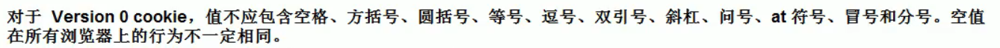

Cookie 是服务器通知**客户端保存键值对**的一种技术

客户端有了Cookie 后， 每次请求都发送给服务器

每个Cookie 的大小不能超过4kb

Cookie 只有一个构造器，必须传入一个键值对


# 创建步骤

创建cookie 对象

```java
new Cookie(key, val);
```

通知客户端保存

```java
resp.addCookie(cookie);   这一句是通知浏览器要在本地创建一个cookie， 不能少这一o

通知
resp.getWriter().write("创建成功");
```


浏览器收到Header 中有一个Set-Cookie， 就会在本地生成一个cookie（没有就创建， 有就修改）


浏览器可能会出现乱码

​	需要设置一下utf8编码


cookie 可以一次创建多个，并不一定只创建一个


# 服务器得cookie

客户端通过在请求头中的Cookie字段， 将本地的cookie 发给服务器

服务器通过request进行接收

```java
request.getCookies();
```


获取key

```java
cookie.getName();
```

获取value

```java
cookie.getValue();
```


## 查到cookie

想要一个特定key 的cookie， 只能在遍历数组的时候判断key

可以放到Utils 中当作常用工具


## 修改cookie 

方法1：创建同名cookie

方法2：找到需要修改的cookie，调用setValue()方法修改

setValue() 对于以下情况，需要使用BASE64编码后再使用




最后都需要使用response.addCookie() 来通知客户端 


# 浏览器查看cookie

Application --> cookie 


# 生命控制

```java
cookie.setMaxAge()
```

正数表示在指定**秒数**后过期

负数表示在浏览器退出后就删除（**默认是-1**）   Session 形式

0 表示马上删除	


浏览器中显示的时间是格林时间（英国时间）


# Path

cookie的Path属性可以有效过滤是否将cookie发送给服务器

通过请求的地址有效地过滤


客户端可以一次性发送多个cookie


默认是到当前工程路径

request.getContextPath() 是得到当前工程路径


谷歌浏览器只有在满足cookie 指定路径的页面中，才会显示出cookie 的信息


# 免用户名登录

第二次登录时会有用户名提示


