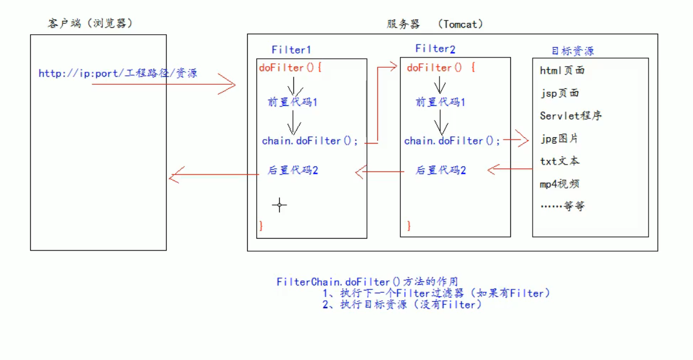

JavaWeb 的三大组件

- Servlet
- Listener
- Filter


JavaEE 的规范（接口）


作用： 拦截请求，过滤响应


拦截请求的常见的应用场景：

权限检查

日记操作

事务管理


# 权限检查

例：工程中的admin 目录下的所有资源都必须是用户登录之后才允许访问

用户登录的信息会保存在Session域中


jsp可以使用请求转发来实现登录的操作

在访问服务器的目标资源之前，先进行一步Filter，检查是否有权限

​	有权限就直接访问

​	无权限就转去登录界面

编写的Filter java 文件，需要实现Filter接口

```java
import javax.servlet.Filter;

@override
init ();
    
@Override
//专门用于权限检查
public void doFilter() {
	如果有权限，就直接用filterChain.doFilter(request, response) 继续执行访问资源的操作
        		如果没有这一行代码，即使登录上了也不会跳转到资源上访问
        		只会显示空白页面
}
    

```

web.xml 也需要一步配置 (与Servlet类似)

```xml
<filter>
	<filter-name></filter-name>  Filter 的名字
    <filter-class></filter-class>	Filter 对应的全类名
</filter>

<filter-mapping>  //配置Filter的拦截路径
	<filter-name></filter-name> 当前的Filter拦截路径给哪个Filter使用
    <url-pattern>/admin/*</url-pattern> 配置拦截路径  / 表示工程路径 映射到IDEA下的web 目录
    	* 表示目录下的全部资源
    	只要是访问admin 下的资源，就会进行Filter的检查
</filter-mapping>
```

Filter的拦截会优先于页面加载


# 生命周期

执行方法的顺序

1、构造器

2、init

3、doFilter

4、destroy


工程在启动的时候，就会执行 构造器和init 方法

​	Filter就已经创建了

每次拦截就会执行一次doFilter()


当工程结束的时候就会执行destroy 方法

​	停止web 工程的时候， 就会销毁Filter过滤器


# FilterConfig 类

Tomcat每次创建 Filter的时候，就会创建一个FilterConfig类， 里面包含Filter的配置信息


获取Filter的配置内容

1、Filter的名字 	`getFilterName()`

2、web.xml 中配置的init-param初始化参数 	`getInitParameter("")`

3、ServletContext对象		`getServletContext()`


# FilterChain 类

多个过滤器一起工作


FilterChain.doFilter()

如果有下一个过滤器，就执行下一个过滤器

如果没有其他的过滤器了，就执行目标资源



如果Filter2 的doFilter() 不写，就不会访问目标资源，直接就返回了Filter1 继续执行Filter1 的后置代码


多个过滤器的**执行顺序是依赖web.xml 中配置的filter 的顺序**


多个过滤器执行的特点：

1. 所有Filter和目标资源默认都执行在同一个线程中	`Thread.currentThread().getName();`
2. 多个Filter共同执行的时候都使用同一个Request对象，Request域是共享的


# 拦截路径

只关心请求地址是否与设置好的路径相匹配，而不关心这个资源是否存在


## 精确匹配

配置到具体的资源文件


## 目录匹配

使用* 匹配目录下的所有文件

请求地址需要与这个目录匹配(到目录路径)

​	`http://ip:port/工程路径/目录/*`


## 后缀名匹配

*.html 

匹配所有的html 文件

请求地址必须以html 结尾


可以以任意 字符串结尾，不一定是存在的文件类型（.abc)

**不能以/ 开头**


