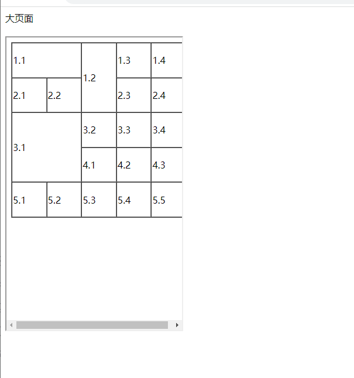
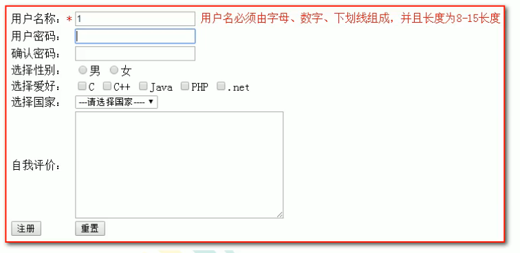

# HTML

## 简介

CSS决定页面的布局效果

B/S结构

browser(浏览器)/server(web服务器)

前端开发流程

美术实现-->前端工程师-->java程序员

网页组成部分

内容(数据) + 表现(不同的显示效果) + 行为(页面中的元素与输入设备讨人交互的响应, javascript实现)

超文本标记语言HTML

通过标签来标记要显示的网页中的各个部分

网页文件本身是一种文本文件

通过在文本文件中添加标记符, 可以告诉浏览器如何**显示**其中的内容

## 创建HTML文件

1. 创建一个web工程(静态的web工程)
2. 在工程下创建html 页面

## HTML 文件书写规范

```
<html> 表示整个html  页面的开始
	＜head> 　头信息
		＜title> 标题 </title>
	</head>

＜body> 
	页面的主体内容
＜/body>
</html> 表示整个html 页面的结束


<!-- 注释　-->  Ctrl + Shift + /
```

## 标签介绍

<标签名>	 	 </标签名>

开始标签		 结束标签
***标签的<> 里面对大小写不敏感***

标签有自己的属性:

1. 基本属性: 可以简单修改样式效果

例如:  bgcolor 是背景颜色

 `<body bgcolor="green">`

2. 事件属性:  可以直接设置事件响应后的代码

例如:

`\<body onclick="alert('23424324')">`
alert 可以接收任意参数, 参数就是警告框的信息
点击时会出现

 `\<button onclick="alert('jijij ')"> `
按扭 标签

双标签 `<p> </p>`

 单标签 `<br/> 自结束标签`

    	br 换行 
    
    	hr 水平线

标签的语法

***浏览器会自动修复一些错误***

1. 标签不能交叉嵌套
   ❌`<div><span> 内容 </div></span>`
   ✔`<div><span> 内容　</span></div>`
2. 有文本内容的标签(双标签)必须正确的关闭
   ❌`<div>内容`
   ✔`<div> 内容 </div>`
3. 无文本内容的标签(单标签)
   ❌`<br> 内容`
   ✔`<br/>`内容
4. 属性必须要有值, 属性值必须用引号引起来
5. 注释不能嵌套

## 常用的标签

### 1. font 字体, 可以修改字的字体, 颜色, 大小

```
<font color="red" face="宋体" size="7"> 字体 </font>
```

### 2. 特殊字符

```
< ===>> &lt
> ===>> &gt
html 会裁掉文档中的空白字符, 只会剩下1个
空格 ===>>      
```

### 3. 标题标签

```
h1 到 h6
<h1>1</h1>
<h2>2</h2>
```

```
对齐属性
默认是左对齐
<h3 align="right">右对齐</h3>
<h4 align="center">中间</h4>
```

### 4. 超链接

在网页中所有点击之后可以跳转的都是超链接
a 标签是超链接
target 是设置哪个目标进行跳转
	_self		当前页面(默认是这个属性)
	_blank	新的页面
    href 设置链接的地址

```
这两个是等价的
<a href="http://www.baidu.com">百度</a>
<a href="http://www.baidu.com" target="_self">百度</a>
```

打开时使用一个新标签来跳转

```
<a href="http://www.baidu.com" target="_blank">百度</a>
```

### 5. 列表标签

* 无序

- 有序
- 定义

```
<ul>
    无序的列表
<li>列表中的每一项</li>
</ul>

<ol>
    有序列表
<li>列表中的每一项</li>
</ol>
```

```
<ul type="none">可以使用type 来设置无序列表前面的样式</ul>
```

跟浏览器相关的可能会出现兼容的问题---->比如上面这个type 在IE中就不能正常显示

### 6. img标签

可以在html 页面上显示图片

```
img标签是图片标签, 用来显示图片
    height 高度
    width 宽度
    border 边框
    alt    当找不到的时候显示的字段
    src可以设置图片的路径


    web 中有绝对路径 和 相对路径
        绝对路径:  http://ip:port/工程名/资源路径
            不能用:     盘符:/目录/文件名

        相对路径:       .          当前文件所在的目录
                       ..       当前文件所在的上一级目录
                       文件名     当前文件所在目录的, 相当于./文件名


    javaSE 相对路径: 从工程名开始算
            绝对路径:  盘符:/目录/文件名
```

```

```

设置边框

```

```

### 7. 表格标签

#### 标准表格

**table** 是表格标签

   border  设置边框

    width 	表格宽度
    
    height 	表格高度
    
    align 设置表格在页面中的对齐位置
    
    cellspacing 单元格之间的间距 ---> 0 是两条线紧挨着, 不是两条边框线重合

**tr** 行标签

**th** 表头标签

**td** 单元格标签  	

    align 设置单元格内的文本对齐

b 加粗标签

```
<table border="1" width="300" height="200">
    <tr>行
<td align="center"><b>1.单元格</b></td>
        <th>1.2</th>
    </tr>
    <tr>行
<td>2.单元格</td>
    </tr>
</table>
```

th标签 等价于 td align="center" + b

#### 跨行跨列表格

占多个行(列)单元格

cospan 一个单元格占两列, 会在本列向外挤出去一个原来的单元格

rowspan 一个单元格占两行, 会把下面的单元格向右挤出去一个单元格, 所以还是会多一列

### 8. iframe 标签

**必须用双标签**

在html 页面上打开一个小窗口, 用来加载一个单独的页面



- iframe 和 a 标签组合使用的方法:
  1. 在iframe 标签中使用name 属性定义一个名字
  2. 在a标签的target 中设置iframe 的name属性值

### 9. 表单标签

表单: 就是html 页面中用来收集用户信息的集合, 然后将信息发送给服务器


form 标签:
就是**表单**

`<intput type="text" value="默认值"/>` ---> **单行文本输入行**, 敲enter 也不会换行
value 是表格内直接显示的信息

type="password" 可以设置成看不到信息的密码窗口, 其中可以使用value 设置框内的默认信息, 但不管设置或者输入什么, password 框内都只会显示密文信息, 看不到东西

type="radio" 单选框
后面加上选项文字
   ``性别:<input type="radio"/>男<input type="radio">女 ``
通过分组来控制单选  name="" 同一组内只能选一个, 如果想在一个组内设置一个默认选项, 使用 checked="checked"

    性别:`<input type="radio" name="sex"/>`男 `<input type="radio" name="sex">`女
    性别:`<input type="radio" name="sex" checked="checked"/>`男 `<input type="radio" name="sex">`女

多选(复选)
默认值可以使用checked="checked"

    兴趣爱好:`<input type="checkbox" />` 爱好1 `<input type="checkbox">` 爱好2

下拉列表
select 标签
option 是下拉列表中的选项
selected="selected" 可以设置默认选项, 如果不用selected 进行设置, 则默认显示第一个option的信息

    国籍:`<select >`
        `<option value="value值有什么用">`请选择你的国籍 `</option>`
        `<option value="" selected="selected">`中国 `</option>`
        `<option value="">`美国 `</option>`
    `</select>`

多行文本输入域
rows设置可以看到的几行, 超过该值会出现滚动条来显示
cols 显示每行有多少个字符, 超过后会到下一行显示
默认值: 不能使用value 来设置
    用标签之间的文本来当作默认值(与select标签相同)

自我评价:`<textarea rows="5" cols="20">`默认值 `</textarea>`

重置和提交
value 修改按扭上的文字

    `<input type="reset" value="想要按扭显示的信息" />`(这个不在按扭里面显示)重置按扭 `<br/>`
    `<input type="submit" />`

按扭
value 修改按扭上的文字

`<input type="button" value="说明信息">`

file
点击提交按扭可以实现上传

`<input type="file" />`

隐藏域
当要发送某些信息, 而这些信息不需要用户参与(提交的同时发送给服务器, 但用户不用看到)

`<input type="hidden" value="aujeif aw"/>
`
表单信息一般放在表格中显示, 可以使用表格来控制对齐

提交
<font color="red">action 属性设置提交的服务器地址</font>
method 设置提交的方式  GET(默认值) 或 POST

表单提交时, 数据没有发送给服务器的三种情况:

1. 表单项没有name值(所以想发送给服务器都要加上name 属性, 不然发不给服务器)
2. 单选和复选(下拉列表中的option标签, 都需要添加value 属性, 来发送给服务器) 不写的话, 只是发送on, off
3. 表单项不在提交的form 标签里面

method:

1. GET的特点:
   `http://localhost:63342/test/html/%E8%A1%A8%E5%8D%95.html?_ijt=cfblvh10hniajrh718j3qe18gk&_ij_reload=RELOAD_ON_SAVE`
   - ? 前面是form 标签中action 中的值
     - ? 后面是请求的参数
     - action 属性[? + 请求参数]
     - 请求参数的格式是: name=value&sex=male
   - 不安全
   - 有数据长度的限制(不超过100个字符)
2. POST的特点:
   - 地址中没有请求参数, 只有action 的属性值
   - 相对于GET 请求更安全
   - 理论上没有数据长度的限制

### 10. 其他标签:

1. div
默认独占一行

<div>标签</div>
<div>标签</div>  

2. span 
长度是封装数据的长度
`<span>span1</span>`
`<span>span2</span> ` 

`<span> `用于对文档中的行内元素进行组合。

`<span> `标签没有固定的格式表现。当对它应用样式时，它才会产生视觉上的变化。如果不对 `<span>` 应用样式，那么` <span> `元素中的文本与其他文本不会任何视觉上的差异。

`<span> `标签提供了一种将文本的一部分或者文档的一部分独立出来的方式。

3. p
默认会在段落的上方或下方各空出一行(如果已经有了空行, 就不空了)
`<p>段落标签</p>`

# CSS

*层叠式表单*
用于增强控制网页样式并允许样式信息与网页内容分离的一种标记性语言

语法规则

```
选择器 {
    属性 : 值;
},
```

选择器决定CSS样式影响的HTML 标签
属性就是要改的样式名

若有多个声明, 就用**分号** 分开每个声明

一般一行只会描述一个属性

注释方式: /*  */

## 应用方式

1. 在标签的style 属性上设置样式(所有的标签都有该属性)

```
<div style="border: 1px solid red">div1</div>
<span style="border: 2px solid blue">span1</span>

```

- 可读性差
- 复用差

2. 在head 中使用style 定义CSS样式

```
<head>
    <meta charset="UTF-8">
    <title>Title</title>
    <style type="text/css">
        div {
            border: 1px solid red;
        }
        span {
            border: 1px solid red;
        }
    </style>
</head>

```

**style 标签里都是css语法**

- 只能在一个页面内复用, 不能在多个页面中复用CSS代码

Ctrl + R --> 替换

3. 把CSS样式写成一个单独的CSS文件, 再通过引用link 来使用

<link rel="stylesheet" type="text/css" href="1.css"/>

- 好维护

## 选择器

### 标签名选择器

格式:
    标签名 {
        属性 : 值;
    }

可以决定哪些标签被动使用这个样式

***标签以及属性可以查手册***
color(字体颜色): red;
font-size: 30px;
solid(实线), dashed(虚线), dotted(点线)


tabel 中的width 是指的整个表格的宽度

th, td 中的width 是指的单元格的宽度

### id选择器

```
#id属性值 {
    属性 : 值
}  
```

id选择器, 可让我们**通过id 属性**选择性地去使用这个样式
*在标签中为标签定义id 属性*

```
<head>
    <meta charset="UTF-8">
    <title>Title</title>
    <style type="text/css">
        #id001{
            color:blue;
        }
    </style>

</head>
<body>
<div id="id001">div1</div>
<div>div2</div>
```

### class选择器

格式:

```
.class属性值{
    属性: 值
} 
```

可以通过class 属性可以有选择地去使用样式
在标签中设置class 属性

### 后代选择器
.样式名 后代标签1 后代标签2 ... {

}

### 组合选择器

格式:

```
选择器1, 选择器2, 选择器n {
    属性: 值;
}

```

选择器可以各种类型的选择器
可以让多个选择器共用同一个代码
只要是组合中的标签属性, 都可以用来设置样式

## 常用样式

1. 颜色 color
2. 边框 border
3. 宽度 width
4. 高度 height
5. 背景颜色 background-color
6. 字体大小 font-size
7. 居中(块在页面中的显示)
   margin-left:auto;
   margin-right:auto;
8. 文本居中 text-align:center;
9. 超链接去下划线 text-decoration: none;
10. 表格细线
    将边框合并:
    table {
    border:1px solid black;
    **border-collapse: collapse;**
    }
    td,th{
    border:1px solid black;
    }
11. 列表去除修饰
    ul{
    list-style:none;
    }
