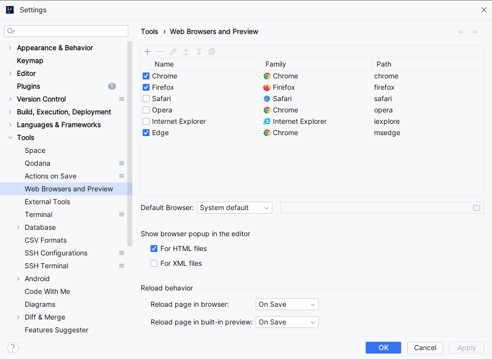
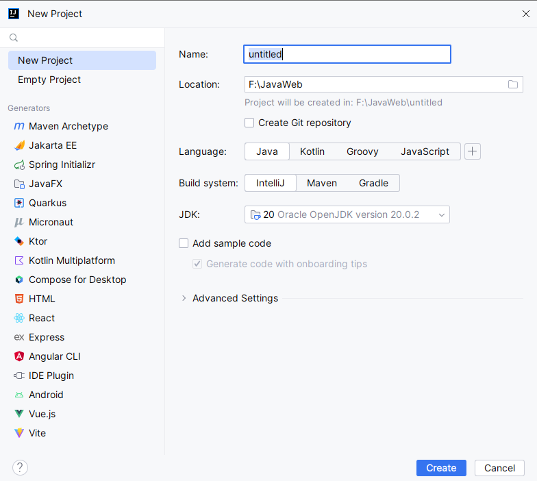
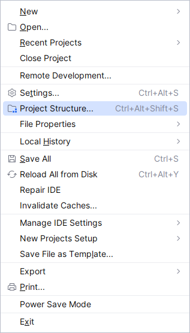
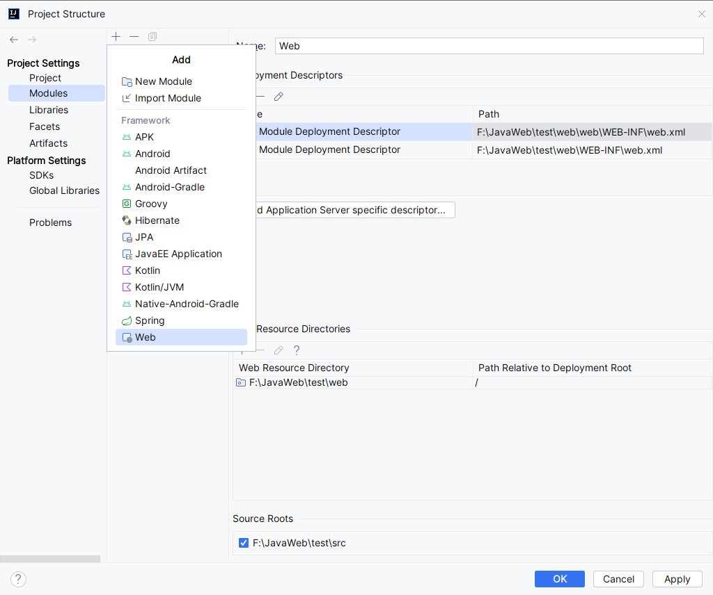
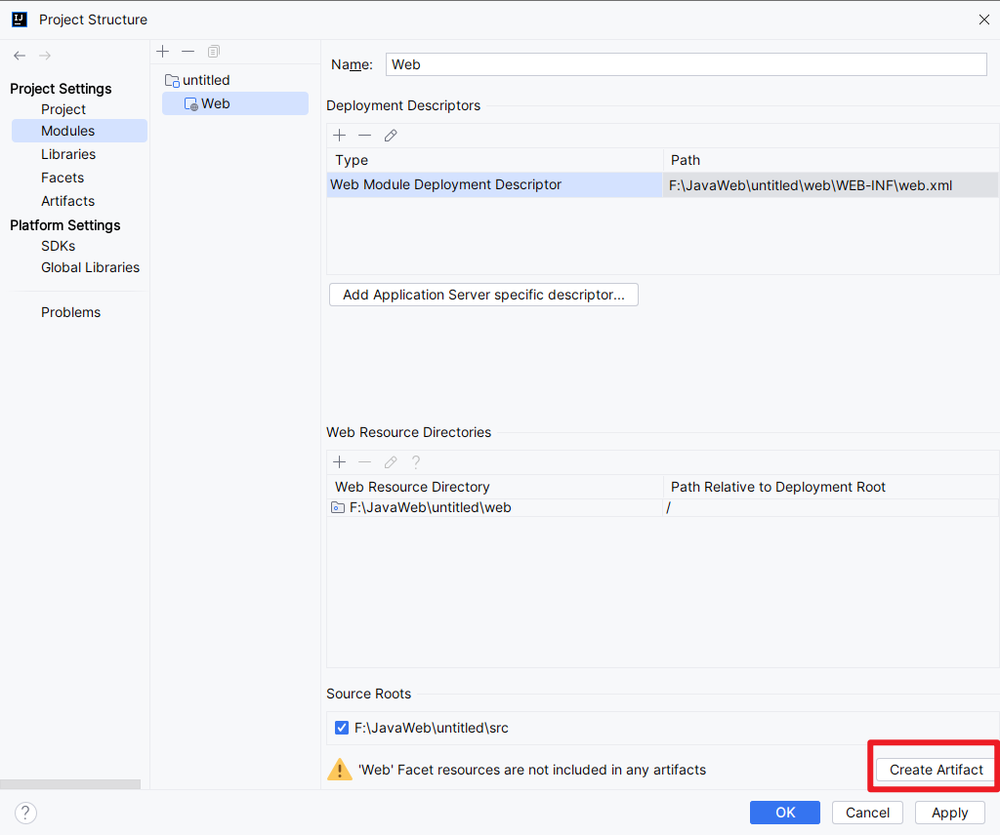
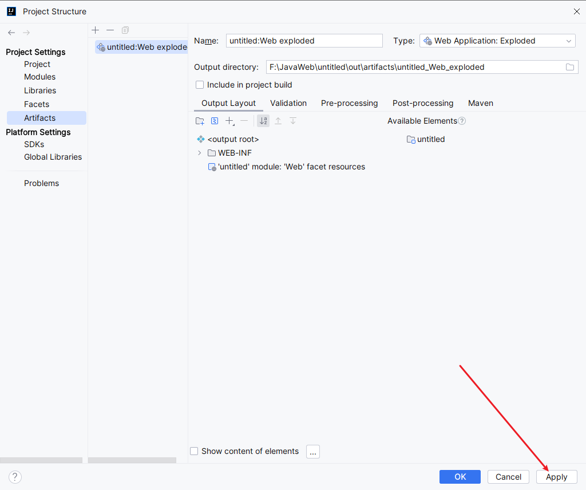
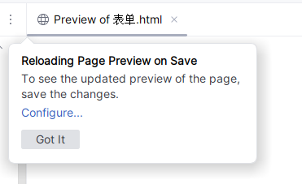
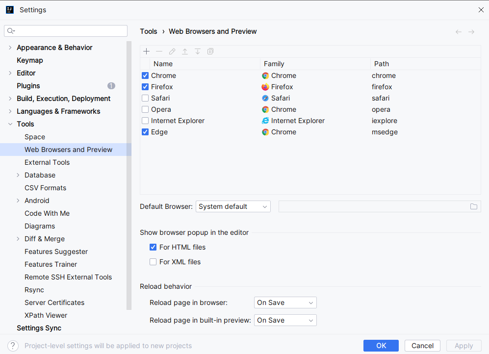
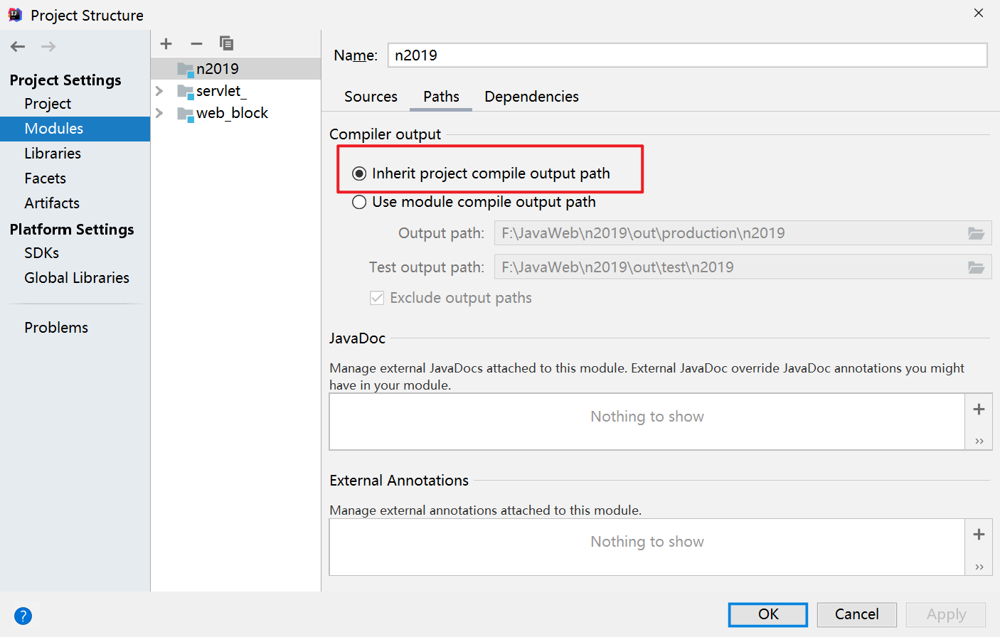
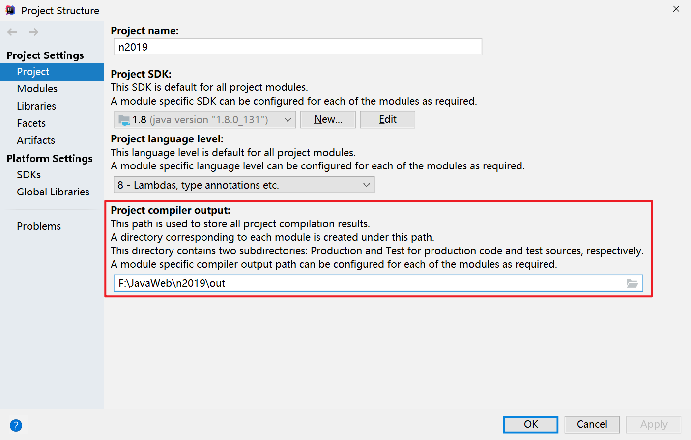

# 版本

王振国用的IDEA 是2019.3.1

# 页面的自动更新设置

# 创建新的static web 项目

# Reloading Page Preview on Save

# 快捷键

Ctrl + R : 替换  

Ctrl + Shift + R 按照不同的目录进行替换

Alt + Shift + 上(下) : 将代码上(下)移   

Ctrl+Alt+V 自动生成变量名

Ctrl + p 查看参数

# 断点

菱形断点， Java Method Breakpoints 

眼睛断点， Java Field Breakpoints 

闪电断点， Exception Breakpoints

# 其他

# Cannot start compilation: the output path

https://blog.csdn.net/qq1808814025/article/details/109543885

# Error:java: 无效的源发行版: 13

https://blog.csdn.net/Supreme7/article/details/104965778

在project structure --> project --> project language level 修改为自己使用的java 版本

