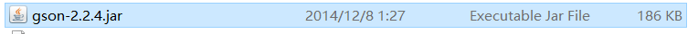
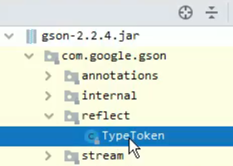

轻量级的**数据交换格式**


完全独立于语言的文本


轻量级是与xml 作比较

数据交换：客户端与服务器之间的业务数据的传输


# Javascript使用Json（客户端）

Json由键值对组成

由花括号包围{}

​	每个键由引号引起来

​	每个键和值之间使用： 分隔

​	多组键值对之间使用 ， 分隔


## 定义

```javascript
var jsonObj = {
   "key1" : 12,
    "key2" : "adf",
};
```

值：字符串， 数值， bool，数组（一个数组里面可以有多种数据类型），json 对象（里面再嵌套一层Json），数组嵌套Json


## 访问

这个jsonObj 是一个Object 类型

键相当于对象中的一个属性

key 访问和访问对象的属性一样

​	jsonObj.key名


谷歌在使用alert 显示内容的时候，显示不出来_


## 常用方法

Json有两种存在形式

1。 以对象形式存在

​	Json 对象

2。 以字符串的形式存在

​	Json 字符串


两种形式可以相互转换


**JSON要写大写**

JSON.stringfy() --- Json对象转换成json字符串  ----- 像JAVA 中的toString()

JSON.parse() ---- 把Json 字符串转换成Json对象 


一般操作Json中的数据时， 需要Json对象的格式

一般客户端与服务器之间进行数据交互的时候使用Json字符串


# JAVA 使用（服务器）

需要导入Json包




## JavaBean 与 Json互换

1。 创建Gson 对象


gson.toJson(想要转成Json的类对象);

​	将类中的toString() 保存成Json字符串


gson.fromJson(str, 类.class);  

​	把json的Str 转成指定类的对象


## List 与 Json 互换

多个Java 对象在List中


创建Gson 对象

方法与JavaBean一样




自己编写一个List类，继承这个TypeToken 类

TypeToken的泛型就是自己要转的具体的带有泛型的List（也可以是声明的时候，实现List接口的类）

​		List<Person> 或 ArrayList<Person>

编写好这个List类后，就在gson.fromJson(jsonStr, **new PersonListType().getType()**);


这样就可以将List中的对象完全转换成自己定义的对象，能够取出对象进行使用


## Map 与Json 转换

方法与之前一样的

fromJson（） 中， 只有当转换成JavaBean的时候使用Class

​				其余的时候都要使用typeOfT

也就是这个Map也要用typeOfT才行

也得像List 一样创建一个Map 的类型，继承TypeToken，泛型也是写Map定义的时候使用的类型


## 注意

声明的List 或Map类， 可以使用匿名内部类来实现

而不用创建一个新的类，一直占用内存


```java
gson.fromJson(str, new TypeToken<List<Person>>(){}.getType());
```

<font color="red">匿名内部类需要带一个{} </font>

{} 里面写具体的方法（函数）

