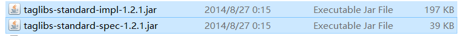
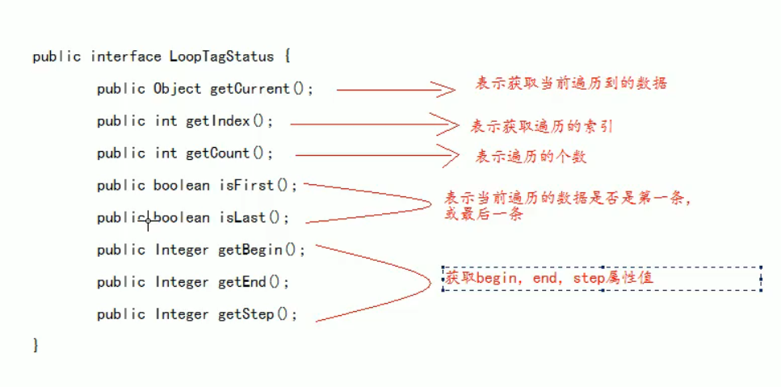

这是一个标签库

jsp standard tag library

标签库是用来替换代码脚本 -----  jsp 页面更简洁


数据库和XML 库是不用的库

如果在jsp中直接访问了数据库，会破坏javaEE的三层结构

XML 


# 使用步骤

在jsp 标签库使用taglib指令引入标签库 

1、 先导入jstl标签库的jar包



2、 使用taglib 指令引入标签库

`<%@ taglib prefix="c" uri="http://java.sun.com/jsp/jstl/core" %>`


# 核心标签库

## <c:set />

可以向域中保存数据

域对象.setAttribute(k, v)

<c:set scope="page" var="key的值" value="value值"  />

scope 设置保存的域

page === pageContext域 （默认是page)

request === request域

session === session域

application === ServletContext 域


## \<c:if>

做if 判断

<c:if test="判断的条件, 里面写的是EL 表达式 ${ }"> **执行语句**放到标签里面 \</c:if>


没有对应的else 语句


## \<c:choose> \<c:when> \<c:otherwise>

进行多路判断

与switch 类似


choose 标签开始选择判断

when 中的test 属性表示判断的情况

otherwise 表示剩下的情况


从上往下判断

```jsp
<c:choose>
	<c:when test="${变量 比较 值}">
    	输出内容
    </c:when>
    <c:when test="${}">
    	输出内容2
    </c:when>
    <c:otherwise>
    	其他情况
    </c:otherwise>
</c:choose>
```

有一个满足条件后就会直接跳出其他的判断


1、 标签里不能使用html 注释 --- 会直接报错

​	要使用jsp 注释 <%-- --%>

2、 when 的父标签一定是choose 标签

​	只要想用when, 就得再嵌套一层的choose 标签


## \<c:forEach>

遍历输出


遍历整数

```jsp
<c:forEach begin="1" end="10" var="i">
	${i}
</c:forEach>
```

var 表示遍历的变量，循环的变量，当前遍历到的数据

end 可以取到


遍历集合

```jsp
增加for
<c:forEach items="遍历的集合" var="item">
	${item}
</c:forEach>
```

var 表示当前遍历到的数据


遍历map

```jsp
<c:forEach items="" var="entry">
	var 中就是一个entry(k-v 对)
    ${entry} 输出每一个键值对
    
    ${entry.key}  只输出key （就是一个getKey()方法 )
    ${entry.value} 只输出value （就是一个getValue()方法)
    
</c:forEach>
```


遍历List

可以嵌套使用begin 和end 来指定遍历范围

**step**调整步长

varStatus表示当前遍历到的数据的状态 


