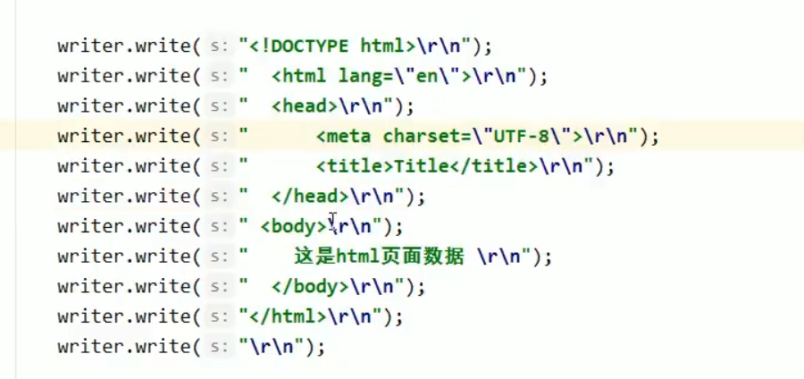
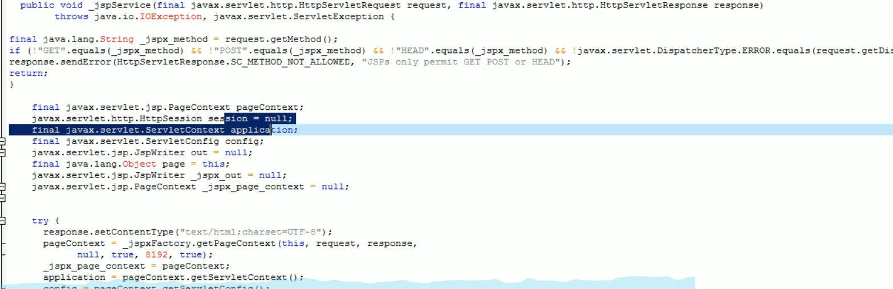
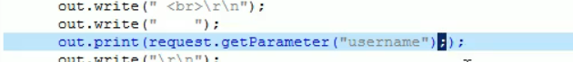
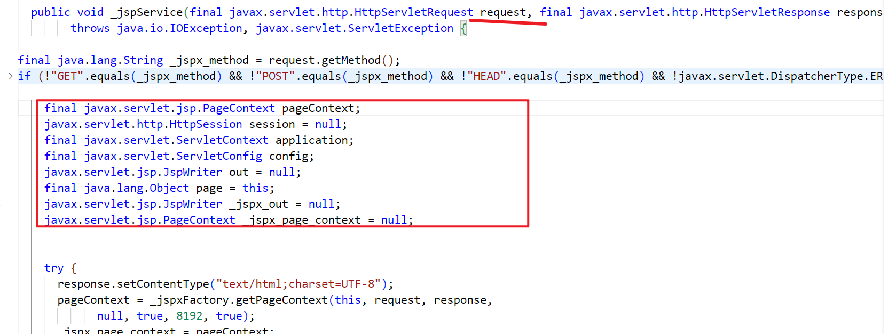
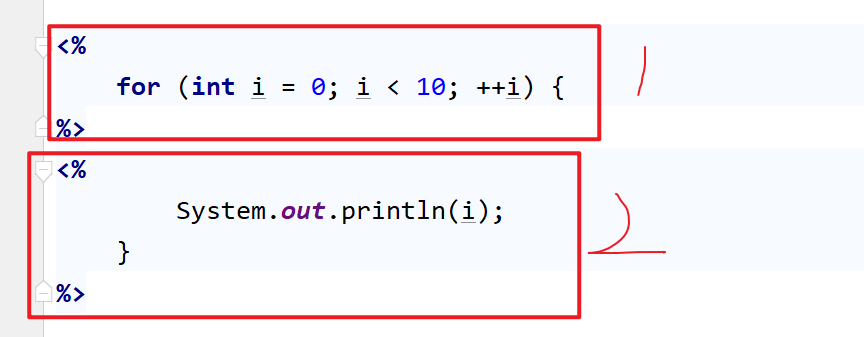
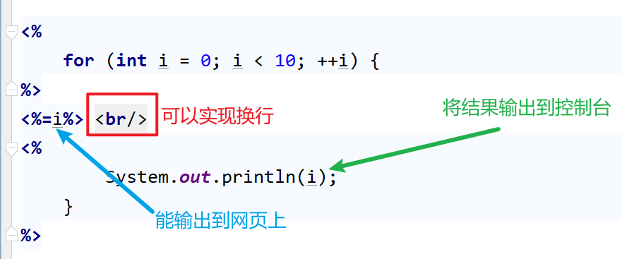
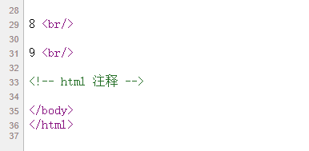
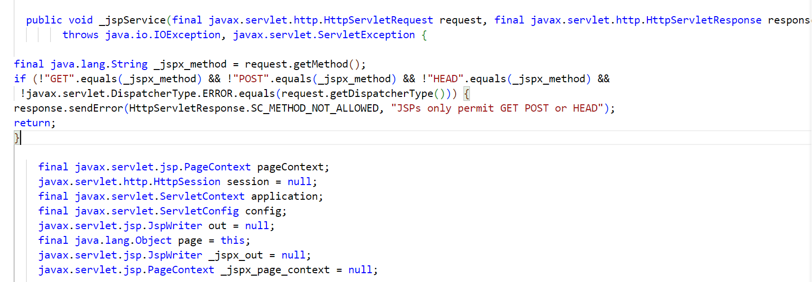
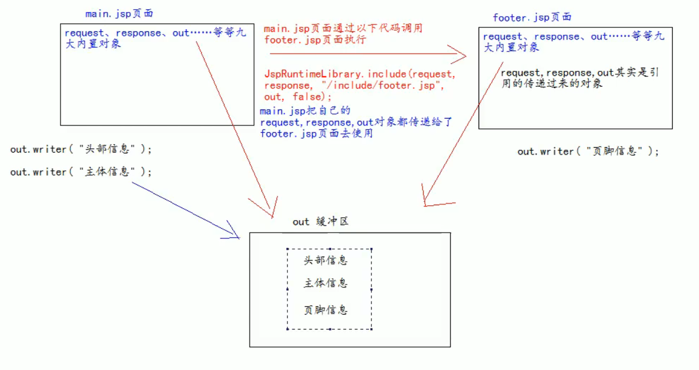

# 介绍

全称是 Java Server pages 

主要用来代替Servlet 程序回传html 页面的数据


Servlet 回传页面非常繁琐

开发成本和维护成本极高


**Servlet 回传网页的过程**



非常麻烦


**Jsp 回传网页的过程**

直接在web 下新建一个jsp 文件，然后在里面写就行


jsp 和html 页面一样，都是放在web 目录下，并且和web 的访问方式是一样的

html: http://ip:port/工程路径/xx.html

jsp: http://ip:port/工程路径/xx.jsp


<font color="red">在网页上访问jsp 资源时，会将jsp 页面翻译成一个对应的Servlet java程序</font>

jsp 页面本质上是一个Servlet 程序

第一次访问 jsp 文件时，会将jsp 文件翻译在一个java 源文件以及一个字节码文件

jsp extends HttpJspBase extends HttpServlet

​	在java 源文件中，写的回传语句是和自己写的回传代码是一样的

​	也是很多行writer.write()


# 三种语法

## 1 头部的page 指令

可以修改jsp 页面中的属性 或 行为


| 属性               | 作用                                                         |
| ------------------ | ------------------------------------------------------------ |
| language           | 表示jsp 翻译后是什么语言文件                                 |
| contentType        | 表示返回的数据类型是什么（和setContentType()设置的一样)      |
| pageEncoding       | 文件本身的字符集 （默认不写是utf-8)                          |
| import             | 导入包 <%@ page import="" %>                                 |
|                    |                                                              |
| **out 输出流使用** |                                                              |
| autoFlush          | 当输出缓冲区满了后，是否自动刷新缓冲区， 默认是true          |
| buffer             | 设置缓冲区的大小，默认是8kb                                  |
|                    |                                                              |
| erroPage           | 设置当jsp 运行时出错自动跳转的错误页面的路径                 |
|                    | 这个路径一般都是以斜杠开头 /                                 |
|                    | 表示请求的地址是http://ip:port/工程路径/                     |
|                    | **映射到代码的web 目录**                                     |
|                    | 本质还是一个Servlet 程序， / 代表的路径是一样的              |
| isErroPage         | 设置当前页面是不是错误页面，默认是false                      |
|                    | 如果是true， 可以获取异常信息                                |
|                    | 设置后，在源代码中会出现一个exception 对象，根据这个异常对象，可以获取异常信息 |
| session            | 设置访问当前的jsp 文件是否会创建HttpSession 对象，默认是true |
| extends            | 设置jsp 翻译出来的类默认继承哪个类                           |


## 2 脚本

### 声明脚本（很少用/不用）

格式： 

```jsp
<!%  声明java 代码  %>
```

可以给jsp 翻译的java 类定义**属性**和方法 （还可以是**静态代码块**，**内部类**等）

```jsp
<!% public static Integer a; %>
```


### 表达式脚本

格式： 

```jsp
<%= 表达式 %>
```

在jsp 页面上输出数据


可以输出的数据类型有： 

整型，浮点型，字符串，对象


特点：

1、 所有的表达式脚本都会被翻译到\_jspService方法中

2、 表达式脚本都会被翻译为out.print()输出到页面上

3、 由于表达式脚本都在\_jspService方法中，所以\_jspService 都可以直接使用



方法中的所有的变量都可以用----request, pageContext...

4、表达式脚本中的表达式<font color="red">不能以； 结束</font>



这样就会出现语法错误


### 代码脚本

格式：

```jsp
<% java语句 %>
```

可以在jsp 页面中编写自己需要的功能

写的是**java 语句**，	如果要写**方法**得用声明脚本

if、 for、\_jspService 方法内的代码

```jsp
if:

<% 
	int i = 0;
	if (i == 0) {
         
    } else {
		
    }
%
```

会原样翻译过去

​		结果**会输出到后端控制台**<%语句%>

​		表达式脚本会将结果**输出到网页**上<%=表达式%>


和表达式脚本一样，都会将代码翻译到\_jspService 方法内

```jsp
使用_jspService 方法中对象的方法

<% 
	String username = request.getParameter("username");

%>
```


 特点：

1、 代码脚本翻译之后都在\_jspService 中

2、 代码脚本由于翻译到这个\_jspService 方法中，所以在\_jspService 中的现有对象都可以直接使用




等等都可以直接用

3、 代码脚本强大，还可以由**多个代码脚本块组合成一个完整的java 语句**




4、 代码脚本可以和表达式脚本上一起使用



5、 可以与标签组合在一起使用


## 3 三种注释

### html 注释

会被翻译到源代码中，放在\_jspService 方法里

out.write("<!-- html 注释 -->\r\n");

```jsp
<!-- -->
```

网页源码中可以看到该输出语句




### java 注释

一般在代码脚本中用

会被翻译到源代码中

```jsp
//
/**/
```


### jsp 注释

可以将注掉jsp 文件内的所有代码

```jsp
<%-- --%>
```


# 九种内置对象

Tomcat 翻译到Servlet源文件中后，内部提供的九个对象




| 对象        | 作用                                             |
| ----------- | :----------------------------------------------- |
| response    | 响应对象                                         |
|             |                                                  |
| request     | 请求对象                                         |
| pageContext | 上下文对象                                       |
| session     | 会话对象                                         |
| application | Servlet 上下文对象                               |
|             |                                                  |
| config      | ServletConfig 对象                               |
| out         | jsp输出流对象                                    |
| page        | 指向当前jsp 对象                                 |
| exception   | 异常对象	只有在开启isErroPage之后才会显示出来 |


## 四大域对象

域对象是可以像Map 一样**存取数据的对象**  setAttribute  getAttribute

功能一样，不同的是他们对数据的存取方式范围


pageContext 上下文对象  			 	PageContextImpl 类

​	当前jsp 页面范围内有效

request 请求对象 						HttpServletRequest 类

​	一次请求内有效

session 会话对象 						HttpSession 类

​	一个会话范围内有效

​		打开浏览器访问服务器直到**关闭浏览器**会话结束

application  Servlet 上下文对象			Servlet 类

​	整个web 工程范围内都有效

​	只要web 工程不停止，数据一直都在


使用优先级： 从小到大

减轻服务器内存的压力


## 输出 out 和 response.getWriter 的区别

response 经常用于设置返回客户端的内容 （输出）

out 给用户做输出


区别在于： 

这两个会有自己独立的缓冲区	 

会分别向自己的缓冲区写入

jsp 所有的代码执行结束后，会做两个操作：

1。 执行out.flush()，将out 的缓冲区中的数据追加写入到response 的缓冲区的末尾

2。 执行response.flushBuffer()，把全部数据写给客户端


由于jsp 翻译后都是使用out 输出，因此一般情况下统一使用out 输出

避免打乱页面的输出顺序

out.write()

out.print()

​	print 不管是什么数据，都会转成String 类型，然后才去输出

​	write 输出**字符串**没有问题

​	print 输出**任何数据**都没有问题


write输出int 数据，会直接将int 值强转成char 放入缓冲区中


jsp 页面中，可以<font color="darkviolet" size=5>统一使用out.print()进行输出</font>


# 常用标签

一个页面包含三个部分

一、导航栏，菜单，轮播广告，用户登录信息，天气信息等


二、页面的主体内容


三、加入我们，友情链接，联系我们，版本信息等等

 


## 静态包含

第三部分是一个网站所有的子网站**都有一样的内容**

一个单独的jsp 页面，只维护一份

改一处其他所有的都会修改


主体页面**引用**这个jsp 小页面

```jsp
<%@ include file="/ 以/打头" %>
```

第一个斜杠表示http://ip:port/工程路径

映射到代码的web 目录

也可以不用/， 这样就表示从当前目录下找


被包含进来的jsp 是没有被翻译的，只会翻译主页面

静态包含的特点：

1， 静态包含不会翻译被包含的页面

2， 静态包含是把被包含的页面的jsp 代码复制到主页面进行输出


## 动态包含

可以实现和静态包含一样的效果

```jsp
<jsp:include page=""></jsp:include>
```


特点：

1, 会把被包含的页面翻译成java 文件

2, 在主页面上使用代码去调用被包含页面去输出


两个jsp 文件翻译成的java 文件中，被调用的页面中的request, response, out 对象是指向的主页面传过来的对象引用，因此使用的是一个out 缓冲区

所以输出信息时，主页面先将自己页面的信息放到out 缓冲区，然后将out 传给被调用页面，被调用页面再去将自己页面的输出信息追加到out 缓冲区中

信息加载完成后，将out 缓冲区交给response.writer 的缓冲区，再由response 输出到用户界面上



3, 动态包含，还可以传递参数

```jsp
<jsp:include page="">
    根据下面两行就可以将username 和 password 两个参数及对应的值传递给了被调用页面
    <jsp:param name="username" value="abc"></jsp:param>
    <jsp:param name="password" value="123"></jsp:param>
</jsp:include>
```

```jsp
在被调用页面写出request.getParameter 方法，就可以获取传递过来的参数 
使用<%= %?> 可以将对应的信息输出到浏览器界面 
<%=request.getParameter("username")%>
```


**使用静态页面较多**


## 转发标签

原来实现转发的方式 是使用 代码脚本

```jsp
<%
	request.getRequestDispatcher(path).forward(request, response);
%>
```


jsp 标签使用

实现请求转发

```jsp
<jsp:forward page=""></jsp:forward>
```


用法：

可以用来实现页面上的搜索功能

通过一个 Servlet 来查询搜索结果，将搜索结果返回给前端

​	获取请求的参数

​	根据请求参数查询数据库

​	将查询结果发送给客户端，输出到页面  ------  （交给jsp)

使用请求转发技术发送给jsp 处理输出

​	数据使用请求域对象保存（因为是一次请求）


不能直接访问jsp 页面，必须经过Servlet 程序获取数据库的查询数据，否则请求域对象中是没有数据的


