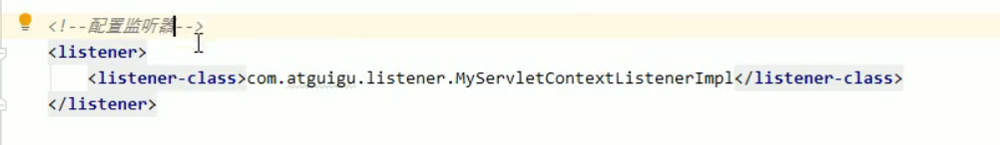

# Listener 监听器

javaWeb 的三大组件之一：

+ Servlet

+ Listener

+ Filter

Listener 是javaEE的规范（接口）

用处：

监听某种事物的变化，通过回调函数返回给用户（程序），之后做一些处理

一共有八个监听器

现在使用的  **ServletContextListener**	

可以监听ServletContext对象的创建和销毁

​	工程启动的时候创建，停止时销毁

这个监听器中有两个方法：

| contextInitialized | Context 对象创建时立刻调用，做初始化 |
| ------------------ | ------------------------------------ |
| contextDestroyed   | Context 对象销毁时调用               |

使用步骤：

1、 编写一个类实现ServletContextListener

2、 实现两个回调方法

3、 到web.xml 中配置监听器

配置：

