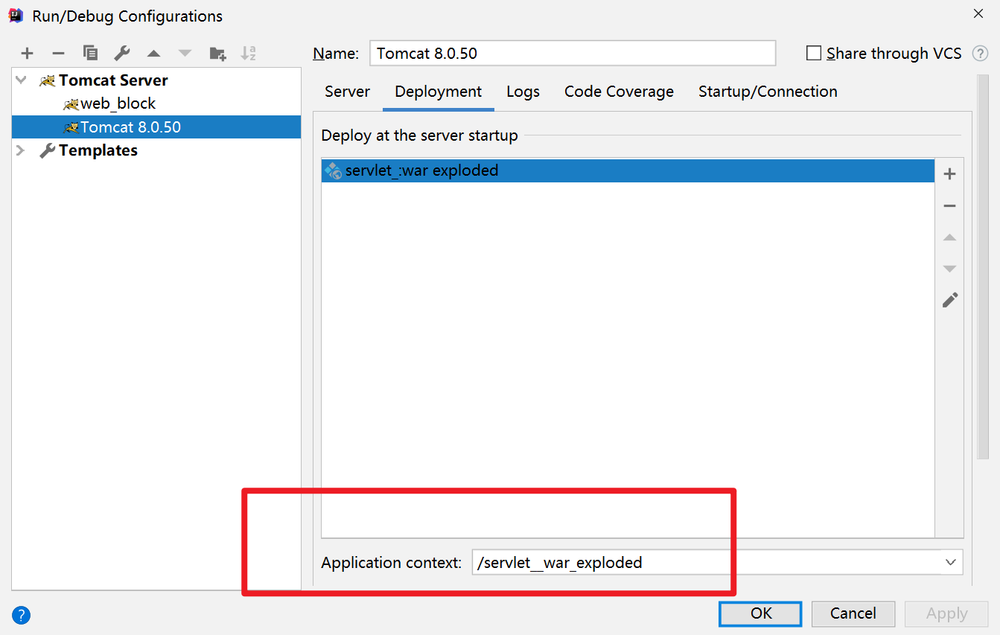

JavaEE 规范之一

​	规范就是接口

JavaWeb  的三大组件之一

-  	Filter

- Listener

- Servlet


有什么用： 运行在服务器中的java 小型程序

**可以接收客户端发来的请求，并响应数据给客户端**


# 创建方式

## 1. 编写一个类来实现接口


在src 中新建一个类


## 2. 有一个方法很重要： 实现service  处理servlet 的请求，并响应数据


## 3. web.xml 中配置servlet 程序的访问地址

 

这个报红是要配置地址


工程路径是从这里设置的


在地址栏输入http://ip:port/工程路径/hello   就会访问servlet 中指向的全类名对应的类(service 方法)

url-pattern 标签中的地址是自定义的，可以是任意地址

**约定大于配置**

​								如果不以/ 开头，会报错

<servlet-mapping> 中的name必须和<servlet> 中的name保持一致


# url 到 servlet 程序的对应

http://localhost:8088/工程路径/资源路径


这两个是IDEA中创建的两个web 工程，相当于是Tomcat文件目录中的webapps

设置的工程路径就是为了能够访问这些web工程


在http 中输入的资源路径， 会优先检查在web.xml  中配置的那些url路径


整体的步骤： 


# Servlet 生命周期

1. 执行Servlet 构造器方法 
2. 执行init 初始化方法 
3. 执行service 方法
4. 执行destroy 销毁方法


每次刷新，重新执行且只会执行 service 方法（1, 2 两步是不会再次执行的）

在停止整个工程的时候， 会去调用destroy 方法


在ServletRequest 的子接口HttpServletRequest 中，有getMethod 方法，可以查询当前访问时使用的方法是get, post等等


# 开发的实际应用

## 使用Servlet 子类进行开发

一般常用的是HttpServlet 这个子类

1. 编写一个类去继承HttpServlet 类
2. 根据业务需要重写doGet 或doPost 方法 
3. 到web.xml 中配置Servlet 程序的访问地址


## 使用IDEA 创建Servlet 程序 


只需要配置一下<servlet-mapping> 即可


# Servlet 的源码

tomcat 的zip压缩包，选那个src.zip --> 只选java 这一个


# Servlet 类的继承关系


由下而上是继承或是实现的关系

- Interface Servlet 

负责定义整个Servlet 程序的访问规范

- Class Generic Servlet

实现了Servlet 中的接口，很多空实现

有一个ServletConfig 类的引用，并对ServletConfig  的一些使用做一些方法 

-  Class HttpServlet 

实现了service 方法，并实现了请求的分发处理

​	在Generic Servlet 中，实现了很多接口的方法，但惟独没有实现service 这个方法，仍然是一个抽象的方法 

​		谁继承了Generic  这个类，谁就去自己实现service 这个方法 

`String method = req.getMethod();` 通过获取不同的请求方法，来实现不同方法的分发处理

doPost 和 doGet 中，抛出不支持GET/POST	的异常 （就是不能直接使用这个类的doGet 和doPost）

- 自己的程序

只需要将doPost 和 doGet 重写就可以了


# ServletConfig

servlet 的配置类

这是一个接口Interface

Servlet 和ServletConfig 是由**Tomcat 负责创建**，我们负责使用

Servlet 程序默认是第一次访问的时候创建， ServletConfig 是每个Servlet 程序创建时创建一个对应的ServletConfig对象

```java
getServletConfig();
//只能获取自己servlet 对应的信息（init-param等）
```

getServletConfig() 方法是从GenericServlet 继承过来的

在GenericServlet中，有一个init 方法，会将config参数保存下来，因此可以使用getXX() 获取到

而在自己的servlet 程序中重写init后，如果没有写super.init(config) 这一条语句，GenericServlet 就不会保存住config 信息，此时再去调用getXX() 方法， 就一定会报出null异常

 


## 作用

1. 可以获取Servlet 程序的别名servlet-name  的值

```java
servletConfig.getServletName()
```


2. 获取初始化参数init-param 

需要在xml 文件中配置一下<init-param> 标签， 这个标签要放在servlet 标签中

<param-name> 是参数名

<param-value> 是参数值

这个init-param标签可以有多个，这样就可以有多个初始化参数了

获取方法： 

```java
servletConfig.getInitParameter("自定义的param-name名");
```


3. 获取ServletContext 对象

```java
servletConfig.getServletContext()
```


# ServletContext类

1. 是一个接口
2. 表示servlet 上下文对象
3. 一个web 工程只有一个ServletContext 对象实例
4.  ServletContext 是一个域对象
4.  ServletContext 对象是在web 工程部署时创建， web工程停止的时候销毁 

域对象是一个可以像Map 对象一样存取数据的对象， 只要工程没有被销毁，设置的setAttribute() 就会一直存在，工程中的其他模块文件，都是可以获取到的，自己也可以一直访问


域指的是存取数据的操作范围

|        | 存数据         | 取数据         | 删除数据          |
| ------ | -------------- | -------------- | ----------------- |
| Map    | put()          | get()          | remove()          |
| 域对象 | setAttribute() | getAttribute() | removeAttribute() |


## 获取ServletContext 的方法： 

1. getServletConfig().getServletContext();

2. getServletContext();

    这个方法是在GenericServlet 中定义的，在GenericServlet 中，也是使用的getServletConfig().getServletContext() 这个方法来获取的ServletContext 对象的

    


## 作用

1. 获取web.xml 中配置的上下文参数

**上下文参数context-param是要放在servlet 标签之外**

**属于整个web工程**

​	在这个工程中的所有模块中，都可以得到这些参数

可以配置多个context-param(一个标签有一个名字)

```java
context.getInitParameter("标签中写的参数名")
```


2. 获取当前的工程路径

```java
context.getContexPath();
```


3. 获取工程布署后，在服务器上的绝对路径

```java
context.getRealPath("/");	
```

/  会被服务器解析为`http://ip:port/工程名/`

这个getRealPath("/") 会获取到IDEA中的web 文件目录

如果想获取web目录中的其他资源的地址，可以写成getRealPath("/其他的目录名")，这样就会在原来的绝对路径的基础上，继续找下一个目录的路径


4. 像Map 一样存取数据

    就像存了一个键值对一样

    如果没有保存，获取会得到一个null 值

    - 存：
        - context.setAttribute(name, value);		即可
    - 取
        - context.getAttribute(name);

​			


# HTTP

协议：指双方或多方相互遵守的规则

HTTP协议：客户端和服务器之间发送数据遵守的规则

数据又叫报文

客户端给服务器发数据叫请求

服务器给客户端回传叫响应


## 请求协议格式

请求分为GET, POST两种请求

### GET

请求行

​	请求方式												GET	

​	请求资源路径[+?+请求参数]				

​	请求协议和版本号										HTTP/1.1	

请求头

​	key: value 不同的键值对表示不同的含义


常见的请求头：

|Key | Value|
|----|----|
|Accept | 客户端可以接收的数据类型|
|Accept-Language | 语言类型（zh_CN 中文中国，en_US 英文美国）|
|User-Agent | 用户代理（代替用户发送请求，其实就是浏览器的信息）|
|Accept-Encoding | 客户端可以接收的编码格式或压缩格式|
|Host | 表示请求的服务器的ip和端口号|
|Reference | 
|Connection | 当前连接如何处理（Keep-Alive  回传完数据不要马上关闭，保持一会连接； Closed 马上关闭）|


### POST

1. 请求行

​	请求方式												POST	

​	请求资源路径[+?+请求参数]				

​	请求协议和版本号										HTTP/1.1	

2. 请求头

    key: value 不同的键值对表示不同的含义

    ​	和GET 的大部分的k-v都是相同的

    | Key            | Value                                                        |
    | :------------- | :----------------------------------------------------------- |
    | Refer          | 请求发起时，浏览器中的地址（从哪里来： 记录流量是从哪里来的） |
    | Content-Type   | 表示发送的数据类型<br />（Application/x-www-form-urlencoded：提交的数据格式是name=value&name=value, 然后对其进行url 编码， url 编码是将非英文字转换成%xx%xx这个形式 <br />multipart/form-data：  以多段的形式发给服务器，以流的形式提交，用于上传） |
    | Content-Length | 发送的数据（请求体）的长度                                   |
    | Cache-Control  | 如何控制缓存                                                 |

    

    在头和体之间有一个空行

3. 请求体

​	发送给服务器的数据


### GET 有哪些

1. form 标签method=get
2. a标签
3. link 标签引入css
4. script标签引入js文件
5. img标签引入图片
6. iframe标签引入html 页面
7. 在浏览器的地址栏后，敲回车

### POST有哪些

1. form 标签method=post


## 响应的HTTP格式 

1. 响应行
     	1. 响应的协议和版本号		HTTP/1.1
        2. 响应状态码  				200
        3. 响应状态描述符			   OK  （对上面的状态码进行说明）

     
     
     常见的状态码
     
     | 200  | 请求成功                                                     |
     | ---- | ------------------------------------------------------------ |
     | 302  | 请求重定向                                                   |
     | 404  | 请求服务器的已经收到了，但是数据不破旧不存在（请求地址错误） |
     | 500  | 表示服务器已经收到请求，但**服务器内部错误**（代码错误）     |
     
     
     
2. 响应头
	key : value 
	不同的响应头有不同的含义
	
	在头和体之间也会有一个空行	

| Key            | Value                      |
| -------------- | -------------------------- |
| Server         | 表示服务器的信息           |
| Content-Type   | 表示响应体的数据类型       |
| Content-Length | 响应体的长度               |
| Date           | 请求响应的时间（格林时间） |
|                |                            |


3. 响应体
    回传给客户端的数据


# MIME类型

HTTP中使用的数据类型 

格式是  大类型/小类型

​		与某种文件扩展名相对应

| 文件               | 扩展名 | MIME类型   |
| ------------------ | ------ | ---------- |
| 超文本标记语言文本 | .html  | text/html  |
| 普通文本           | .txt   | text/plain |
| GIF图片            | .gif   | image/gif  |

大类型有： text, image, audio, video,application 

小类型有：html, gif, jpg, ...


# HttpServletRequest类

## 作用

每次有请求进入Tomcat 服务器，Tomcat 就会把请求过来的HTTP协议解析好封装到Request对象中（每次请求就会由Tomcat创建一个）

然后传递到service(), doGet(), doPost()方法中

可以通过HttpServletRequest对象获取到所有请求的信息


## 常用方法

| 方法名                          | 作用                                       |
| ------------------------------- | ------------------------------------------ |
| getRequestURI()                 | 获取请求的资源路径                         |
| getRequestURL()                 | 获取请求的统一资源定位符（资源的绝对路径） |
| getRemoteHost()                 | 获取客户端的IP地址                         |
| getHeader(想获取的请求头的名字) | 获取请求头（*字符串不区分大小写*）         |
| getParameter(参数名)            | 获取请求参数                               |
| getParameterValues()            | 获取请求参数（多个值的时候使用）           |
| getMethod()                     | 获取请求的方式（GET，POST）                |
| setAttribute(key, value)        | 设置域数据                                 |
| getAttribute(key)               | 获取域数据                                 |
| getRequestDispatcher()          | 获取请求转发对象                           |

**URI 和 URL：**


URL 会带上IP地址


getRemoteHost() 会得到客户在请求时自己的ip 地址


获取请求参数： 

​	如果是get 请求，能够正确接收

​	如果是post 请求，不能正确地接收中文输入，会出现乱码 

​		***解决post 中的乱码的方法：***

​			在doPost 中，使用方法req.setCharacterEncoding("utf8");

​				可以写成utf8，也可以是UTF-8，都可以识别

​			setCharacterEncoding() 方法需要在获取请求参数之前使用才有效，不能获取一部分的参数之后再设置（下图这种使用情况就不会成功）

​		


## 请求的转发

服务器收到请求后，从一个资源跳转到另一个资源

 

在Tomcat 服务器中，需要多个资源**共同完成**一个功能

​	Servlet1 程序

​	Servlet2 程序

​	...

从Servlet1 到 Servlet2 的过程叫数据转发

	

Servlet1:

HttpServletRequest 对象也有一个setAttribute() 方法，这个和context 中的setAttribute() 方法一样，设置后都是在域内生效

​	获取下一个资源的地址： getRequestDispatcher(一个路径名，要写的是"/servlet2")  必须要以/ 开头，表示的是完整的工程路径（http://localhost:8080/工程路径）映射到IDEA中该工程下的的web目录

​	转发到下一个资源：requestDispatcher.forward(request, response)

​	

Servlet2: 

​	检查第一步是否已经完成： request.getAttribute()  得到与第一步相同的key对应的值，如果值与设置的逻辑相同，就进行下一步的处理

​	

**在地址栏的后面输入?key=value 可以进行传参**


请求转发的特点： 

1. 地址没有发生变化

2. 只有一次请求

3. 共享request域中的数据

4. 可以转发到WEB-INF目录下

    1. 本来是不能访问WEB-INF这个目录下的资源，但可以使用请求转发技术，进入到WEB-INF中获取资源

5. 无法转到外面的地址（比如不能把getRequestDispatcher()中的转发路径名写成www.baidu.com)

    

​	 

### base标签


修改相对路径的所相对的地址，让他可以变成同一个地址

使用base 标签可以设置一个当前页面中所有相对路径工作时的参照路径，跳转时会根据这个参照路径来进行跳转

一般base 标签写在title 下面（在head 标签里面）

`<base href="http://localhost:8080/工程名/目录名/资源名">` 这里的href 就是设置的参照地址

​	这样设置之后，请求转发就可以再跳回去了

​	最后的资源名可以省略（原因是资源并不是目录），但是资源名前面的 / 不能省略（将最后一个识别为目录名）

​		如果不写那个 / ， 就会认为最后的那个目录是一个资源路径，就会直接将其忽略，以倒数第二个作为目录


# web 中的相对路径和绝对路径

相对路径：  

| .      | 当前目录        |
| ------ | --------------- |
| ..     | 上一级目录      |
| 资源名 | 当前目录/资源名 |

绝对路径：

http://ip:port/工程名/资源路径


# web 中斜杠/ 的不同意义

在web 中，斜杠是一种绝对路径

在不同的环境下，代表不同的绝对路径

​	

浏览器解析为http://ip:port/

​	标签中的href


服务器解析为http://ip:port/工程路径/

​	1. servlet-mapping中配置的路径

​	2. servletContext.getRealPath("/")

​	3. request.getRequestDispatcher("/");


response.sendRedirect("/") 把/ 发送给浏览器解析，得到http://ip:port/

​	请求重定向


# HttpServletResponse 类

和HttpServletRequest 同时传入

每次请求进来，都会创建一个

表示所有响应的信息

如果需要设置返回给客户端的信息，都可以通过Response 对象来进行设置


## 流

通过流传递给客户端

有两个响应流（输出给客户端）

字节流

​	getOutputStream();

​	传递二进制数据，常用于下载

字符流

​	getWriter()

​	回传字符串

两个流同时只能使用一个，如果同时使用会报错


想返回给客户端数据，先要创建一个流

回传字符串数据，创建字符流

```
writer.write("data")
```


**响应的乱码**

如果直接在内容里写中文，返回的会是	?????

默认的编码集是ISO-8859-1，这是一个拉丁字符集

```
response.setCharaterEncoding("utf8");
```

设置服务器的字符集是utf8

设置的只是服务器的字符集，如果与浏览器的字符集不统一，会变成另一种乱码（浏览器默认是GBK）

​		可以在浏览器进行修改字符集


也可以通过响应头，设置浏览器的字符集

```
response.setHeader("Content-Type", "text/html; charset=uft8");
```

​	不会区分大小写，utf8也可以，UTF-8也可以


```
response.setContentType("text/html; charset=utf8");
```

这一行代码，会同时设置服务器和浏览器的字符集为utf-8

这个方法一定要在获取流对象前调用才有效

```
response.setContentType("text/html; charset=utf8");
response.getWriter(); //必须是这个顺序
```


## 请求重定向

客户端给服务器发请求，服务器告诉客户端另一个新地址访问（因为之前的地址可能已经被废弃）


响应码302 表示重定向


1. 浏览器向原来旧的地址发起请求
2. 旧的地址会返回响应状态码和新的地址
3. 浏览器解析该返回的信息，之后再次发起新的请求，这次请求的地址就是新的地址
4. 最终的结果是由第二次请求的地址返回
5. 浏览器获取第二次的结果，并显示在页面上


两个地址，则需要两个Servlet 进行操作

第一种方法：

旧的Servlet:

```
response.setStatus(302)

response.setHeader("Location", "新的地址") (http://localhost:8080/工程名/新的Servlet)
```

新的Servlet:

```
// 处理请求
response.getWriter().write("处理的结果");

```


重定向的第二种方法：

```
response.sentRedirect("新的地址");
```


重定向的特点:

1. 地址栏会发生变化
2. 会有两次请求
3. 不共享Request 域中的数据  (setAttribute() 设置之后，在第二次的Servlet 中是无法得到的)
    1. Tomcat 在每次请求的时候，会封装一个**新的**Request 对象，在这个对象中，Request域是共享的
4. 不可以跳到WEB-INF 中的资源中 （与请求转发是不一样的）
5. 可以跳到工程以外的地址（比如：www.baidu.com)
    1. localhost:8080  后面不加工程路径就是在工程以外的


