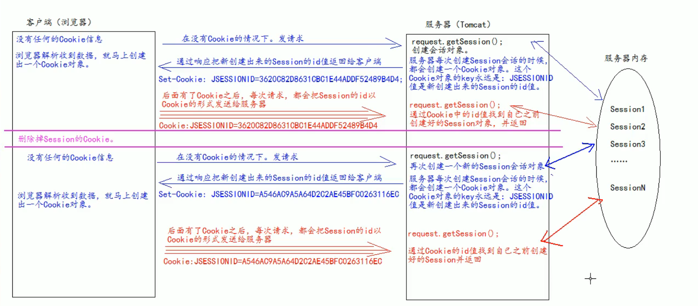

1。 一个接口HttpSession

2。 用来维护一个客户端和服务器之间关联的技术

3。 每个客户端都有自己的Session会话

​	Session中经常用来保存用户登录的信息

​	**Cookie是保存在客户端，而Session是保存在服务器**


# 创建&获取

```java
request.getSession()
    第一次调用该方法是创建Session会话
    之后的每次调用都是获取前面创建的Session对象
    
```

isNew() 判断是不是新创建的


每个会话都有一个id号，id是唯一的

getId()得到Session的会话id值


# Session 存取域数据

```java
request.getSession().setAttribute(key, val);

request.getSession().getAttribute(key);
```


# 生命周期

以秒为单位

session 对象中有设置的方法

```java
//设置 
setMaxInactiveInterval();

//获取
getMaxInactiveInterval();
```


默认时长是1800秒 --- 30分钟

tomcat 的xml 中的标签`<session-timeout>`是30分钟，单位是分钟 

可以自己在web.xml 中修改自己想要的默认超时时长

```xml
<session-config>
	<session-timeout>20</session-timeout>  表示当前工程所有的默认的超时时长为20 分钟
</session-config>
```


修改个别的超时时长，用setMaxInactiveInterval()修改


超时：

客户端两次请求的最大间隔时长，如果超过这个时间，Session对象就会销毁

​	服务器中的Session 对象，有一个timeout 属性每过一秒都会-1

​	如果多次请求的间隔时间还没有到设置的时长，timeout 属性就会重置为设置的时长


值为正数的时候设置新的超时时长

负数代表永不超时（很少使用）----服务器会一直占用内存

让Session会话立即超时，使用新的API： invalidate()


浏览器关闭后，Session直接超时：

- 服务器每次创建Session会话的时候，都会创建一个**Cookie对象**，这个Cookie对象的key永远是**JSESSIONID**，值是新创建出来的Session的id值

- 浏览器解析收到的数据，马上创建Cookie对象

- 有了Cookie后，每次请求都会把Session的id以Cookie的形式发送给服务器
- 之后服务器getSession() 方法会以Cookie中的ID值来找对应的Session对象
- 由于浏览器关闭后，Cookie会销毁，而浏览器中没有相应的Cookie信息，此时服务器无法根据Cookie信息找到原来的SessionID, 因此就会创建一个新的SessionID --- 新的Session会话 
- 




Session 是基于Cookie来实现的


