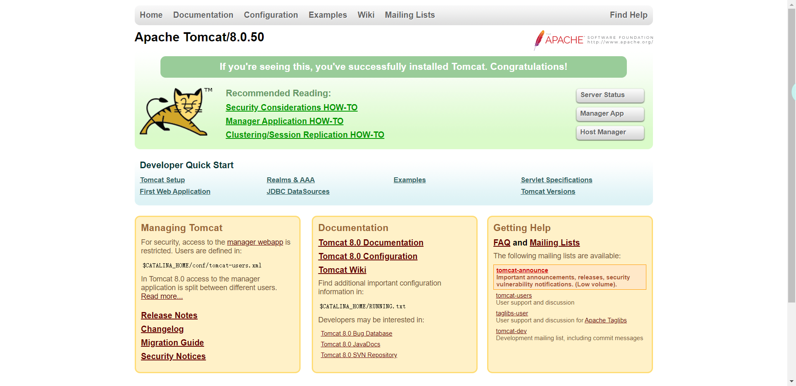
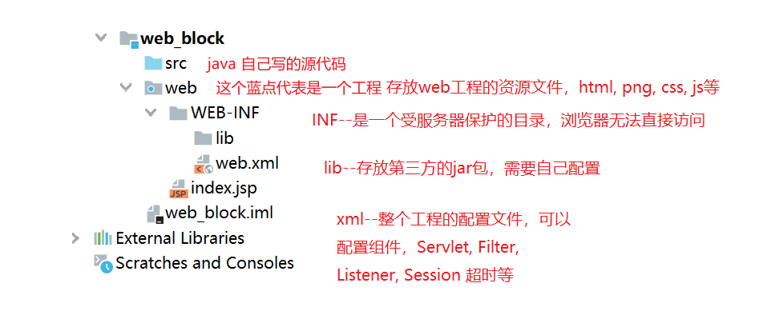
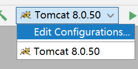
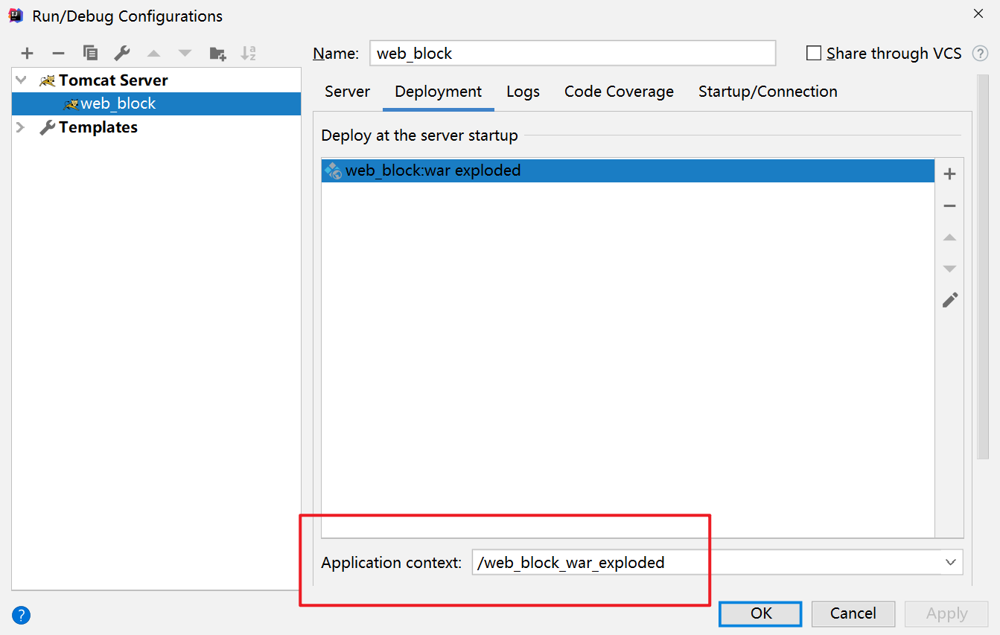
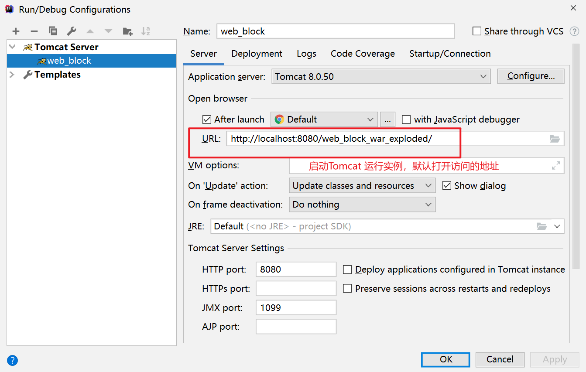
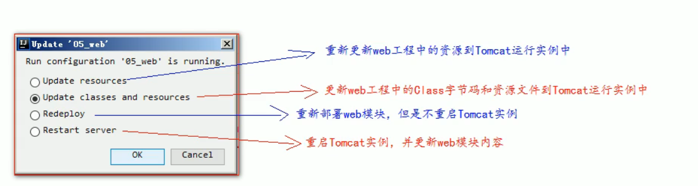
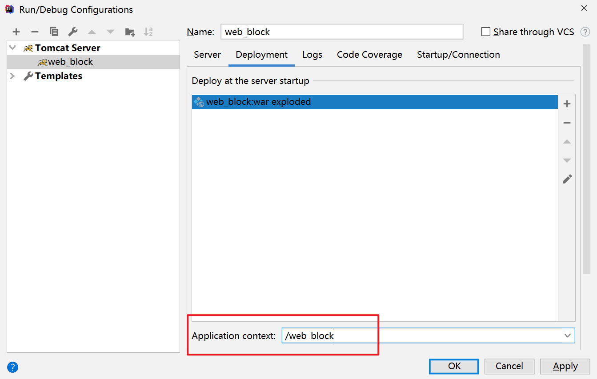
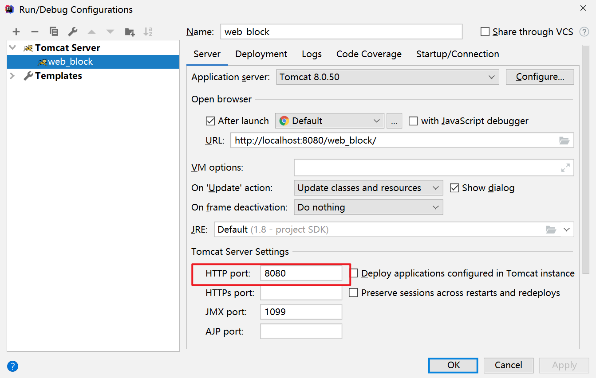
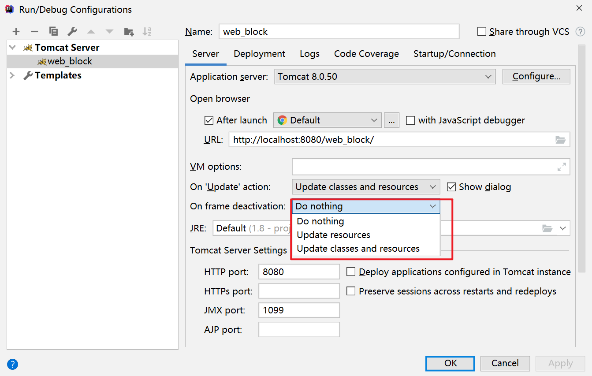

Tomcat 是一种服务器  

# JavaWeb
所有通过Java语言编写的**可以通过浏览器访问的程序**的总称  
基于请求和响应来进行开发的   

## 请求 
客户端给服务器发送数据

## 响应
服务器给客户端回传数据

请求和响应是成对出现的, 有请求就会有响应    

# Web资源
分类: 按实现的技术和呈现的效果的不同, 又分为静态资源和动态资源两种 

静态资源: html, css, js, txt, mp4, jpg等等  
动态资源: jsp页面, Servlet程序, asp, php等等  

常用的服务器:
Tomcat: **轻量级**的JavaWeb容器  
            容器指的是服务器    
        这是应用最广的服务器   
Jboss: 不适合入门   
GlassFish:  商业服务器  
Resin:  收费  
WebLogic: 收费里应用最广的    
    适合大型的项目  

# Tomcat
不同的版本的Tomcat 实现了不同的JavaEE 的规范  
与Servlet有版本的对应关系  

Servlet程序: 从2.5版本是现在世面上使用最多的版本 
到了Servlet3.0之后, 就是注解版本的Servlet使用

## 程序的目录
- bin:      tomcat服务器中的所有**可执行程序**   
- conf:     tomcat服务器的**配置文件**  
- lib:      里面有tomcat 服务器的**jar包(**对javaEE实现的规范)  
- logs:     存放tomcat服务器运行时的输出日志信息  
- temp:     放临时数据  
- webapps:  部署的web工程(里面**一个目录是一个工程**)
- work:     tomcat工作时的目录, 用于存放tomcat运行时jsp翻译为Servlet的源码, 和Session钝化(序列化)的目录

## 启动
1. 找到tomcat目录下的bin目录下的startup.bat文件, 双击即可启动tomcat服务器  
2. 使用命令行: 
    1. 打开命令行
    2. cd到tomcat的bin目录下
    3. 命令: catalina run

两种方式的区别:  
如果是用命令行, 可以看到错误信息  
不会再一闪而过

判断是否已经启动: 
在浏览器中输入以下地址: 

1. `http://localhost:8080`
2. `http://127.0.0.1:8080`
3. `http://电脑真正的ip:8080`

### 常见的启动失败:  
#### 1

双击startup.bat文件, 会出现一个小黑窗口而过:
一般是没有配置好JAVA_HOME环境变量   

#### 2

很奇怪，可以正常启动，但是在浏览器上打不开

直接重新解压安装

## 退出tomcat 
1. 手动关闭启动窗口 
2. tomcat 窗口中使用 Ctrl+C
3. ***找到tomcat的bin目录下的shutdown.bat, 双击, 就可以停止***

## 修改tomcat的端口号
Mysql 默认端口号是3306  
tomcat 默认是8080  

1. 找到tomcat 目录下的conf 目录, 找到server.xml 配置文件  
2. 在xml中找到connector标签, 其中的port属性, 将这个属性修改即可(1-65535)  
   

修改完端口号一定要重启tomcat服务器才能生效   

http默认的端口号是80

## 将web工程布署到Tomcat中
1. 只需要将web工程的目录 拷贝到tomcat的webapps目录下即可(在wbapps 下新建一个目录)   
   一个目录就是一个工程   
   1. 在webapps 中创建一个文件夹，即新工程
   2. 将原web 工程复制到这个新文件夹中
   3. 访问web 工程方式： 
      1. 在浏览器中输入地址http://localhost:8080 相当于访问到了webapps 这个文件夹中
      2. 只用在8080后加工程目录

2.  写配置文件
   1. conf\Catalina\localhost 中，新建一个新的xml 配置文件
   2. 将`<Context path="/web03" docBase="E:\IdeaProjects\JavaWeb\out\artifacts\web03_war_exploded" />`放入这个新的xml文件
      1. Context 表示一个工程的上下文
      2. path 表示工程的web访问路径
      3. docBase 表示本地的工程目录在哪里---> 可以将工程放在任意位置

## html 两种打开方式的区别：

本地打开文件： 是使用file 协议， 表示让浏览器直接读取file:后的路径，解析之后到浏览器中显示即可， 不需要走网络

在地址栏输入后打开： 使用的http协议，访问服务器，请求并拿到资源之后再交给浏览器进行解析

## 地址栏的默认访问地址

当在地址栏输入时，不加工程名时，默认访问的是ROOT 工程

在地址栏输入地址，工程名后面不加其他的资源路径时，默认访问的是index.html

# IDEA 加Tomcat 服务器

2023.2

https://blog.csdn.net/qq_44776411/article/details/132480550

**先有工程后有模块**

# 动态Web工程

module -> Java Enterprise -> Web Application -> create web.xml 

动态的web 工程模块中， 会带有一个index.jsp

在新建的WEB-INF中， 习惯性地创建一个目录lib, 用于存放工程用到的jar 包

## 添加jar 包

1. 将jar 包复制到lib 目录中，右击Add as Library --> Module Library

然后可以在src 目录中写文件，进行测试包是否导入成功

2. Project Structure --> Modules --> 找到想要修改的模块 --> Dependencies  可以将添加了的jar 包删除 
3. Project Structure --> Libraries --> **+** --> 找到jar 包的目录，将想要添加的jar包全部加入 --> choose module --> 之后在Artifacts 中将类库用Fix 重新部署一下 

## 部署Web 工程到Tomcat 运行

1. 先将工程使用的Tomcat实例改一下名

2. 在Deployment 中有部署的web工程，默认是当前这个工程，如果需要这个Tomcat实例同时跑多个工程，可以在这个Deployment 中添加工程

​														自动生成的工程路径

3. 

这个默认访问地址可以自定义修改

## 可修改

### 工程路径

修改为与自己当前的web 工程名相同

原来的路径后面还有_war_exploded

### 端口号

### 	

### 资源热部署

修改资源后想立刻在浏览器中刷新，看到变化

