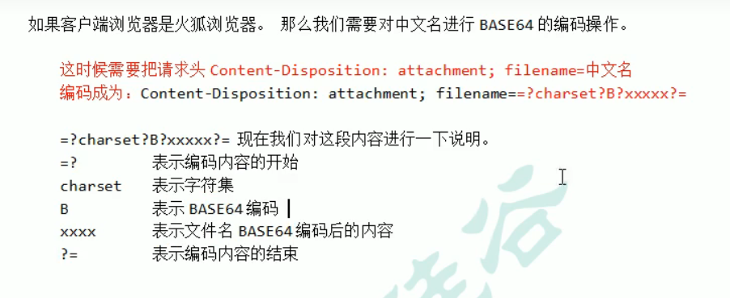

# 过程

1、 获取要下载的文件名

​	可以使用request.getParameter() 得到？？？

​		如果文件名是设置死的， a 标签中的文件名可以直接设置成一个参数传过来

​			后台使用request.getParameter("content"); 来得到名字

​		如果不通过参数传过来，后台是无法得到标签中的内容

2、 读取要下载的文件内容

​	通过ServletContext 读取

​	inputStream = servletContext.getResourseAsStream(文件路径); --- 将文件按照流的形式读入

3、 把要下载的文件内容回传给客户端

​	outputStream = response.getOutputStream();

​	IOUtils.copy(inputStream, outputStream);  --- 通过commons 包里面的IOUtils 可以将输入流里面的内容复制到输出流里面，然后让输出流去输出

4、 在回传前通过响应头告诉客户端要返回的数据类型

​	mime = servletContext.getMimeType();

​	response.setContentType(mime); 

​	也可以	response.setHeader("Content-type", mime);

5、 通过响应头 告诉客户端收到的数据是要下载使用

​	response.setHeader("Content-Disposition", "attachment; filename=" + 文件名);

# 文件名含有中文

下载时无法正常显示名字

对文件名进行编码

**url 编码**（IE 和谷歌）

response.setHeader("Content-Disposition", "attachment; filename=中文名" + URLEncoder.encode("中文名", "utf-8"));

把中文转换成%xx%xx 这种形式

**Base64编码**(火狐)

BASE64Encoder base = new BASE64Encoder();

str = base.encode(String.getBytes("utf8"));

这里的encode 方法的参数是一个字节数组

方法执行后是一个编码完成的内容

解码：

BASE64Decoder decode = new BASE64Decoder();

decode.decodeBuffer(str);

解码后是一个字节数组

content = new String(bytes, "utf8");

区分不同的浏览器：

request.getHeader("user-agent").contains("Firefox");

这个contains 方法区分大小写