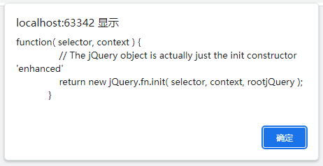
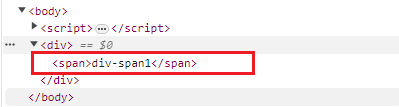
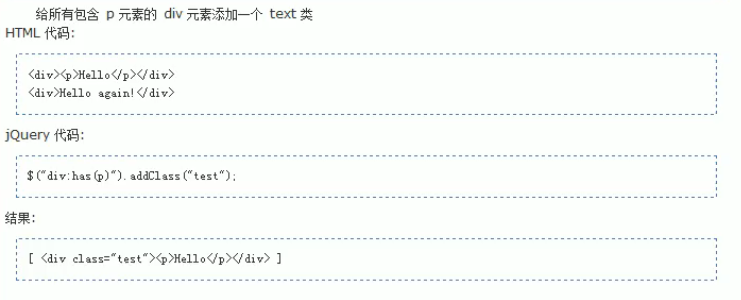
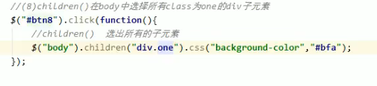
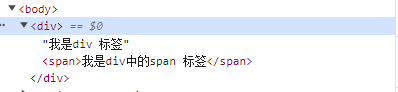
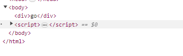
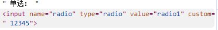

# 注意

jQuery中尽量使用单引号
在嵌套的时候, 单,双相交

后面加.css() 可以将查询的结果转为特殊的格式

# 简介

js和查询, 辅助js开发的类库
引入jquery文件 -- [html页面中jquery导入方法](./importjquery.md )


alert($); 来测试是否引入成功

$ 是一个函数


# 添加响应函数

1. 使用jQuery查询标签对象
2. 使用标签对象.click(function(){})

***$ 是jQuery的核心函数***

传入的参数不同, 会有不同的功能

1. 传入的是函数时:相当于window.onload = function(){}`        $(function () { alert("页面加载后自动调用"); })`
2. 传入的是HTML 时
   `$("<div> <span>div-span1</span>").appendTo("body");`
   会去创建这个HTML标签对象

```
<head>
    <meta charset="UTF-8">
    <title>Title</title>
    <script src="../script/jquery-1.7.2.js"></script>
    <script type="text/javascript">
        $(function () {
            $("<div> <span>div-span1</span>").appendTo("body");
        })
    </script>
</head>
<body>

</body>
```



3. 传入的是选择器字符串

- id 选择器$("#id属性值");
- 标签名选择器根据指定 的标签名查询标签对象$("标签名");
- 类型选择器
  $(".class属性值");

4. 传入的是dom对象时:　
   把dom对象转为jQuery对象　　
   DOM对象在使用alert时, 效果是 [object HTML标签名Element]

jQuery对象效果是:
[object Object]

# jQuery的本质:

jQuery对象就是 **DOM对象数组＋jQuery提供的一系列功能**　　　

## 与DOM对象的区别

可用的 方法/属性 有差别
DOM可以用innerHTML属性
而jQuery不能用

## Dom 与 jQuery 对象互转

1. DOM 转 jQuery
   $(DOM对象) 可以转成JQuery对象
2. jQuery 转 DOM

- 先有jQuery对象
- jQuery对象[下标]即可取出DOM对象

# jQuery选择器

## 基本选择器
1. id选择器					#id
2. element 标签名选择器		直接写标签名
3. class 类别选择器  			.class类名
4. \* 所有元素
5. 组合选择器  将每一个选择器得到的元素合并到一起后返回
   $("div, span, #id");

选择器中,
p.myClass 表示  **必须是class是myClass类型的p标签**

**结果的顺序是在页面中的顺序**

`style="display:none"`  表示在页面中不显示这个标签

选择标签要在加载完后开始
\$(function(){
    **这里写选择标签的事件**
})

```
//1.选择 id 为 one 的元素 "background-color"
$("#btn1").click(function () {
    $("#one").css("background-color","red");

```

`<span style="color:blue; font-weight: bold; font-size:30px">`

#bbffaa (薄荷绿)  

## 层级选择器

在给定的祖先元素下匹配所有的后代元素

- ancestor descendant
- parent > child  只能查子元素
- prev + next  紧跟在prev后面的next 元素
- prev ~ siblings  prev 后面的所有紧跟的元素

`$(document).ready(function(){})` 是 `$(function(){})`的全写

## 过滤选择器

### 基本过滤选择器 (在字符串里面写上 :XXX )

:first  获取第一个匹配的元素
:last
:not(selector)  去除所有与选择器匹配的
:even 索引值是偶数的(从0开始)
:odd  奇数的
:eq(index) 索引值的元素
:gt(index)  大于索引值的
:lt(index)  小于索引值的
:header 匹配标题
:animated  匹配正在执行的动画的元素
先写标签名, 再写过滤器:XXXXX

**看需求, 考虑是不是应该加标签名**
header直接写即可
animated也是直接写

### 内容过滤器(在文本中找)  :

:contains(text) 匹配在**文本**中包含给定文本的元素
:empty    匹配所有不包含子元素或文本的空元素(起始标签和结束标签之间**没有其他的内容**)
:parent     匹配有子元素或者文本的元素(有内容的, 与empty 相反)
:has(selector)  匹配含有**选择器**所匹配的元素的元素


### 属性过滤器  标签名[]

- [attribute]
  包含给定属性的元素
- [atttribute=value]
  包含给定的属性以及有给定的value值
- [attribute!=value]

1. 匹配不含有指定的属性attribute必须有指定的属性:
   标签名[attribute][attribute!=value]  (多一层的过滤)
2. 属性不等于给定value值的元素

- [attribute^=value]
  以value 打头的元素
- [attribute$=value]
  以value 结尾的
- [attribute*=value]
  给定的属性是以**包含**value的元素
- [selector1][selector2]
  复合选择器
  同时满足所有的选择器
  (多个中括号)

### 表单过滤器(选择特定的标签)

- :input  匹配所有的input, textarea, select 和button 元素
- :text  单行文本框(type只要text)
- :password (type只要password)
- :radio(单选框)
- :submit(input 是submit类型的)
- :checkbox(复选框)
- :reset(input 中的reset)
- :button(button 按钮 | input中的button 		这两个都算)
- :file(input 中的file)
- :image(input 中的image类型)
- :hidden  匹配不可见的元素
  (display:none | type="hidden")

### 表单对象属性

- :enabled 匹配所有可用元素
  - 可用: 单选,复选等, 只要没有disabled="disabled" 即可
- :checked 已经选中的元素(指单选和复选)
- :selected  下拉列表中的选中的元素

.val() 可以操作表单项的value属性值
不写是获取, 写上值就是修改

遍历方法:
$对象.each(function() {
    alert(this.value);
});
function() 的() 中有一个this 对象, 里面有当前遍历的dom对象

下拉列表中, 有一个属性是multiple="multiple", 可以设置成能多选目标

## 元素筛选(*括号* 里都能加过滤器, 自定义 )

- eq()  获取给定的索引的元素 与:eq() 一样
- first()  获取第一个元素
- last()    获取最后一个元素
- filter(exp) 进一步过滤(过滤器)
- is(exp)  判断是否匹配定的选择器, 只要有一个就返回true
- has(exp)  有相应的选择器的标签
- not(exp) 与exp匹配的元素
- children()    给定选择器的所有子元素,不含孙子元素
- find()   找所有的后代元素, 不止子元素
- next()  当前元素的下一个兄弟元素
- nextAll()  当前元素的所有兄弟元素
- nextUntil()   当前元素到指定匹配的元素为止, 这中间的所有元素, 不包括until 所指的
- parent() 取父元素
- prev(exp) 当前元素的上一个兄弟元素, 有当前元素有多个相同的标签名, 则每个当前元素都会返回一个前一个兄弟元素
- prevAll()  前面全部兄弟元素
- prevUntil()  到until所指为止, 这之间的所有元素
- siblings(exp)  所有的兄弟元素(前后都是返回值)
- add()  add匹配的选择器的元素 添加到当前的元素中(相当于再加一个匹配的值)



## 元素筛选与层级选择器的差异:

筛选是写在外面的方法
如: `$("div").first();`
层级是 `$("div:first");`

# jQuery 的属性操作

- html()  可以设置和获取起始标签和结束标签中的**内容**, 跟dom 属性 的innerHTML 一样(但这是一个方法)
- text() 可以设置和获取起始标签和结束标签中的**文本**, 与dom属性的innerText 一样
- val()  可以设置和获取**表单项**的**value属性值**, 与dom属性的value一样

  - val()可以同时设置多个表单项的选中状态
    将想选中的的value值放在[] 里面

  ```
      $(":radio").val(["radio2"]);
      $(":checkbox").val(["checkbox1", "checkbox2"]);
  
  ```

  - 同时多种类型:

  ```
  $(":checkbox, :radio, #multiple").val(["checkbox1", "checkbox2","radio2"]);
  ```

***不传参数是获取, 传参是设置新的值***

开始的标签样式:

`alert($("div").text("go").text());`

将原来div标签中的内容替换成传递的参数
最终的效果是:


html() 会把里面的参数转成一个标签样式进行显示, 而text() 只会将内容替换成参数的文本, 不会有html 的样式

- attr()  可以设置和获取属性的值

```
$(":checkbox:first").attr("name"); //attr 里面是一个值的话就是获取这个属性的值
$(":checkbox:first").attr("name", "aklg"); //attr里面如果有两个值的话, 就将name属性的值修改为第二个值
```

- prop()  可以设置和获取属性的值

attr() 在查询checked状态时, 如果已经选中了, 就返回checked; 如果没有这个属性会返回undefined, 官方认为返回undefined 是一个错误, 因此有了第二个prop() 来进行查询
当prop() 查询checked的状态时, 如果没这个属性, 就会返回false; 如果已经选中了, 就返回 true

attr() 不推荐操作
*checked, readOnly, selected, disabled* 这些属性
而prop() 只推荐操作以上的属性

attr() 还可以操作非标准的属性, 比如自定义的属性
`$(":radio:first").attr("custom", " 12345");`


# 练习: 全选, 反选, 全不选

反选

```
$("#checkedRevBtn").click(function () { //绑定点击事件
    $("input[name='items']").each(function () {
        this.checked = !this.checked;
    })

    var totalNum = $(":checkbox[name='items']").length;
    var ckedNum = $(":checkbox[name='items']:checked").length;
    if(totalNum == ckedNum) {
        $("#checkedAllBox").prop("checked", true);
    } else {
        $("#checkedAllBox").prop("checked", false);
    }

```

# 操作DOM

## 创建标签

使用$("标签")  该方式, 可以自动地创建一个括号内的标签

DOM 是一个描述标签的对象<--->标签

直接操作jQuery的object 对象

## 插入

a.appendTo(b)    把a插入到b子元素末尾, 成为最后一个子元素

a.prependTo(b)  把a插入到b所有子元素之前, 成为第一个子元素

```
          $("<h1>标题</h1>").appendTo($("#c"));  //$("<h1>标题</h1>")可以创建一个新的标签
            //结果是插入到了c标签里面的最后面, 是最后一个子元素
          $("<h1>标题</h1>").prependTo($("#c"));//结果是插入到了c标签里面的最前面, 是第一个子元素
```

a.insertAfter(b) 得到的效果是得到ba, 把a插到b的后面
a.insertBefore(b)       得到的是ab, 把a插到b的前面

**如果b有多个, 则每个b都会操作一次**

## 替换

a.replaceWith(b)  把a换成b
用后面的换前面的
如果有多个a, 只会换成一个b

**a.replaceAll(b)  把所有的b都换成a**

用前面的换后面的

## 删除

a.remove();  删除a标签
a.empty();  删除a标签里面的内容, 不删除标签a

# 左移, 右移

```

		$(function () {
			//全部移动
			//$("button:eq(0)").click(function () {
			$("#btn2").click(function () {
				// $("#left option").each(function () {
				// 	//this 是一个dom 对象, 不能使用appendTo操作
				// 	//所以用each 会失效
				// 	this.appendTo( $("#right select") );
				// })
				$("#left option").appendTo($("#right select"))
			});

			//只动点击选中的标签
			$("button:eq(0)").click(function () {
				$("#left option:selected").appendTo($("#right select"))
			})
		})
```

# 练习: 表单添加/删除

```
	$(function () {
		var delFun = function () {
			//要让click事件中使用的函数与这里响应的函数 是一个对象
			//原来的click(fun(){}) 就不要再写那个新的函数了
			//如果写了新的函数, 则click里面是一个fun函数
			//而在fun函数里面, 调用一个新的delFun 函数
			//这两个函数不是一个函数, 有一层的调用关系
			//所以令 click(这里的函数) 直接是delFun
			//而delFun形式不能是delFun(), 有了() 是去调用函数
			//我们的目的不是去调用这个函数, 而是令click里面直接使用delFun--?click响应时, 本来的function(){} 就是delFun, 而不是去调用他执行
			//()会把函数调用的返回值传给click
			//click 需要的不是返回值, 而是那个函数
			var name = $($(this).parent().parent()).find("td:first").text()
			//确认提示框函数, 显示的是括号内写的内容
			if(confirm("是否真的要删除["+ name +"]吗?")) {
				//当用户点击了确认就返回true
				//当用户点击了取消就返回false
				//怎么删除
				//行对象.remove
				//找行对象
				//有一个this 对象, 是当前正在响应的  是是是是  dom 对象
				//点击哪个Delete, 哪个标签就会响应这个
				//a 标签的alert()是看地址的
				//在找父元素时, 得给$ 转一下
				$(this).parent().parent().remove()
				return false; //可以阻止浏览器跳转(阻止默认行为)
			}
		}
		$("#addEmpButton").click(function () {
			// 创建行标签对象
			var inputObj = $(":input");
			var name = inputObj.eq(0).val()
			var email = inputObj.eq(1).val()
			var salary = inputObj.eq(2).val()
	
			var newTr = $("<tr>" +
					"<td>" + name + "</td>" +
					"<td>"+ email +"</td>" +
					"<td>"+ salary +"</td>" +
					"<td><a href=\"deleteEmp?id=003\">Delete</a></td>" +
					"</tr>")
			newTr.appendTo("#employeeTable")

			newTr.find("a").click( delFun )
		});
		//绑定的a是页面刚加载完成时候进行的, 自己加的a标签是没有的
		$("a").click( delFun )  //
	});
```

# CSS样式操作

- addClass() 添加样式
- removeClass()  删除样式
- toggleClass()  有就删除, 没有就添加
- offset()  获取和设置元素的坐标

```
	$(function(){
		var $divStyle = $("div:first")
		$("#btn01").click(function () {
			$divStyle.addClass("redDiv blueBorder") /*使用空格可以添加多个样式*/
		})

		$("#btn02").click(function () {
			$divStyle.removeClass("blueBorder")  /*使用空格可以一次删除多个样式*/
			/*当什么都不写的时候, 就是把这个标签的所有样式都删除*/

		})

		$("#btn03").click(function () {
			$divStyle.toggleClass("blueBorder")/*反复切换(有|没有)*/
		})

		$("#btn04").click(function () {
			//第一个匹配的元素的偏离值
			//这里的元素就是$divStyle
			var pos = $divStyle.offset()/*会显示到屏幕的左上角的偏离坐标*/
			console.log(pos)

			$divStyle.offset({
				top:30,
				left:500
			})
			//按照这个设置的新的数值, 将元素进行移动
			//会根据当前的屏幕大小进行移动
		})
	})
```

# 动画

## 基本动画

- show() 将隐藏的元素显示
- hide()  将可见的隐藏
- toggle()  可见的隐藏, 不可见的显示
  可以添加 参数
  第一个参数是动画时长, 单位是毫秒
  第二个参数是回调函数, 动画完成后自动执行的函数

```
		$("#btn1").click(function () {
			$("#div1").show(); /*绑上样式 后即可使用方法设置动画*/
		})
```

自动动画:　　
设置一个函数，回调函数是自身　　

## 淡入淡出

- fadeIn()  淡入
- fadeOut()  淡出
- fadeToggle()  切换
- fadeTo(时间, 透明度)  在指定时成内慢慢将透明度修改到指定的值(0透明, 1 完全可见, 0.5半透明)

```
		$("#btn1").click(function () {
			$("#div1").show(); /*绑上样式 后即可使用方法设置动画*/
		})
```

# 练习: 品牌展示

```

<script type="text/javascript">
	$(function() {
		//只有在加载完整个页面后才会有li标签
		$("li:gt(4):not(:last)").hide();
		// $("li:contains('7275')").show()
		$(".showmore a").click(function () {
			$("li:gt(4):not(:last)").toggle(); //使标签可以来回显示/隐藏
			//修改其中的属性
			$("div div span").attr("href", "less.html")
			//使用hidden 来判断到底应该是什么class
			if($("li:gt(4):not(:last)").is(":hidden") ){
			// if($("div div").attr("class") != "showmore"){
				$("div div").attr("class", "showmore")
				$("div div span").text("显示全部品牌")
				// $("li:contains('佳能')").removeClass()
			} else {
				// $("div div").attr("class", "showless")
				$("div div").removeClass()
				$("div div").addClass("showless")
				$("div div span").text("显示精简品牌")
				$("li:contains('佳能')").addClass("promoted")
			}
			return false;
		});
	});
</script>
```
# 事件操作 
## 页面加载后:  
`$(function(){})`和`window.onload = function(){}` 有什么区别:   

1. 先执行jQuery, 后执行js的  

jQuery 的页面加载完成之后是浏览器的内核解析完页面的标签创建好DOM对象之后就会马上执行  
`$(document).ready(function(){})` 所有的页面都准备好后就执行  

`window.onload` 除了要说影响解析完标签创建好对象之外, 还要等标签显示时需要的内容加载(iframe, img等资源加载后)  
加载完成有两个结果:  1. 加载成功
                    2. 加载失败  

2. 执行的次数:  
js只会执行最后一次的`window.onload`, 之前的就会被新的覆盖掉, 不会去执行  
而jQuery是有几个$(), 就会加载几次

## 其他事件处理方法   
- click()   绑定单击事件, 触发单击事件  
触发单击事件: 传function是绑定事件, 不传的是触发单击事件
- mouseover()   鼠标移入事件
- mouseout()   鼠标移出事件

```
// 使用live绑定的单击事件
$("h5").live("click",function () {
  alert('h5单击事件 == live方法绑定');
});

$('<h5 class="head">什么是jQuery?</h5>').appendTo( $("#panel") );

$("button").click(function () {
  $("h5").click(); // 不传function是触发事件
});
```
- bind() 可以一次性绑多个事件(比如: click, mouseout...)  
- one()  使用上与bind 一样, 但one 绑定的每个事件只会响应一次  

- unbind() 与bind() 相反的功能  
    如果什么都不写, 就删除所有的事件  

- live() 可以用来绑定选择器匹配的所有的事件, 哪怕这个元素是**后面动态创建出来的也有效**


# 事件的冒泡  
父子元素**同时监听同一个事件**(比如click..)  
当触发子元素事件的时候, 同一个事件也会被传到父元素的事件里去响应  

与界面相关的操作会有冒泡  
阻止方法: 在子元素的函数体内, 写上return false, 就可以阻止事件的冒泡传递  

# 事件对象  
每次触发一个事件的时候, 就会有一个事件对象用地记录这个事件时所发生的所有信息  

先得到这个对象, 再去操作这个对象   

## 获取对象 
在事件的function(event)中加一个参数(一般多用event当作参数名)  
这个参数就是一个事件对象   


js中获取:  
```
        window.onload = function (){
            document.getElementById("div1").onclick = function (event) {
                console.log(event);  //这个event 就会有很多点击时记录的信息
            }
        }
```

jQuery获取: 与js一样:  
```
        $("#div1").click(function (event) {
            console.log(event);
        });
```

## 应用事件对象  
使用事件对象中的信息来判断一些接下来要进行的操作   


# 练习: 图片跟随 
