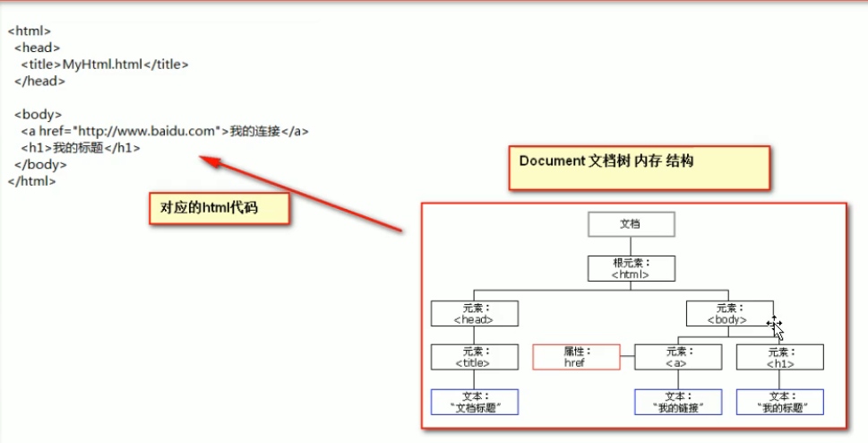
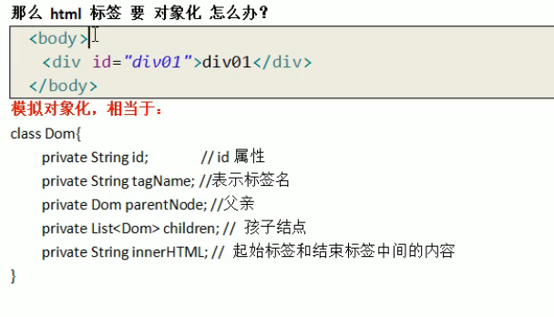

# 介绍

开始主要是完成页面的数据验证, 因此其运行在客户端, 需要浏览器来解析执行javascript 代码简写为 js与java 没有关系, 是两个语言

- js 是弱类型, 类型可变
- java 是强类型,定义变量时就已经确定了类型, 并且是不可变

js 是var类型, 不确定是什么类型
var i;
当给变量赋值时, 如果给的是整型, 则变量类型是整型, 如果是字符串类型, 则变量是字符串类型
i = 1;
i = "abc";

js的三个特点:

- 可用来做信息的**动态交互**
- 安全性(不允许直接访问本地硬盘)
- 跨平台性(只要是可以解析js的浏览器都可以执行, 和平台无关)

# js 和html 代码的结合方式


## 1. 只要在head/body 标签, 使用script标签来写js代码

```
<body>
  <script type="text/javascript">
    //警告框函数
    //可以接收任意类型的参数, 这个参数就是警告框中的提示信息
    alert("hello javascript");
  </script>
</body>

```

## 2. 代码放在单独的js 文件中, 之后再引用

```
<head>
    <meta charset="UTF-8">
    <title>hello-2</title>
    <!-- 需要使用script引用外部的js 文件
        src 属性专门用来引入js文件路径, 可以是绝对路径, 也可以是相对路径

    script 标签可以 定义js代码, 也可以用来引入js文件
    一个标签 两个功能只能2选1, 不能同时使用两个功能
    想要使用另一个, 必须使用第二个script 标签
    -->
    <script type="text/javascript" src="1.js"></script>
    <script type="text/javascript">
        alert("hhh");
    </script>
</head>
```

## 变量

1. 其他语言常见的类型

   - 数值类型: number   --包括--> int short long float byte double
   - 字符串类型:  string
   - 对象类型: object
   - 布尔类型: boolean
   - 函数类型: function
     - 一个变量可以指向一个函数
2. js 中特殊的值:

- undefined  未定义, 所有的js变量未赋予初始值时, 都是undefined类型
- null 空值
- NaN  全称是 Not a Number 非数字, 非数值

js定义变量的格式:
var 变量名;
var 变量名 = 值;

**typeof** 是js提供的方法, 可以取变量的类型返回

```
var i;
//alert(i); //undefined
i = 12; // 12
//alert(i);
//alert(typeof(i)); //number
i = "abc"; 
//alert(typeof (i)); //string

```

js中的类型是不停变化的, 当赋给一个变量为数值类型后, 还是可以给一个string 类型, 此时, 变量就会变成string 类型

```
var a = 12;
var b = "ab";

alert(a * b);
```

结果是NaN

## 关系运算

java 中常见的-略
等于: ==   等于是简单的做字面值的比较
全等于: ===  除了字面值的比较之外, 还要比较两个变量的数据类型

```
var a = 12;
var b = "12";
alert(a == b);
```

⬆ 结果是true(只做值的判断)

```
var a = 12;
var b = "12";
alert(a === b);

```

⬆ 结果是false(还会判断类型)

## 逻辑运算

- 且运算 &&
- 或运算 ||
- 取反运算 !
  与java 中不同的地方:
  **在javascript 语言中, 所有的变量都可以作为一个boolean 类型的变量**
  只有四种情况是假:

1. 0
2. null
3. ""  空串
4. undefined

```
      var a = 0;
      if(a) {
        alert("0为真");
      } else {
        alert("0为假");
      }

      var b = null;
      if(b) {
        alert("null为真");
      } else {
        alert("null为假");
      }

      var c = "";
      if(c) {
        alert("空串为真");
      } else {
        alert("空串为假");
      }
    
      var d = undefined;
      if(d) {
        alert("undefined为真");
      } else {
        alert("undefined为假");
      }
```

⬆ 结果全为false

判断的逻辑:

1. &&
   有两种情况:

- 当表达式*全为真*的时候, *返回最后一个表达式的**值***
- 表达式中*有一个为假*的时候, 返回*第一个为假的表达式的**值***

2. ||有两种情况:
   - 表达式*全为假*的时候, 返回*最后一个表达式的**值***
   - 只要*有一个表达式为真*的时候, 就会*把第一个真的表达式的**值***

## 数组

格式:
var 数组名 = []; //空数组
var 数组名 = [1, "abc", true]; //可以有多种数据类型

arr.length : 数组的长度
**js中数组可以给空数组赋值(不会报越界错误, 长度就会更新+1), 同时在赋完值之后还可以取值进行运算(!读操作不会进行扩容)**
*可以给任意位置赋值,只要通过数组下标进行赋值, 那么最大的下标值就会自动进行扩容操作
中间没有赋值的位置, 数据类型是undefined*

数组遍历:

```
var arr = [1, "abc", true];
for(var i = 0; i < arr.length; ++i) {
    alert(arr[i]);
}
```

## 函数

函数需要调用才会执行定义方式:

1. function 关键字定义函数
   function 函数名(形参列表) {
   函数体;
   }

```
//无参函数
// function  fun1() {
//   alert("无参函数被调用!");
// }
// fun1();

//有参函数
//fun2(var a, var b) 会报错, 因为在java 中给形参定义类型是为了限定, 而在javascript 中, var并不能限定住类型, 因此不用写var, 而且写var还是错误的使用方式
function fun2(a, b) {
  alert("fun2被调用了, a = " + a + ", b = " + b);
}
fun2(1, 2);
```

在js中直接使用return 语句返回即可, 不需要标明返回类型是什么

```
function sum(a, b) {
    var res = a + b;
    return res;
}
alert(sum(1, 2));
```

2. 第二种方式
   var 函数名 = function(形参列表) {函数体}

```
var fun = function (a, b) {
    alert(a + b);
}
fun(1, 2);

var fun2 = function (a, b) {
    return a + b;
}
alert(fun2(1, 2));
```

### 重载

js不允许重载, 会直接覆盖上一次的定义
强行调用会执行最后一次定义的函数

### 函数的arguments 隐形参数(只有function 函数内)

不需要定义, 可以直接用来获取所有参数的变量
像java 中的可变长参数一样
Object... args
可变长参数是一个数组

js的隐形参数也和java的可变长参数一样, 操作类似数组

```
function fun() {
    alert(arguments.length);
    alert(arguments[3]);
}
fun(1, 2, 3, true);
```

编写一个函数计算所有参数的相加的和, 并返回(写两个参数可读性会更好, 其实与不写没什么区别)

```
function add(a, b) {
    var sum = 0;
    for(var i = 0; i < arguments.length; ++i) {
        sum += arguments[i];
    }
    return sum;
}
```

如果同时有整数 和 字符类型, 会进行字符拼接
可以排除字符类型的数据:
  `if(typeof(arguments[i]) == number)`

## 自定义对象

1. Object 形式的自定义对象
   var 变量名 = new Object(); //一个新的对象
   变量名.属性名 = 值 //定义一个属性
   变量名.函数名 = function(){} //定义一个函数

对象的访问:
变量名.属性/函数名();

在函数体当中可以使用this来指代对象

```
<script type="text/javascript">
var obj = new Object();
//alert(typeof(obj));
obj.name = "小王";
obj.age = 19;
obj.fun = function () {
    alert(this.name + obj.age);
}
obj.fun();
</script>
```

2. 花括号形式的自定义对象
   属性名与值之间用 **:** 分开
   每一对属性与值之间, 用 **,** 分开, 但是最后一对后面不要再加 **,**, 不然会报错
   定义函数就直接在里面加就行, 和属性-值是一样的, 同样要使用 **,** 分开

var 变量名 = {
    属性名:值,
    属性名:值,
    函数名: function(){}
};  //  对象

访问方法与第一种方法一样

## 事件

事件是电脑输入设备和页面进行交互的响应
(点, 划过...都是)

常见的事件:

- **onload** 加载完成事件  页面加载完成之后, 常用于做页面js代码的初始化操作
- **onlick** 点击操作 点击时的响应操作
- **onblur** 失去焦点事件 ---> 常用于输入框失去焦点后验证其输入是否合法
- **onchange** 内容发生改变事件 ---> 常用于下拉列表和输入框内容发生改变后操作
- **onsubmit** 表单提交事件  ---> 常用于表单提交前,* 验证表单项是否合法*

事件的注册(绑定):
告诉浏览器, 当事件响应后**要执行哪些操作代码**

静态注册:
通过html 标签的操属性直接赋于操作响应后的代码

动态注册:
先通过js代码得到标签的dom对象, 然后再通过dom对象.事件名 = function(){} 这种形式赋于事件响应后的代码

动态注册基本步骤:

1. 获取标对象
2. 标签对象.事件名 = function(){}

### onload事件

#### 静态注册

加载完成后自动触发
支持onload方法的标签有：`<body>, <frame>, <frameset>, <iframe>, , <link>, <script>`

```
<body onload="alert('具体的动作')">

</body>
```

解析完页面后浏览器自动触发

一般是在具体的行为在外面定义好一个方法

```
<head>
    <meta charset="UTF-8">
    <title>Title</title>
    <script type="text/javascript">
        function onloadFun() {
            alert("具体的行为1");
            alert("具体的行为2");
        }
    </script>
</head>
<body onload="onloadFun()">
</body>
```

#### 动态注册

固定写法:

```
<head>
    <meta charset="UTF-8">
    <title>Title</title>
    <script type="text/javascript">

        window.onload = function () {
            alert("动态行为1");
            //alert("动态行为2");
        }
    </script>
</head>
<body>
</body>
```

这个时候就不要再在body 标签里面写onload="", 否则会失效

### onclick事件

#### 静态注册

标签中常用的方法是在外面定义函数, 直接在标签中调用

```
<head>
    <meta charset="UTF-8">
    <title>Title</title>
    <script type="text/javascript">
        function f() {
            alert("onclick");
        }
    </script>
</head>
<body>
    <button onclick="f()">按扭1</button>
    <button>按扭2</button>
</body>
```

#### 动态注册

```
<head>
    <meta charset="UTF-8">
    <title>Title</title>
    <script type="text/javascript">
        window.onload = function () {
            //1. 获取标签对象
            //document 是js中提供的对象---->整个页面中的所有内容
            //getElementById 通过id属性得到标签对象

            var btnObj = document.getElementById("btn01");
            //
            btnObj.onclick = function () {
                alert("动态注册onclick");
            }
        }
    </script>
</head>
<body>
    <button id="btn01">按扭1</button>
</body>
```

1. 给要赋予onclick 操作的标签取一个id值
2. 然后通过window.onload获取整个页面文档
3. 最后在加载时给该标签添加onclick 事件

### onblur 失去焦点事件

常用于输入框

什么是焦点:
当点击输入框时, 边框会出现高亮--->焦点
当再次离开输入框时, 即为失去焦点

#### 静态注册

```
<head>
    <meta charset="UTF-8">
    <title>Title</title>
    <script type="text/javascript">
        function fun() {
            //console 是控制台对象, 由js提供, 专门用于向浏览器的控制器打印输出, 用于测试使用
            //log() 是打印的方法
            console.log("失去焦点");
        }
    </script>
</head>
<body>
    用户名:<input type="text" onblur="fun();"><br/>
</body>
```

#### 动态注册

1. 获取标签对象
2. 通过标签对象.事件名 = function(){};

```
<head>
    <meta charset="UTF-8">
    <title>Title</title>
    <script type="text/javascript">
        window.onload = function () {
            var userObj = document.getElementById("user");
            userObj.onblur = function () {
                console.log("动态注册");
            }
        }
    </script>
</head>
<body>
    用户名:<input type="text" id="user"><br/>
</body>
```

### onchange 事件

内容发生改变
两次选择不能相同, 否则不会触发

#### 静态注册

```
<head>
    <meta charset="UTF-8">
    <title>Title</title>
    <script type="text/javascript">
        function fun() {
            alert("123");
        }
    </script>
</head>
<body>
    请选择:
    <select onchange="fun()">
        <option>--1--</option>
        <option>--2--</option>
    </select>
</body>
```

#### 动态注册

```
<head>
    <meta charset="UTF-8">
    <title>Title</title>
    <script type="text/javascript">
        window.onload = function () {
            var listObj = document.getElementById("list");
            listObj.onchange = function () {
                alert("动态注册");
            }
        }
    </script>
</head>
<body>
    请选择:
    <select id="list">
        <option>--1--</option>
        <option>--2--</option>
    </select>
</body>
```

### onsubmit 事件

表单提交
提交时验证是否合法

#### 静态注册

提交前要验证是否合法
如果有一个不合法, 就不提交

阻止方法:
onsubmit接收的是false 时,就不会提交了
因此可以在函数中返回一个boolean 值, 这样就可以阻止不合法的数据提交
`return fun();`*静态注册*不能少这个**return**

```
<head>
    <meta charset="UTF-8">
    <title>Title</title>
    <script type="text/javascript">
        function fun() {
            alert("静态注册提交事件");
        }
    </script>
</head>
<body>
    <form action="https://localhost:8080" method="get" onsubmit="fun();">
        <input type="submit" value="静态注册"/>
    </form>
</body>
```

#### 动态注册

```
<head>
    <meta charset="UTF-8">
    <title>Title</title>
    <script type="text/javascript">
        window.onload = function () {
            //获取标签对象
            var formObj = document.getElementById("form");
            //通过标签对象.事件名 = function(){};
            formObj.onsubmit = function () {
                alert("动态注册表单提交发现不合法");
                return false;
            };
        }
    </script>
</head>
<body>
    <form action="https://localhost:8080" method="get" id="form">
        <input type="submit" value="动态注册"/>
    </form>
</body>
```

## DOM模型

Document Object Model 文档对象模型
将页面文档(整个html文件)中的标签, 属性, 文本, 都转化成对象

### ***Document 对象***
树型结构图  --> 由Document管理维护  
   
有上下级的关系  
1. Document管理 了所有的HTML文档的内容  
2. 有层级关系  
3. 把所有的标签都对象化  
    对象化:    
        用类来描述记录信息  
    标签对象化: 
        使**用类来记录标签**信息  
          

4. 可以通过document访问所有的标签对象   

#### 方法  
1. getElementById()  
返回对拥有指定id的第一个对象的引用(只能查到第一个, 后面的查不到)   
如果要操作一个标签, 必须先获取这个标签对象  

value的值是随着输入的不同而得到不同的值  

验证字符串规则, 要用正则表达式  

*正则式.test() 方法是用于测试字符串是否符合规则  * 返回值是false 或 true;
```
<head>
    <meta charset="UTF-8">
    <title>Title</title>
    <script type="text/javascript">
        function onclickFun() {
            var usernameObj = document.getElementById("username");
            var username = usernameObj.value;
            var patt = /\w{5,12}$/;  //5~12个数字,字母,下划线
            if(patt.test(username)) {
                alert("符合要求");
            } else {
                alert("不符合要求");
            }

        }
    </script>
</head>
<body>
    用户名:<input type="text" id="username" value="msg"/>
    <button onclick="onclickFun()">校验</button>
</body>
```
obj.innerHTML 表示起始标签和结束标签之间的内容  
innerHTML 可读可写  
可以是文字, 也可以是图片  
(将图片复制到当前工程的目录下)


##### ***正则表达式***  
/正则表达式规则/  
中间的语法规则与java相同  

最小匹配原则  
不是贪婪  

2. getElementByName()
根据name属性来查, 返回值有多个, 是个数组(保存的是标签对象)  
是按照标签顺序保存的, 因此可以使用 下标索引来取值    
每个元素都是dom对象  
然后使用dom的方法   

checked 表示复选框的选中状态, 选中是true, 没选中是false 
checked 是一个可, 可写的属性, 因此可以是像上面的innerHTML一样进行修改   

3. getElementByTagName() 
按标签名字查, 并返回集合  
集合中都是dom对象  
集合中元素顺序是他们在html 页面中从上到下的顺序  
也是可以修改的属性  
4. createElement() 
使用js代码创建html标签, 并显示在页面上  
document.createElement("div"); //在内存中  
divObj.innerHTML = "内容";   //还是在内存中(<div>内容<div>)  
要给body 加子元素   
body对象.appendChild(divObj);(document.body.appendChild()
要在页面加载完之后用, 因此要放在window.onload 中);  

**文本也是一个子节点:**  
textNodeObj = document.createTextNode("文本内容");
divObj.appendChild(textNodeObj);  
在append方法里, 可以加入一个textNodeObj, 这样也可以创建一个标签节点  

 


##### 总结
三个方法, 优先使用id进行查询   
如果没有id属性, 则优先使用name查  
如果id, name都没有, 再按标签名查   

以上三个方法, **代码一定要在页面加载完成之后查询**, 否则查不到的  
即: 放在onload, onclick 的函数中
放在onclick中, 代表只有点击时才会去调用函数  

### 节点
节点就是标签对象  
注释, 文字等也算是节点  
但由于其他的内容操作不了, 因此简化为标签对象  

方法:
- getElementByTagName()  
获取当前节点的指定标签名孩子节点(按标签名获取子节点)  
- appendChild(Node) 
添加一个孩子节点  

属性:  
- childNodes  所有的子节点 
    - 会包括标签之间的空白字符(空白边当作是字符串对象)
    
- firstChild 当前节点的第一个子节点 

- lastChild  当前节点的最后一个子节点 

- parentNode  当前节点的**父节点** 

- nextSibling  当前节点的下一个兄弟节点 

- prevoiusSibling  当前节点的上一个兄弟节点

- className  获取/设置标签的class属性值

- innnerHTML  标签之间的内容

- innerText  标签之间的文本
    innerHTML指的是从对象的起始位置到终止位置的全部内容,**包括Html标签**。
    innerText   指的是从起始位置到终止位置的内容,但它**去除Html标签**。
    内容和文本的差别:  

    分别显示 `<p id="p1">hello world </p> 和 hello world`  
    
    
    

window.onload 是在整个页面加载完成之后才会执行   
如果把onclick的函数也放在onload中, 代表在页面加载完成之前, 是不能点击按钮的    

  
这个对象可以用innerHTML 来获取  
(IDEA可能不会有提示)  

