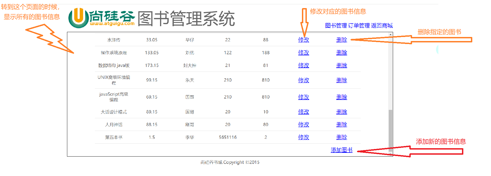

# 相对路径

web 中有绝对路径 和 相对路径
        绝对路径:  http://ip:port/工程名/资源路径
            不能用:     盘符:/目录/文件名

​    	相对路径:       .          当前文件所在的目录
​                   	..       当前文件所在的上一级目录
​                   	文件名     当前文件所在目录的, 相当于./文件名

javaSE 相对路径: 从工程名开始算
        绝对路径:  盘符:/目录/文件名


# 第一阶段

**界面**

## 注册界面
```
<!DOCTYPE html>
<html>
<head>
<meta charset="UTF-8">
<title>尚硅谷会员注册页面</title>
<link type="text/css" rel="stylesheet" href="../../static/css/style.css" >
<style type="text/css">
	.login_form{
		height:420px;
		margin-top: 25px;
	}
	
</style>
	<script src="../../static/script/jquery-1.7.2.js"></script>
	<script type="text/javascript">
		$(function () {
			//绑定单击事件
			//用户名验证
			$("#sub_btn").click(function () {
				//1.获取用户名输入框的内容
				var username = $("#username").val();
				//2.创建正则表达式
				var usernamePatt = /^\w{5,12}$/;
				//3. 验证
				if (!usernamePatt.test(username)) {
					//4. 提示用户结果
					$("span.errorMsg").text("用户名输入有误");
					return false;
				}
				$("span.errorMsg").text(""); //合法后要去掉错误信息

				//密码验证
				var password = $("#password").val();
				var passwordPatt = /^\w{5,12}$/;
				if (!passwordPatt.test(password)) {
					$("span.errorMsg").text("密码格式有误");
					return false;
				}
				$("span.errorMsg").text("");

				//确认密码的验证
				var repwd = $("#repwd").val();
				if (!(password == repwd)) {
					$("span.errorMsg").text("确认密码与密码不一致");
					return false;
				}
				$("span.errorMsg").text("");

				//邮箱验证
				var email = $("#email").val();
				var emailPatt = /^\w{3,12}@\w+.com$/;
				if (!emailPatt.test(email)) {
					$("span.errorMsg").text("邮箱格式有误");
					return false;
				}
				$("span.errorMsg").text("");

				//验证码验证
				var code = $("#code").val();
				//去掉前后的空格
				code = $.trim(code);
				if (code == null || code == "") {
					$("span.errorMsg").text("请输入验证码");
					return false;
				}
				$("span.errorMsg").text("");
			});
		});
	</script>
</head>
<body>
		<div id="login_header">
			
		</div>
		
			<div class="login_banner">
			
				<div id="l_content">
					<span class="login_word">欢迎注册</span>
				</div>
				
				<div id="content">
					<div class="login_form">
						<div class="login_box">
							<div class="tit">
								<h1>注册尚硅谷会员</h1>
								<span class="errorMsg"></span>
							</div>
							<div class="form">
								<form action="regist_success.html">
									<label>用户名称：</label>
									<input class="itxt" type="text" placeholder="请输入用户名" autocomplete="off" tabindex="1" name="username" id="username" />
									<br />
									<br />
									<label>用户密码：</label>
									<input class="itxt" type="password" placeholder="请输入密码" autocomplete="off" tabindex="1" name="password" id="password" />
									<br />
									<br />
									<label>确认密码：</label>
									<input class="itxt" type="password" placeholder="确认密码" autocomplete="off" tabindex="1" name="repwd" id="repwd" />
									<br />
									<br />
									<label>电子邮件：</label>
									<input class="itxt" type="text" placeholder="请输入邮箱地址" autocomplete="off" tabindex="1" name="email" id="email" />
									<br />
									<br />
									<label>验证码：</label>
									<input class="itxt" type="text" style="width: 150px;" id="code"/>
																		
									<br />
									<br />
									<input type="submit" value="注册" id="sub_btn" />
									
								</form>
							</div>
							
						</div>
					</div>
				</div>
			</div>
		<div id="bottom">
			<span>
				尚硅谷书城.Copyright &copy;2015
			</span>
		</div>
</body>
</html>

```


# 第二阶段

实现用户的**注册和登陆**


客户端（浏览器） + JavaEE + 数据库


## JavaEE 三层架构

1. Web 层 （视图展现层）
    	1. 获取请求的参数，封装成Bean 对象
    	1. 调用Service 层处理业务
     	3. 页面回传数据
              	1. 请求转发
                   	2. 重定向

    
    Servlet程序
    
    
    
2. Service 层（业务层）
    1. 处理业务逻辑
    1. 调用持久层保存到数据库

	Spring 框架
	
	
	
	1 个业务1 个方法
	
	
	
3. Dao 持久层（将数据写到数据库） 数据访问层
    1. 只负责与数据库交互（CRUD：Create, Read, Update, Delete)

​	JDBC

​	DBUtils

​	JDBCTemplate

​	


不同的层级有不同的包

| Web 层        | com.atguigu.servlet/web/controller  | Servlet 程序       |
| ------------- | ----------------------------------- | ------------------ |
| Service 层    | com.atguigu.service                 | Service 接口包     |
|               | com.atguigu.service.impl            | Service 接口实现类 |
| DAO层         | com.atguigu.dao                     | DAO接口包          |
|               | com.atguigu.dao.impl                | DAO 接口实现类     |
| 实体Bean 对象 | com.atguigu.pojo/entity/domain/bean | JavaBean 类        |
| 测试包        | com.atguigu.test/junit              |                    |
| 工具类        | com.atguigu.utils                   |                    |


Dao 封装对**数据库的操作**， 不涉及业务逻辑 --- 一张表一个Dao

Service 专注**业务逻辑**， 当涉及数据库操作时，就调用Dao 来实现 

两个层的功能有可能会基本没有区别 


编码流程 不同于 软件设计流程 


写功能是从上往下写

Test 是从下往上测试

## 整体流程

1. 先创建数据库和表

2. 编写数据库对应的JavaBean 对象 

    有一个user类与数据库的表对应

    里面的属性对应于表中的各个列名
    
    设置getter setter constructor toString 这几个部分
    
    
    
    

​	编写之前项目经理应该会有一个Util 工具类

​	编写DAO 层（需要访问数据库）---> 需要编写工具类JDBCUtils

​				-----> 还要写一个BaseDao


3. 🤢 编写JDBCUtils 类 ---> 用于管理数据库的连接池
    1. 获取连接
    2. 关闭连接


​	编写JdbcUtils的测试类，@Test 是要导入这两个包


4. BaseDao 

5. 编写具体的Dao 和测试
    1. UserDao
        1. *为什么这个UserDao 是一个接口？*

​	

​	新的测试方法： 在接口类中，Ctrl + Shift + T 


6. 编写UserService 和测试
7. 编写web 层
    1. 共有两种功能 
        1. 用户登录  用户注册


### JdbcUtils 的编写流程

目的是为了管理数据库的连接池

（1）先写这个类里面需要什么方法

​	a. 获取连接  getConnection()

​	b. 关闭连接 close(Connection connection)

（2）根据这个方法框架来完成整个类的编写


a. 先将返回值全部设为空，只是搭一个框架

b. 导入需要的包

c. 初始化连接

​	1、首先知道需要一个DataSource	

​		使用静态代码块完成初始化

​	2、 使用DruidSourceFactory.createDataSource(）创建连接池

​		 这里就要使用一个properties 对象参数

​	3、 properties 对象需要读取自己的文件 (从流中加载数据)

​		使用load 方法加载一个流

​		流 --  JdbcUtils.class.getClassLoader().getResourceAsStream(路径)

​				这里的路径默认是从src 开始的(不用写 /)

​				properties 放在src 这个目录里面， 和com 在同一级

d. 实现获取连接的方法

e. 实现关闭连接的方法


​				

### BaseDao 的编写流程

BaseDao 里面是为了给其他人进行复用（继承）的， 不用写对象实例

----> 设置成抽象类


使用DbUtils 操作数据库

QueryRunner 


update() : 返回值是影响的行数， 如果是-1 代表是执行失败

​		主要用于Update, Delete, Insert

​	queryRunner.update(); ====>  第三个参数是代表查询语句中的占位符？ 所在的位置， 使用一个可变参数来传


查询返回一个JavaBean 

queryForOne(): 

​		queryRunner.query()	传入一个new BeanHandler<>();

查询返回多个对象

queryForList(): 

​		与一个对象的情况，只有传入的对象不同	new BeanListHandler<>()

查询返回一个值Scalar


ScalarHandler: 表示单行单列的查询结果

BeanHandler:表示把**结果集中的一行数据，封装成一个对象**，专门针对结果集中只有一行数据的情况。

BeanListHandler:表示把结果集中的**多行数据，封装成一个对象的集合**，针对结果集中有多行数据。


<T>List<T> 

第一个T就是振臂一呼，告诉大伙，哥是个类型，以后见到别不认识我。

第一个T 代表是一个泛型，第二个与List 组合在一起的List<T> 代表的返回类型是一个List，这个List 中放的对象类型是T 所指的类型


### UserDao 的编写流程

考虑在网页的访问过程中，与User 相关的**数据库操作**有哪些：

- 注册时：
    - 查询用户名是否存在
    - 将用户信息保存在数据库中
- 登录时：
    - 查询用户名和密码是否正确

​	

### UserDaoTest 的编写方法

测试哪个模块，就在Test 中新建一个对象

然后在方法的对应test 方法中，使用新建的对象来调用要测试的方法

检查方法的输出是否合理


### UserService 的编写流程

Service 是业务层，一个业务一个方法

看这个User 会有哪些方法： 

​	登录

​	注册

​	检查用户名是否存在

​	

### web 的编写流程

注册 的思路： 

​	服务器需要有一个Servlet 程序接收网页上提交的表单请求


​	1、 创建一个Servlet 程序 并 配置好地址

​	2、 修改html 页面上的表单的action 所指的地址（action 里面不带/） 

​			修改base 地址

​			action 是提交表单的时候要发送的地址


<font color="red" size=5>还是不太理解</font>

​	form 里面的action 加/ 和不加/ 表示的是哪里，怎么能够找到servlet程序

​	<font color="darkviolet" size=4>加上/ 之后（例如/testFile)，指的是`http://ip:port/testFile` <br/>	如果不加/ ， 就是`http://ip:port/工程路径/testFile`</font>

​	

​	


## 导入第三方包方法

（1）所有加进来的第三方包，都要放在bookstore(工程目录) -> web -> WEB-INF -> lib 中

（2）加进项目的方法：

a.  Project Structure -> libraries ->  + ->Java -> 找成自己放在lib 中的jar包 -> 修改这个Library 名字 

b. Modules -> 工程名 -> Dependencies -> + -> Library

c. Artifacts -> Fix

d. Apply ✔


## 文件放的位置

（1）所有加进来的第三方包，都要放在bookstore(工程目录) -> web -> WEB-INF -> lib 中

（2）数据库需要的properties 文件，要放在src 这个目录里面， 和com 在同一级

原因：

​	使用了这个方法获取：  Class.getClassLoader.getResourceAsStream(String path) ：默认则是从ClassPath根下获取，path不能以’/'开头，最终是由ClassLoader获取资源。 

​	具体解释：

​	https://www.cnblogs.com/macwhirr/p/8116583.html


# 第三阶段

<font size=5>**优化**</font>

注册失败添加提示信息

改成jsp页面后方便回写提示信息 ---- 方便输出内容


## 改jsp文件

html 页面最上面一行添加page 标签

改成jsp 后缀

​	*按照目录进行替换*


## 抽取页面中相同的内容 


## 动态获取ip 地址

href 里面的地址要用表达式脚本


使用request 对象里面的相应方法，获取地址中的每个部分

​	http, ip, port, 工程路径...


## 显示错误信息


## BaseServlet 抽取

一般一个模块只会使用一个Servlet程序


request.getParameter() 方法可以获取指定name的value值（只要是value指定了，就可以获取）

​	因此，可以用input:hidden 使用不同的value来分出不同的功能


用反射来根据不同的请求得到不同的处理方法

```java
method = servletProgram.class.getDeclaredMethod(methodname, 后面是方法需要的参数(Class.class类型，指明参数是什么类型));
		this.getclass().getDeclaredMethod()
		获取当前类的类型
            
method.invoke(new servletProgram())  意思是调用servlet中的method 方法  
    	invoke(this, req, resp) 使用当前这个对象实例this, 调用方法时需要传入两个参数req, resp
            
```


每一个模块都是：

1、 获取action 参数

2、 通过反射获取对应的方法

3、 通过反射调用方法


## BeanUtils 

数据封装和抽取

一次性将所有的请求参数注入到JavaBean 中

第三方包


BeanUtils.populate(bean对象，传的多个参数构成的map(使用request.getParameterMap()))

注入是靠相应的属性名的setter方法，将参数名改成setXXX() 方法，然后将值设置好

```java
BeanUtils.populate(创建好的一个对象，map值);
工具会利用参数对应的set 方法，将参数值直接设置在传入的对象中（对象会被修改）
  	这行代码执行完成后，对象中的内容会记录上所有的参数信息
```


写的是Map 参数可以在Dao, Service 层使用这个工具

耦合更低	

使用HttpServletRequest 耦合很高


# 第四阶段

<font size="5"><b>使用EL 回显信息</b></font>

EL 表达式在参数值为空时，自动输出空串


# 第五阶段

进行图书模块


## MVC

| view       | 视图   | Jsp/html | 显示界面                    |
| ---------- | ------ | -------- | --------------------------- |
| controller | 控制器 | Servlet  | 处理代码请求，派发页面      |
| model      | 模型   | JavaBean | 将数据封装在一个JavaBean 中 |

最早出现在web 层

目的是为了解耦合

将软件代码拆解成组件，单独开发 


## 开发流程

数据库 ---> JavaBean ---> Dao ---> Service ---> Web

## 数据库

根据要记录的信息，编写相应的表


## JavaBean

根据数据库表的属性， 编写相对应的类

在类有需要的属性 和 对应的方法


## Dao

为了实现页面功能的需要，编写对应的访问数据库的方法


页面功能：

- 页面中显示图书信息

- 添加新的图书
- 删除图书的信息
- 修改已有图书的信息

 


对应需要的数据库方法：(增，删，改，查)

- 列出所有的图书信息
- insert 新的书
- 根据指定书的id 来删除某本书 
- 根据指定书的id，select 查到已有的图书信息
- update 新的值


## Service

根据页面中的功能，编写对应的方法功能


- 显示图书
- 添加图书
- 删除图书
- 改书
    - 改之前，需要先查到已有的图书信息


## Web

Servlet 程序

控制数据的处理

接收前端的请求 -- 发送需要的数据


**Web层的实现是关键**


**一个模块用一个Servlet程序来完成其所有的功能**


在页面上访问图书管理，不能直接去jsp页面中，因为此时页面中还没有数据

​		jsp是属于客户端，不能直接查询数据库

应该向Servlet层发送请求，让Servlet 通过Service 来调用Dao 实现查询数据

Servlet将查到的图书信息保存到Request 域中，通过请求转发带着数据打开jsp页面

​	jsp页面此时再将所有的信息展示出来

​		使用JSTL 标签遍历输出


**如果jsp 页面中不显示servlet 传回的数据，可能是没有导入jstl包**

list 之后的页面没有顶在最上面，有一段的空白


**如果直接访问jsp页面得不到数据，可以先访问Servlet 程序之后再转发**


这里加上/manager 是为了方便之后进行权限管理


前台是给普通用户使用

​	一般不需要权限检查就可以访问的资源或功能

​	

后台是给管理员使用的

​	一般都需要权限检查才可以访问的

​	

通过地址来区分前台，后台


## 页面中的功能

添加，删除，修改，显示页面


### 添加

**添加图书会出现表单重复提交**

​	当用户完成提交请求，浏览器会记录下最后一次请求的全部信息

​	当用户按下F5就会发起浏览器记录的最后一次请求----添加操作

​		因此需要使用重定向转发到显示图书的界面

```java
resp.sendRedirect()
```

请求转发/ 是表示工程路径

重定向/ 是表示端口

因此地址需要添加一个工程名

```java
resp.sendRedirect(req.getContextPath() + "/manage/bookServlet?action=list");
```


重定向之后，再按F5之后，最后一次请求就是list 这个请求，不会是add+list

在使用请求转发的时候，add + list 是在一次请求中完成的，因此浏览器保存最后一次请求的所有信息，会包括add 这一步

而在使用重定向时，add 是第一次请求，list 是第二次请求，浏览器保存最后一次请求的所有信息，就是第二次发起的list 请求

​	这个时候按下F5，他只会执行list 这一步操作，而不会执行第一步的add 步骤


### 删除


### 修改

先要查找书的具体信息， 向BookServlet 请求id值对应的书的信息

带着查询结果返回到book_edit.jsp页面


#### 区分update 和addNewBook

由于update 和addNewBook 都会转到book_edit.jsp 这个页面

因此，应该区分这两种情况


方法1：

```jsp
主页
<td><a href="manager/bookServlet?action=getBook&method=update&id=${book.id}">修改</a></td>
<td><a href="pages/manager/book_edit.jsp?method=add">添加图书</a></td>
```

```jsp
edit页面
<input type="hidden" name="action" value="${param.method}">
```


方法2：

```jsp
<input type="hidden" name="action" value="${empty param.id ? "addNewBook" : "updateBook"}">
```

方法3：

```jsp
<input type="hidden" name="action" value="${empty requestScope.book ? "addNewBook" : "updateBook"}">
```


### 分页

一次加载所有的数据会很慢

需要一个Page类来显示分页的界面


当前的页码

总页码

当前页码的所有数据

每页的显示数量

总数量


| 属性      | 获取方法                                  |
| --------- | ----------------------------------------- |
| pageNum   | 客户端传递                                |
| pageSize  | 客户端传递（自定义）                      |
|           | 页面布局决定                              |
| totalNum  | sql 语句查询                              |
|           | select count(*) from bookinfo;            |
| totalPage | totalNum / pageNum 取上整                 |
| item      | sql                                       |
|           | select * from bookinfo limit begin, size; |
|           | begin = (pageNum - 1) * pageSize          |
|           |                                           |


#### Long 转int

由于sql 语句查Count之后会是Long 类型，因此需要转成int 

Long 与Integer 之间没有任何继承关系，因此不能直接强转

先转成Number， Number 与Integer之间是继承关系

再调用Number的intValue()方法 即可转为int

```java
num1 = queryForScalar(sql) ---> 编译类型是Object ---> 运行类型是Long
num2 = (Number)num1 ---> 转成Number类型
num2.intValue();	----> 转成int类型
```


#### 获取地址栏地址

JavaScript 有一个location 对象，其中href属性可以获取地址栏的地址

href属性可读可写

赋值就是页面跳转


#### 前端页面页码合法检查

1。 上一页的按钮处理


2。 页码超范围的时候不跳转


#### 服务器页面页码合法检查

页码检查是一个常用的方法

因此可以考虑将其放在Page 类中，每次使用Page进行分页的时候都会检查页码的范围是不是合理


页码 < 1 

​	跳到第一页

页码　> 总页码

​	跳到最后一页


#### 多个页码显示


#### 添加功能

返回的地址永远设置成当前总页码数 + 1


#### 删除／修改

返回地址是修改时的所在页码


#### 优化

可以将请求地址抽取成类的一个属性


在商城首页的分页条和管理界面的分页条，可以是一个分页方式 --- 因此可以做成一个共同的模块


### 价格搜索

调用Service --> sql 语句 -- List

保存到Request域中 ---- 将List 传回页面 -- 分页显示


带有排序 -- 排序放在limit 前面

```sql
select * from bookinfo where price between min and max order by price limit begin, size;
```


价格回显在输入框中

其他页中不会显示价格区间内的物品 以及 输入框中不会回显

类中设置url属性的时候，要带上min max 参数值


# 第六阶段

## 登录

页头显示登录号或个人昵称

保存到Session域

> **Session中经常用来保存用户登录的信息**


## 注销

将Session 域中的信息删除 或 销毁Session 对象 

**重定向**到登录界面 或 首页


## 表单重复提交 

三种常见情况：

1。提交完表单 -- 服务器使用请求转发进行页面跳转， 这个时候用户按下F5，浏览器会根据最后一次的缓存发送请求

​	解决：使用重定向来进行跳转

2。用户正常提交服务器，但由于网络延迟等原因，迟迟未收到服务器的响应。这个时候，用户以为提交失败，多次点击 提交 按钮

​	重定向不能解决

3。用户正常提交，服务器也没有延迟，但提交完成后用户回退浏览器重新提交，也会造成表单重复提交 


### 解决方法 --- 验证码

1。用户第一次访问表单的时候，就要给表单生成一个随机的验证码字符串

2。把生成的验证码保存到Session域中

3。把验证码生成为验证码图片，显示在表单中


服务器：

1、获取Session 域中的验证码，并删除Session中的验证码

2、获取表单中的表单项信息

3、比较Session中的验证码和表单项中的验证码是否相等

第一次发送后，由于删除了Session域中的验证码，这个时候重复提交后，第三步的比较不会成功，就会阻止多次的重复提交 


#### 谷歌验证码（第三方）使用方法

kaptcha

1、导入包


2、配置第三方的Servlet 程序


访问这个url，就会

- 随机生成一个验证码
- 生成验证码图片
- 保存到Session域中

3、在表单中使用img标签来显示验证码图片，并使用

调整框的大小的属性设置（style）：

```html

```

4、在服务器**获取**谷歌生成的验证码和客户端发送过来的验证码，**比较**使用

获取保存在Session域中的参数（参数名是第三方库中给好的）：


```java
req.getSession().getAttribute(KAPTCHA_SESSION_KEY);
```


获取后立刻删除：

```java
req.getSession().removeAttribute(KAPTCHA_SESSION_KEY)
```


获取表单项中用户填写的验证码，比较


### 点击切换验证码

绑定单击事件

重新调用url

```javascript
this.src = "${basePath}Servlet程序中设置的url"	
```

在事件响应的function 中， 有this 对象， 是正在响应的事件的dom对象

这里事件是点击图片，因此，这个时候this就是img标签

src 属性是表示验证码img标签的图片路径，可读可写

​	可写：赋值就是修改

​	赋值之后就会发起一次请求


有的浏览器点击只会重新加载一次：

浏览器会进行缓存

下次发一样的请求的时候，就会直接将上次响应的内容从缓存中取出来 --- 这样就不会再去请求了，还是上一次请求获取得到的照片


解决：（跳过浏览器的缓存）

缓存由最后的资源名和参数组成

这样在参数中加入一个每次都随机生成的一个键值对  ====> 加一个时间戳

```jsp
"?d=" + new Date();
```


## 购物车

购物车类：

| 属性       | 内容               |
| ---------- | ------------------ |
| totalCount | 购物车中的商品总数 |
| totalPrice | 总金额             |
| items      | 购物车中的东西     |
|            | 类别是商品对象     |

商品类：

| 属性       | 内容         |
| ---------- | ------------ |
| id         | 编号         |
| name       | 名称         |
| price      | 单价         |
| totalPrice | 单个商品总价 |


### 版本类型

**Session版本**

​	购物车信息保存到Session域中


数据库版本

​	购物车信息保存到数据库中


Redis + 数据库 + Cookie

​	使用Redis 和 Cookie来缓存，使用数据库保存


### 功能分析

购物车的功能：全部放入CartServlet 程序中

​	加入购物车


​	删除商品项


​	清空购物车


​	修改商品数量


结账 --- 不属于购物车的模块

​	会跳出一个新的支付的界面 --- 属于订单模块


### 使用的是Session版本

没有与数据库交互，因此没有Dao层

Session 是web层的API,因此也不需要Service 层

增删改查 是放在购物车类中的方法

Servlet程序中的方法， 是直接调用类中的方法来实现 


### Bean

1、 写属性 
	商品类

​	购物车类


2、 在购物车类中写相关的功能方法

添加商品时，不能直接加入到列表中 ---- 如果有添加多个相同的商品，会直接在后面加上一个新的商品，不会增加商品数量

添加之前先查看是否有添加相同的商品，如果已经存在了，就更新总金额

​		如果没有，再直接放入列表中

​	查看：**根据商品的id来搜索**列表 =====> 将商品列表改成Map<id, 商品>


### Servlet 程序

添加商品时，购物车的信息保存在Session域中

每次加入新的商品的时候，都判断一下Session中是否有cart

​	如果有，就直接向购物车里面添加商品

​	否则就创建一个购物车之后再去添加

====== > 只有一辆购物车


重定向回的页面，应该是跳回原来的地址

​	将请求时的地址也发送到服务器  =====  服务器也获取到请求的地址 

​	HTTP协议中， 有一个请求头是<font color="red">referer</font>，会在请求发起时，将请求地址发送给服务器

```java
request.getHeader("Refer");
```


还应该带上一些原来页面的参数 （筛选条件， 页码 。。。）


删除后，重定向回原来的购物车界面

点击删除后，出现删除提示框：

```java
先写页面加载完成之后，再绑定单击事件，之后再去写具体的功能函数
$(function() {   -----> 页面加载完成后执行该代码
	$().click(function() {   -----> 点击指定标签时执行
    	具体执行的代码；
        return confirm("提示框的"+ $(this).parent().parent().find("td:first").text() +"提示信息");
                          this 是获取标签的dom对象
                              parent() 是获取当前标签的父标签
                              find("子标签信息， 可以是各种选择器") 是找当前标签的下的子标签
                              td:first	找第一个td标签
                              text() 获取当前标签的文本w
	});
});

```


### 前端页面

先给加入购物车绑上单击事件

$(this).attr("获取自定义属性名的值")

```html
$(function() {
	$("标签名.class名").click(function() {
		通过location.href = http..... 来修改请求地址
		点击这个按钮后，就会向href 中设置的地址发送请求
	

		this 对象就是当前事件响应的dom对象，
					dom 对象就是点击哪个按钮，就是那个按钮所在的标签
					点击click 指定的对象，this就指向了这个标签
		

		$(this).attr("bookId"); 
		$(this).attr("属性名")		可以根据属性名来取出标签中相应属性名的值
	});
})
```


Map 类型的items，key 是id，值是CartItem

​	用entry.value 可以取出CartItem 这个对象

​	然后根据对象中的属性名来取出属性对应的值


使用Session方法实现购物车，当重启浏览器后，就不会再有数据了


### 修改商品的数量

捕捉鼠标离开输入框 --- 判断当前输入框的内容是否发生了变化  ---  提示用户是否进行修改

```javascript
$("标签定位信息").blur(function() {  失去焦点blur事件 -- 捕捉鼠标离开输入框	
    							onchange事件 -- 内容发生改变时才会发生响应 （最好使用onchange， 如果使用blur 事件，就需要自己判断值是否发生了变化)
    
    if( confirm("提示"+ $(this) 进行取值 +"信息") ){
        
    } else {
        this.value 会指向当前标签的value值
        this.value = defaultValue;  --- 恢复成原来的值
        defaultValue 是表单项dom 对象的属性， 默认的value 属性值
    }
	

});
```


取消 -- 恢复原商品数量

确定 -- 给服务器发送请求，保存修改

​				id， 数量


### 加入购物车后回显


将书名加入到Session中或者在Cart 类中增加记录最后添加图书的属性


# 第七阶段

## 订单模块

点击  去结账


订单类

| 订单号   |      |
| -------- | ---- |
| 价格     |      |
| 订单状态 |      |
| 下单时间 |      |
| 用户id   |      |
|          |      |


订单项类

| id         |      |
| ---------- | ---- |
| 名称       |      |
| 单价       |      |
| 数量       |      |
| 总价       |      |
| 所属订单号 |      |


### 功能分析

生成订单


查看所有订单(管理员)


修改订单状态（管理员）


查看订单详情


查看自己的订单（用户）


收货（用户）


一个Java类一个Dao


自增长的属性在写sql的时候可以不写 

```
insert into bookinfo (`name`, `author`, `price`, `sales`, `stock`, `img_path`) values ("test", "jack", 122, 39, 10, null);
```


数据库 -- dao -- Service -- Servlet -- html

..	-- testdao -- testservice -- .. -- ..


订单号 保证唯一的方法

```java
System.currentDateMillis() + "" + userId
```


将购物车的项转化成订单项，保存到数据库


结账的时候，还需要修改库存和销量的显示问题

​	Service层要调用BookDao来实现修改图书的操作


# 第八阶段

实现Filter权限检查


Filter的url 中可以设置多个拦截地址


与ThreadLocal 组合

## ThreadLocal

用于解决多线程数据安全的类

ThreadLocal 可以给当前线程关联一个数据（数据可以是变量，对象，数组，集合等）


ThreadLocal 的特点：

- 可以为当前线程关联一个数据，可以**像Map一样存取数据**，只不过key 是当前的线程
- 每一个ThreadLocal对象**只能为当前线程关联一个数据**，如果要为当前数据关联**多个数据**，就需要创建**多个ThreadLocal实例**
- 每个ThreadLocal对象实例在定义的时候，都是**static** 类型
- ThreadLocal中保存的数据在**线程销毁后会由JVM自动释放**


ThreadLocal可以为当前线程关联一个数据

像Map一样

Hashtable 是线程安全的

ConcurrentMap 用于高并发，也是线程安全的


````java
ThreadLocal<要关联的数据类型> 
    自动将该数据与当前的线程进行关联
````

TreadLocal.remove() 删除threadLocal 关联的对象


数据库的事务：

让订单和订单项的保存成为一次性操作

```java
Connection conn = JdbcUtils.getConnection();

try {
    //创建事务, 手动提交 
	conn.setAutoCommit(false);

	conn.commit();  //手动提交事务 

} catch(Exception e) {
	conn.rollback();
}

```

确保所有操作，要么都成功，要么都失败，使用一个事务进行操作

必须使用一个Connection对象，才能保证所有的操作是在一个事务内


确保所有的连接使用一个Connection对象 ：

使用ThreadLocal 保存下Connection对象 --- 在同一个线程下进行


事务 -- ThreadLocal -- 线程


数据库操作之后先不用关闭连接，等到整个事务内的操作都执行完成后再commit 时再关闭

Dao 中的异常需要往上层抛，让外层捕捉之后，执行回滚的操作


Dao层不能再有关闭连接的操作，只能交到commit 或 rollback 操作时进行


需要考虑哪些情况需要使用同一个连接中的事务	 


## 使用Filter给所有Service方法加上try-catch

每个Servlet程序中都会有很多的Service方法，不是直接在这些方法每一个上面加Try-catch

​	使用Filter过滤器给所有的Service方法加上try-catch

doFilter() 方法起到的作用：

1. 找下一个过滤器
2. 调用相应的资源


对所有的地址都进行Filter，就会在调用每个Servlet程序的时候都会执行一次Filter 程序，然后再调用action=？ 中的相应方法。实现了try-catch所有的Servlet程序


## 让Tomcat展示所有的异常界面

在web.xml 中，可以通过错误页面配置来进行管理


服务器出错后，自动跳转到指定的页面：

```xml
<error-page>
    <!-- 错误的类型码 -->
    <error-code>500</error-code>
    <!-- 要跳转的页面 -->
	<location></location>
</error-page>
```

Filter中一定要把Exception抛出去


# 第九阶段

使用Ajax 

## 验证用户名是否可用


在输入框中输入了用户名后，鼠标移出输入框，就向Servlet发送一个Ajax请求，判断这个用户名是否可以使用

Servlet：

1、获取请求参数

2、调用Service方法来判断这个用户名是否可用

3、将判断结果用Map的方式来回传给页面


页面上根据回传的结果来展示这个用户名是否可用


发送Ajax请求的时候，由于是在JQuery中发送的请求，因此，还没有点击提交按钮，后台没有发送这个标签

所以，在JQuery中，要在发送Ajax请求时，要将需要的参数都放到参数列表中，然后再使用$.getJSON(url, "参数列表", callback);


## 把商品加入到购物车

原来是在点击了加入购物车按钮后，将整个页面发送到后台进行处理

最后是需要重定向来返回页面


使用Ajax只是将数据保存到Json形式，返回这个Json数据


# 剩余：

- [x] 购物车 --- 2 - 1 = 1 - 1 = 0
- [x] 订单 ----  7
- [ ] Filter ---- 5 - 2 = 3
- [ ] Ajax ----  2

