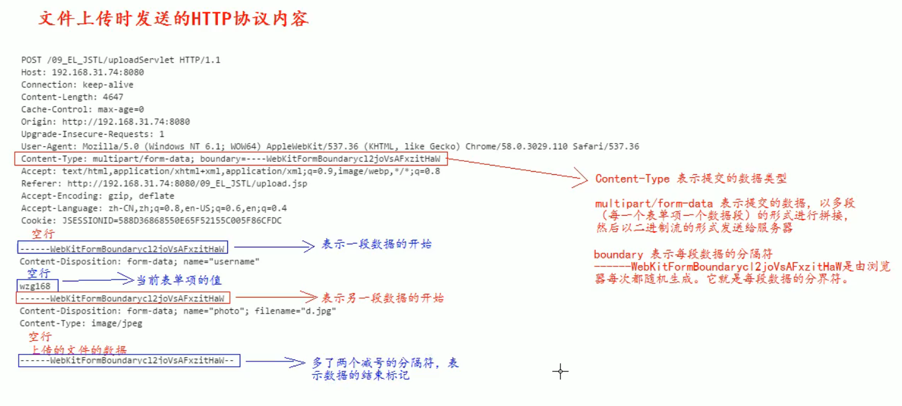

# 过程

要有一个form 标签

method=post

form 标签的encType编码属性值必须为multipart/form-data

​	表示提交的数据以**多段**的形式进行拼接，然后以二进制流的形式发送给服务器

​			每个表单项一个数据段

​	

在form 标签中使用input type=file 添加上传文件

编写服务器代码接收，处理上传的数据

​	先使用Servlet 接收


# HTTP 协议

content-type 中的boundary表示每段数据的分隔标志，表示一段数据的开始

​	这个值是由浏览器每次随机生成的


一个空行后面就是请求体，这个请求体里面就是多段的数据

空行下面的第一行是一个boundary符，表示一段数据的开始


每个键值对（表单项）下面会有一个空行，空行下面的就是这个表单项的值

如果上传的是一个文件，浏览器不会直接显示在这个值，就会只显示一个空行


boundary 后面多两个--  的表示是一个结束符, 而不再是一个开始符了




# 服务器处理

## 接收数据

以 **流** 的形式进行接收

如果使用getParameter() 得不到传过来的数据


```java
byte[] buffer = new byte[1024];  //可以调整不同的空间大小来接收数据
request.getInputStream().read(buffer);
```


## 解析数据

commons-fileupload.jar 这个第三方包可以直接拿过来使用相应的API处理数据

这个jar包依赖commons-io.jar 


1、 导包

2、 常用的类

| ServletFileUpload |                             | 用于解析上传的数据                                   |
| ----------------- | --------------------------- | ---------------------------------------------------- |
|                   | isMultipartContent(request) | 判断数据是不是multipart类型                          |
|                   | parseRequest(request)       | 解析上传的数据，类型是List\<FileItem>                |
|                   |                             | FileItem表示每一个表单项                             |
| FileItem          |                             |                                                      |
|                   | isFormField()               | 判断当前表单项是否是普通的表单项，还是上传的文件类型 |
|                   |                             | true 表示普通的表单项，false 表示文件                |
|                   | getFiledName()              | 获取表单项的name 的属性**值**                        |
|                   | getString("uft-8")          | 获取当前表单项的**值**                               |
|                   |                             | 使用utf8编码                                         |
|                   | getName()                   | 获取上传的*文件名*                                   |
|                   | write(file)                 | 将上传的文件写到参数file 所指向的磁盘                |
|                   |                             |                                                      |


1, 先判断是不是多段数据，只有多段数据才是上传的相关内容

2, 要使用parseRequest() 方法解析数据，就要先创建一个ServletFileUpload 对象

3, 而创建一个ServletFileUpload 对象需要用一个FileItemFactory 来创建

4, FileItemFactory 这个工厂可以由DiskFileItemFactory 这个类实现

5, 解析完之后要逐个判断每一段数据是不是普通的表单项
