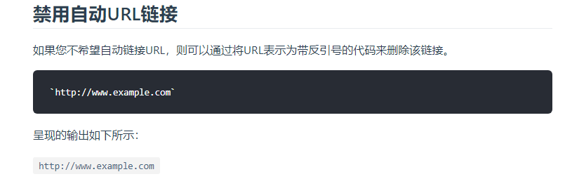

# 标题语法

=====
不同的程序对# 和" "的处理方式不一样
为了兼容, 应该在# 之后加一个" "

## 1.

可以使用# 来表示标题级别
最多可以用6 个# 来表示六级标题

## 2.

在字的下面使用若干个= , 可以表示 "一级标题"
在字的下面用若干个- , 可以表示 "二级标题"

# 段落语法

使用空白行分开段落

不要使用 空格 或 Tab 来缩进

# 换行语法

1. 在一行的末尾添加两个以上的空格, 之后使用回车即可创建一个换行(结尾空格)
2. 在行尾添加 `<br>` 也可以实现换行

!如果在行的末尾不使用两个以上的空格而只按一次回车, 还是在同一行(两次回车是分段)

# 强调语法

## 粗体

在单词的前后各添加 两个**或是两个__
建议使用两个** 来进行加粗

## 斜体

在单词前后各添加一个* 或是一个_

## 加粗和斜体

在单词的前后各添加三个* 或是三个_
***优先使用*, 而尽量不用_ ***

# 引用语法

创建块引用===> 在段落前加个一 >

如果块引用包括多行, 应该给中间的空白行也加上 >

## 嵌套引用

在要嵌套的段落前 加上  >>

## 其他的

Markdown 的其他语法可能可以引用, 需要自己实验

# 列表语法

## 有序列表

每个列表项的前面添加一个数字和一个英文句点
数字不用按顺序, 但列表在显示时是按 顺序排列的
可以嵌套多级, 只用在嵌套的行前打4个空格 或者 是一个Tab

## 无序列表

每个列表项前加上  - 或 * 或 +

### 注意

***如果想保持列表的连续的同时还加入其他的元素, 应该在新元素的前面打4个空格或是1 个制表符***
***列表可以是有序和无序互相嵌套***

# 代码块

将代码放在  `` 之间
`

    #include<stdio.h>

`

每个` 的前面或者是后面, 得跟一个空行, 不然不是代码块

每行的代码前都要有4个空格或是1 个制表符
如果代码块是放在了列表中, 应当将缩进改为2倍

## 围栏式代码块

使用三个``` 或是 三个~~~
语法突出显示:　可以在第一行的反引号旁边加上 指定的语言名字

```json

```

# 分隔线语法

在一行上使用三个及以上的 ***, ---, ___
在分隔线符号的前后各添加一个空白行

# 链接语法

链接文本放在中括号中, 链接地址放在后面的括号中, 链接的 title 是可选的
[链接显示名字](超链接地址 "title")
title 是鼠标放在链接上时会显示的文字
他与超链接地址之间要用 空格 分隔

网址和Email 地址
使用<> 可以将url 或者email 变成可以点击的链接

若想**强调链接**, 要在 *中括号之前, 小括号之后*添加 强调的语法

要将链接表示变成 **代码**, 应该在 中括号 里面添加反引号
[`code`]

引用类型链接分为两个部分:

1. 与文本保持内联的部分
2. 存储在文件中其他位置的部分

# 图片语法

1. !
2. 方括号内增加替代文本
3. 图片链接放在圆括号内
4. 括号里的链接后可以增加一个可选的图片标题文本

eg: 

给图片增加链接:  将图片的markdown 放在方括号里, 然后将链接放在圆括号中
eg: [] ("链接")

# 转义字符

# 表格

使用3个以上的---, 创建标题

| id           | name             |
| ------------ | ---------------- |
| 123124141231 | hsp educationnal |
| 2            | jack             |

表格中的单元格可以随意调整宽度, 渲染的结果是一样的

## 对齐

在标题行中的连字符的左侧和右侧添加 :, 将列中的文本对齐到左侧 | 右侧｜中心
|:--|  ====>  左对齐　　
|--:|  ====>  右对齐
|:--:| ====>  中心对齐

使用 html 语句中的 &#124 来在表格中显示 | 字符

```json
{
    "first":"jack",

}

```

# 脚注

添加注释和参考

# 删除线

在单词的前后各加两个波浪线 ~~

~~sou dfaf afsdafasd fa  f~~

# 任务列表

带有复选框的项目列表
前有- 和 []
注意 在[] 前有空格
如果想复选, 在方括号中加一个x

# emoji

使用表情符号的简码
在单词的前后加上 :

可能有的编辑器不支持

# 自动链接

使用  来禁止自动链接

否则markdown 可能会自动的将复制的url 转成链接形式

# 数学公式

用两个$$ 来连接
