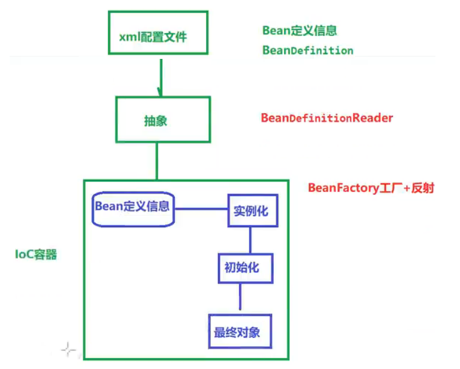
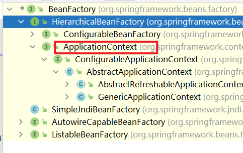
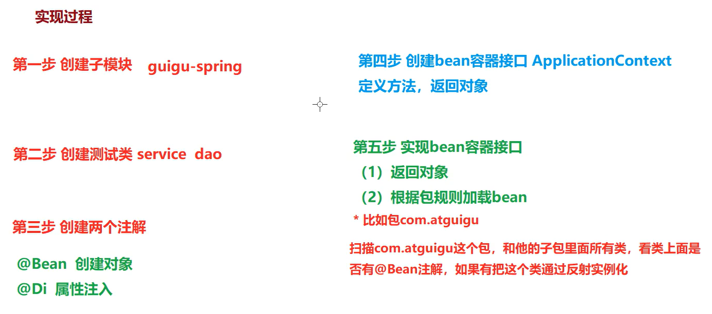
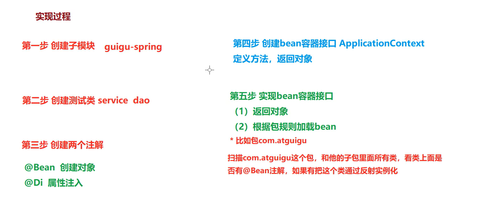
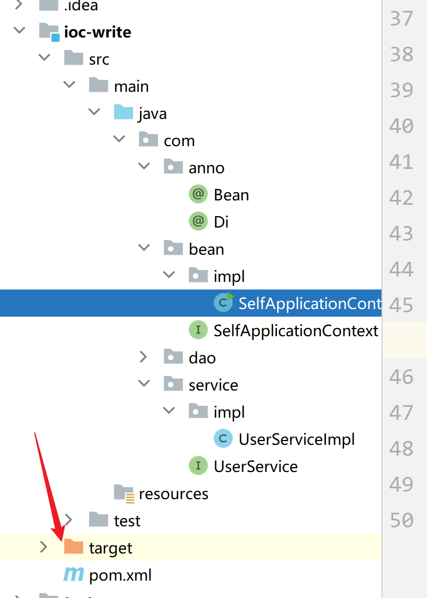

# 概述

是一种<font color="red" size=5>设计思想</font>，可以设计出松耦合的优良程序

Spring通过IOC容器管理所有Java对象的实例化和初始化，控制对象与对象之间的依赖关系

​	A 类对象调用B 类对象中的方法，不需要再去new B() 之后再去调用方法了，而是改成由IOC容器进行管理

​	

IOC管理的Java对象是Spring Bean 


IOC容器：

​	管理容器内的对象的生命周期中的完整过程


告诉IOC我要创建什么对象，我需要维护一个什么样的关系，具体的实现由IOC容器去完成


容器中放的是Bean对象， 使用的是Map集合

​	key-value 是很方便完成存-取操作


## 原理

1、在xml中写好需要的Bean定义的相关信息

2、通过 BeanDefinitionReader 接口来进行读取

3、在IOC容器中就会加载一个Bean定义信息，通过BeanFatory 和 反射 来进行实例化，并进行初始化之后可以得到最终对象




## 依赖注入

DI：实现了控制反转

Spring 在创建对象的过程中，将<font color="red" >**对象依赖属性？？？？？**</font>通过配置进行注入

​	**什么是对象依赖属性？**

依赖注入：在创建对象的过程中，给属性设置值


两种常见的注入方式：

1、 set

​	

2、 构造注入

​	


## Bean管理

**对象的创建过程**以及**属性的注入**合在一起称为Bean管理 


BeanFactory工厂 

IOC最基本的实现，是Spring内部使用的，开发者并不能使用

用户需要使用该接口的子接口ApplicationContext  



 子接口中的实现类：

| 方法                            | 内容 |
| ------------------------------- | ---- |
| ClassPathXmlApplicationContext  |      |
| FileSystemXmlApplicationContext |      |
| ConfigurableApplicationContext  |      |
| Web                             |      |


### 基于XML 管理bean

**父工程中写的xml 配置文件，子模块中的xml 中就不用再写了**


搭环境：建模块，配置xml文件


#### 获取bean的三种方式

三种方式获取到的bean 是同一个bean

1、根据id 获取 

```xml
<bean id="自定义id" class="全类名"></bean>
```

```java
ApplicationContext context = new ClassPathXmlApplicationContext();
context.getBean("id 值");
```


2、根据类型获取

```java
context.getBean(User.class);
```


3、根据id 和类型获取

```java
context.getBean("id值", User.class);
```


根据类型获取bean 时

1：IOC 容器中指定类型的bean有且只能有一个（不能在xml 中给一个class 配置多个不同的id 的bean 标签）

2：对于一个接口，根据接口.class 获取，如果只有一个实现类，可以获取bean （使用instanceof判断是不是一个接口的实现）

​			如果有多个实现类，无法获取bean

a instanceof b 判断a 是不是b 类的一个实例


#### 依赖注入

类里有属性，创建对象过程中，给属性设置值

1、 使用setter 注入

创建类，并设置set方法

在Spring配置文件中配置 

```xml
<bean id="自定义值" class="全类名">
	<property name="属性名" value="给属性值"></property>
  	会自动调用类中的setXxx() 方法
</bean>
```


2、 使用构造器注入

```xml
<bean id="" class="">
    根据属性名和value 来调用构造器
	<constructor-arg name="" value=""></constructor-arg>
    
    <constructor-arg index="" value=""></constructor-arg>
</bean>
```

如果在xml 文件中创建了set方法的注入，在加载xml 文件时会自动执行一次参构造器


3、 特殊值注入

- 字面量赋值 -- 会将标签中的value 属性当作是一个字面量

- null 值 -- 在property 中写一个null 子标签(两种方法都可以)

`<property name="属性名"><null></null></property>`

`<property name="属性名"><null/></property>`

- xml 实体

`&lt;` 等进行**转义**

- CDATA节

在CDATA 区中可以写特殊的需要转义的符号

```xml
<property name="">
	<value><![CDATA[a < b]]></value>
</property>
```


4、 特殊类型的属性注入

1）对象类型

- 引入外部bean

创建两个类的对象 : dept 和 emp

在emp 的bean标签中，使用property 引入dept 的bean

```xml
<bean id="" class="">
	<property name="对象属性名" ref="类在bean 中的id值"></property>
</bean> 
```

就会调用在xml 中创建的外部bean


- 内部bean

将想引用的类的bean 标签写在当前的bean 标签里的property 标签中

```xml
<bean id="" class="">
	<property name="对象属性名">
    	<bean id="" class="">
        	<property name="" value=""></property>
        </bean>
    </property>
</bean> 
```


- 级联属性赋值

 给引用的bean 的类的属性进行赋值

```xml
<bean id="" class="">
	<property name="对象属性名dept" ref="类在bean 中的id值"></property>
    <property name="dept.dname" value="新的值"></property>
</bean> 
```


2）数组类型

```xml
<property name="数组类型属性名" >
	<array>
    	<value>第一个元素</value>
        <value>2</value>
    </array>
</property>
```


3）集合类型

- List类型 

```xml
<property name="集合类型属性名">
	<list>
		<ref bean="外部类id">list 中第一个对象类型元素</ref>
		<ref bean="外部类id">list 中第二个对象类型元素</ref>
        如果是字符串类型，可以直接使用value 标签中写值即可
        <value>值</value>
    </list>
</property>
```


- Map类型

```xml
<property name="map 属性名">
	<map>
    	<entry>
        	<key>map 中的key</key>
            
            map 中的value
            <value></value>
            或 
            <ref bean="外部类id"></ref>
            
        </entry>
    </map>
</property>
```


数组类型和集合类型，相当于把value 和 ref 标签从property 中拿出来，构成多个值


4）引用集合类型的bean

使用标签util:类型 定义集合类型的属性值

util:list 标签中的id 值与注入时引用的值是一样的


**util 标签会报红的原因：**

schema约束中没有util 这个标签的约束

引入这个相应的命名空间就可以使用util 这个标签了

```xml
1。 在文件头的beans 标签中，加入相应的属性

xmlns:uti="http://www.springframeword.orgschema/util"

2。 然后在xsi:schemaLocation 属性中，加上util 需要的链接
"http://www.springframework.org/schema/util/spring-util.xsd
http://www.springframework.org/schema/util
"
```


#### p命名空间

xmlns:p 

p用来避免标签中属性名字的冲突


在注入的时候，不用property 子标签进行属性设置

改用在bean 标签中，加上标签属性p:类的属性名="属性值"


通过使用p:属性名来完成属性的注入

如果是一个对象类型的值，就需要在属性名后加上-ref

```xml
p:teacherMap-ref="teacherMap"
```

这时，等号的右边写得就是id值


#### 引用外部属性文件

所需要的特定固定值放在一个外部文件中

引用外部文件后做到属性注入


之后做修改的时候，只用改外部文件中的内容，而在spring 的配置文件中不会再发生改动


在spring 中只需要引用


数据库场景：

- 引入数据库相关依赖

```xml
    <dependencies>
        <!-- MySQL驱动 -->
        <dependency>
            <groupId>mysql</groupId>
            <artifactId>mysql-connector-java</artifactId>
            <version>8.0.30</version>
        </dependency>
        <!-- 数据源 -->
        <dependency>
            <groupId>com.alibaba</groupId>
            <artifactId>druid</artifactId>
            <version>1.2.15</version>
        </dependency>
    </dependencies>
```


- 创建外部属性文件

```properties
jdbc.user=root
jdbc.password=root
jdbc.url=jdbc:mysql://localhost:3306/spring?serverTimezone=UTC
jdbc.driver=com.mysql.cj.jdbc.Driver
```


- 在spring配置文件中引入**context 命名空间**引入属性文件，使用表达式完成注入

改文件头信息，引入命名空间

使用命名空间中的context 标签

```xml
<contex:property-placeholder location="classpath:jdbc.properties">
表示将类路径下的jdbc.properties 文件引入进来</contex:property-placeholder>
```

注入

```xml
<bean id="" class="">
    //可以从配置文件中读入url
	<property name="url" value="${jdbc.url}"></property>
</bean>
```


#### bean 的作用域

可以使用bean 标签中的scope 属性来指定bean 的作用域

singleton  单实例 （默认）

​		在IOC 容器初始化的时候创建

​		`ApplicationContext context = new ClassPathXmlApplicationContext("xxx.xml")` 执行时就会创建实例化对象

prototype  多实例

​		在获取bean  的时候创建 

​		`context.getBean()` 获取bean 的时候才会创建 


WebApplicationContext 环境中，另有两个作用域：

request

session 


#### bean 的生命周期

生命周期：bean 对象从创建到销毁的时间长度

1、bean对象创建（调用无参构造器）

2、给bean设置相关属性

3、bean 后置处理器

4、对bean 对象进行初始化（调用指定的初始化方法）

​	bean 标签中有属性init-method 

5、后置处理器

6、创建完成，可以使用

7、销毁（配置销毁的方法）

​	bean 标签中的属性destroy-method

​	`context.close()` 不能用接口ApplicationContext，用实现类

8、IoC 容器关闭


后置处理器:

类实现BeanPostProcessor 接口

接口里有两个方法

postProcessAfterInitialization， postProcessBeforeInitialization


xml 文件中配置后置处理器

​	把这个实现了接口的类放入到xml 中，和其他的类一样的加入方法

​	后置处理器是针对所有的bean都生效


#### FactoryBean

spring 中的一种机制

类MyTest实现接口FactoryBean<泛型>

接口有两个方法


配置这个类后，会返回的对象不是MyTest 的对象，而是由接口中的方法getObject() 返回的对象


常用于整合第三方框架 


#### 基于xml 的自动装配

自动装配：注入过程自动实现

简化注入


bean 标签中有属性autowire="" 可以根据类型，也可以根据名字注入

byType, byName

 

根据类型进行自动装配：

在Controller 类里有属性UserService，在注入的时候，会根据这个类型去xml配置文件中去到对应的对象进行注入

如果没有可以匹配的bean来给属性赋值， 这个属性的值就会置为null

如果有多个可以匹配的bean，就会抛出异常

​	因此要保证可以注入的bean对象唯一

 


根据名称进行自动装配：

要保证在xml 配置文件中，对应的bean对象的id与类中的属性名一致


### 基于注解的bean管理

注解：代码中的特殊标记

在运行时被处理，不改变

格式： @注解名称(属性1 = 属性值...)


类，属性，方法上都可以加注解


可以简化xml 配置


#### 创建bean对象，自动装配的步骤：

##### 1、引入依赖


##### 2、开启组件扫描

在xml 配置文件中，开启注解管理bean


先加入命名空间context


基本扫描：

```xml
<context:component-scan base-package="包名"></context:component-scan>
```

base-package 能扫描包以及子包下的所有的类

在类上使用了注解之后就可以进行相应的功能


可以指定排除规则：（exclude-filter)

```xml
<context:component-scan base-package="com.atguigu.spring6">
    <!-- context:exclude-filter标签：指定排除规则 -->
    <!-- 
 		type：设置排除或包含的依据
		type="annotation"，根据注解排除，expression中设置要排除的注解的全类名
		type="assignable"，根据类型排除，expression中设置要排除的类型的全类名
	-->
    <context:exclude-filter type="annotation" expression="org.springframework.stereotype.Controller"/>
        <!--<context:exclude-filter type="assignable" expression="com.atguigu.spring6.controller.UserController"/>-->
</context:component-scan>
```


只扫描特定组件：（use-default-filters)

```xml
<context:component-scan base-package="com.atguigu" use-default-filters="false">
    <!-- context:include-filter标签：指定在原有扫描规则的基础上追加的规则 -->
    <!-- use-default-filters属性：取值false表示关闭默认扫描规则 -->
    <!-- 此时必须设置use-default-filters="false"，因为默认规则即扫描指定包下所有类 -->
    <!-- 
 		type：设置排除或包含的依据
		type="annotation"，根据注解排除，expression中设置要排除的注解的全类名
		type="assignable"，根据类型排除，expression中设置要排除的类型的全类名
	-->
    <context:include-filter type="annotation" expression="org.springframework.stereotype.Controller"/>
	<!--<context:include-filter type="assignable" expression="com.atguigu.spring6.controller.UserController"/>-->
</context:component-scan>
```


##### 3、使用注解**定义bean**

功能都一样, 只是在习惯上在使用的地方有些区分

| 注解名      | 用法       |
| ----------- | ---------- |
| @Component  | 普通Bean   |
| @Repository | Dao        |
| @Service    | Service    |
| @Controller | Controller |


```java
@Component(value="user") 
等价于id="user" class="当前的路径"
```

不写括号内的value="user"， 默认值就会是当前的类名的首字母小写


##### 4、依赖（属性）注入

###### 1）@Autowired 

该注解是Spring 框架中自带的


自动使用类型进行匹配 byType

- 属性注入

开启组件扫描

bean对象创建

定义相关的属性，在属性上添加注解


Autowired 放在属性上面，会根据类型找到对应的对象，完成注入 


- set 注入

进行set方法注入

定义属性后，加上对应的set 方法

然后在set方法的上面加上Autowired 注解


- 构造器注入

定义属性后，写上构造器方法

然后在构造器上写Autowired注解


- 形参注入

在构造器的参数中，写上Autowired 注解

```java 
private String name;

public setName(@Autowired String name) {
    this.name = name;
}
```


- 只有一个构造函数，注解可省略

只有一个构造器（且这个构造器上有需要注入的参数），@Autowired 注解可以省略

不管是哪里的注解方法，都可以不用


- @Autowired 注解和@Qualifier 注解联合

用两个注解可以

Autowired 默认根据类型进行匹配

Qualifier 默认根据名称进行匹配


如果同一个接口有两个实现类，根据接口类型注入就会报错

这个时候可以通过添加一项名称匹配来重新锁定具体的类

@Qualifier(value="想要注入的类的名字，首字母改成小写")


###### 2）@Resource 

不是Spring框架中的

而是JDK 中的一部分

标准注解，通用性更好

默认是根据名称来进行匹配的

​	未指定name，就会使用属性名作为name

如果名称找不到，再根据类型进行装配(类型是定义时的类型)

Resource 能用在属性 和 方法上

JDK 8不需要额外引入包，高于JDK11 或 低于JDK 8需要引入：

```xml
<dependency>
    <groupId>jakarta.annotation</groupId>
    <artifactId>jakarta.annotation-api</artifactId>
    <version>2.1.1</version>
</dependency>
```


注解里面的value 属性，可以不写value=

在类上面的注解中，写上value= "xxxx", 这个xxxx就是这个类的名字（name）


#### 全注解开发

省掉在xml 设置开启组件扫描


使用配置类代替配置文件


在类上加上注解@Configuration

```java
@Configuration
@ComponentScan("写上开启组件扫描的包")  效果等价于在xml 中开启组件扫描
public class SpringConfig {
    
}
```


加载配置类

```java
ApplicationContext context = new AnnotationConfigApplicationContext(配置类.class);
```

​	不是原来根据类路径来加载xml文件了


# 手写IoC

模拟IoC 的实现过程



反射 +　注解


## 反射

首先要先获取类的Class对象（字节码文件）

通过字节码文件，可以操纵属性、方法等


获取Class对象的方式：

１、类名.class

2、对象.getClass()

3、Class.forName("类的全路径")


实例化：

clazz.getDeclaredConstructor().newInstance();


获取构造方法：

1、所有的构造器

clazz.getConstructors() -- 获取public 方法

clazz.getDeclaredContructors()  -- 可以获取private 方法


2、有参构造

clazz.getContructor(参数类型.class)

clazz.getDeclaredContructor(参数类型.class)

​	c.setAccessible(true)；


得到构造之后使用newInstance(需要的参数) 进行实例化


获取属性：

clazz.getFields(); -- public 

clazz.getDeclaredFields(); -- private


field.getName() -- 属性名

field.setAccessible(true);

field.set(对象，属性值)


获取方法：

clazz.getMethods()  --- public

clazz.getDeclaredMethods() ---- private

method.invoke(对象，方法的参数列表中各个参数的值)

clazz.getDeclaredMethod("方法名", 方法中参数列表中各个参数.class)


```
setAccessible(true)
把获取到的方法，属性设置为可访问，而不是对对象进行设置访问权限
```


## 实现步骤

1、创建新的子模块

2、创建测试类

3、创建两个注解

​	自己写注解

​	**@Bean 	<===>	@Service     创建对象**

​	**@Di 	<===>	@Autowired	用于注入属性**

4、创建bean容器接口ApplicationContext

定义方法，返回对象

5、实现bean 容器中的接口

​	1。返回对象

​	2。根据包规则加载bean

​	扫描特定的包，看类上面是否有@Bean 注解，如果有就把这个类通过反射实例化




### 1、创建子模块


### 2、创建测试类


### 3、创建注解

#### 元注解

设置注解的生效范围：使用**元注解**

@Target(ElementType.TYPE)  使用的地方 --- 在类上使用

​	ElementType.FIELD	属性上

@Retention(RetentionPolicy.RUNTIME)  生效时间 -- 运行时

​	


### 4、创建容器接口

BeanFactory 使用的是工厂


### 5、实现bean容器中的接口

map 中放bean对象？？

Class-Ojbect 的键值对


##### @Bean

实例化对象


定义包的**扫描规则**： 

当前包以及子包中，如果哪个类上面有@Bean 自己定义的注解，就把这个类通过反射进行实例化

有@Bean 这个注解，就把这个类通过反射实例化


创建有参构造器，传递包路径


找到文件夹的绝对路径，不是src 的绝对路径，而是编译之后的绝对路径（**待会截图**）




将. 替换成/ 

```java
stringPath.replaceAll("\\.", "/");
```


获取包的绝对路径

根据Thread线程中的一个类加载器getContextClassLoader来获取绝对路径 

```java
Thread.currentThread().getContextClassLoader().getResources(stringPath);


while (urls.hasMoreElements()) {
    urls.nextElement();
    filePath = URLDecoder.decode(url.getFile(), "utf-8");
}
```


获取到的绝对路径中，在com 前面的路径是固定不变的，可以将前面的部分进行截取


获取文件夹中的所有文件

```java
file[] files = file.listFiles();
```

file.listFiles() 方法可以得到file文件夹下的所有内容 == 文件 + 文件夹


文件夹判空

```java
files.
```


获取文件类型对象的绝对路径 -- String

```java
file.getAbsolutePath()
```


子路径需要以/ 开头吗？


判断是不是.class文件

```java
string.contains(".class")
```


判断是不是有注解

```java
Class<?> clazz = Class.forName(fullName);

clazz.isInterface() //判断是不是接口
 
clazz.getAnnotation(Bean.class);  //判断是不是有Bean注解

//实例化
clazz.getConstructor().newInstance();

//把实例化的对象放到map 中
//如果有接口，就把接口作为key
clazz.getIntefaces().length > 0 ;
clazz.getInterfaces()[0], instance;

//没有接口，把类作为key
clazz, instance;


```


###### 遇到的错误

java 会将路径中的/ 视作\\

例如路径为com/java/Test.class

如果将对这个路径字符串使用replace操作，是没有"/" 这个符号的，只能是找"\\\\\\\\"

而如果带着com\java\Test 去调用Class.forName(filePath)， 会无法识别这个路径，因为这不是一个包格式com.java.Test


##### @Di

注入属性


51集


