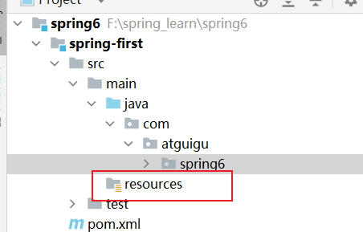

# 框架概述

轻量级的开源的JavaEE框架

​	轻量级：体积很小，jar包少，不需要其他的组件即可以独立使用

简化企业开发的复杂性

框架：实现了一部分的代码， 是一个半成品，减少开发


## 划分方式

广义：以Spring Framework为核心的技术栈

​	

狭义：特指Framework

主要有两个核心：

IOC 和Aop

IOC： 控制反转 --- 把创建对象的过程交给Spring来管理 （Spring来实现new 对象 并进行管理）

Aop： 面向切面编程 --- 不修改源代码的情况下，添加新的功能 


## 特点

非侵入式：不需要其他的组件就可以使用

AOP

容器：在IOC 中管理对象从创建到销毁的过程

组件化：将一个复杂的应用拆分成多个简单的组件

​	用Spring来维护多个组件之间的关系

​		使用XML和JAVA注解的方式进行

一站式：其他的第三方库


使用java17


创建maven聚合工程

父工程   --- 父工程中不需要写代码

创建子模块 


# 开发步骤

1、 引入Spring相关依赖

```xml
    <dependencies>
        <!--spring context依赖-->
        <!--当你引入Spring Context依赖之后，表示将Spring的基础依赖引入了-->
        <dependency>
            <groupId>org.springframework</groupId>
            <artifactId>spring-context</artifactId>
            <version>6.0.2</version>
        </dependency>

        <!--junit-->
        <dependency>
            <groupId>org.junit.jupiter</groupId>
            <artifactId>junit-jupiter-api</artifactId>
            <version>5.6.3</version>
        </dependency>
    </dependencies>

```


2、创建类，定义属性和方法

在java这一目录下，写源代码


3、按Spring 要求创建配置文件(xml文件)

放到resources 中 




3、在Spring配置文件中配置相关信息

bean标签可以完成对象的创建 

class 属性中写的是创建类的全路径（包名＋类名）

id属性是类的唯一标识

```xml
<bean id="user" class="com.atguigu.spring6.User"></bean>
```


5、测试

````java
    @Test
    public void testAdd() {
        //加载Spring配置文件，创建对象
        //从类路径下读入xml文件内容 -- resources 目录下
        ApplicationContext context = new ClassPathXmlApplicationContext("bean.xml");

        //获取创建的对象
        User user = (User) context.getBean("user");
        System.out.println(user);
        //使用对象调用方法
        user.add();
    }
````


## 实现细节

1、加载xml配置文件

2、对文件进行解析技术

3、获取xml文件中的bean标签的属性值

4、根据全路径使用反射创建对象

```java
//加载类
clazz = Class.forName("全路径");
//创建对象
clazz.getDeclaredConstructor().newInstance();
```


创建的对象会放在一个Map中


getValue() 里填写的就是Map 的key值


会执行类的无参构造器


# 前置知识

maven

xml

java 注解

反射


