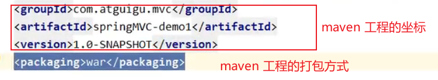

# SSM

Spring MVC

Spring 

Mybatis

# 工具

IDEA --- IDE

maven -- 构建工具

Thymeleaf -- 视图

Spring MVC 5.3.1 -- 核心技术

RESTful 

# maven

`<dependencies>`里面是工程中的所有的依赖

在第一次使用的时候，**需要通过网络**下载所需要的依赖

# MVC 

MVC 是用来实现web 模块

软件架构的思想 

model 工程中的JavaBean  -- 处理数据的类

​	实体类	存储数据

​	业务处理类	Service， Dao  处理业务逻辑和数据访问

view 展示数据 html， jsp

​	与用户进行交互

controller 	控制层，接收请求和响应请求

用户通过视图层发送请求到服务器，Controller接收到了请求后根据请求去调用相应的Service来处理业务逻辑，Service调用Dao操作数据库，将处理结果返回给Controller，Controller再根据请求处理的结果找到相应的View视图，渲染数据后最终响应给浏览器

SpringMVC是Spring的子项目， Spring的MVC模块的内容 

SpringMVC解决的是 表述层 的问题 -- 前台

​	（业务逻辑层 -- 后台

​	Dao -- 数据库操作 ）

SpringMVC是基于Servlet的

只需要使用SpringMVC提供的实现各个功能的代码就可以完成请求的处理

特点：

