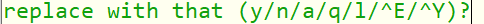

# 命令模式

刚启动vim 进入的是命令模式

每一个按键是都是一个命令，而不是一个字符

## 插入

| i        | 从光标当前位置开始输入文本，也就是光标所在的字符的**前面**开始输入 |
| -------- | ------------------------------------------------------------ |
| I        | 当前行第一个不是空白符的地方开始输入                         |
| a        | 光标所在的字符的**后面**开始输入                             |
| A        | 当前行的最后一个字符之后开始输入                             |
| o        | 从光标的下方插入新的一行，并开始输入                         |
| O        | 从光标的上方插入新的一行，并开始输入                         |

## 修改

| r    | 修改当前光标所在字符            |
| ---- | ------------------------------- |
| R    | 一直修改光标所在字符（ESC退出） |

## 删除

| x        | del                                     |
|----|---|
| X | Backspace |
| dd       | 删除（剪切）当前行                                           |

## 复制粘贴

| yy       | 复制当前行                                                   |
|-----|---|
|  |  |
| v | 字符选择 |
| y | 复制 |
|  |  |
| p        | 在光标位置之后粘贴                                    |
| P        | 在光标位置之前粘贴                                    |

## 撤销等

| u        | 撤销上一次操作                                               |
|-----|---|
| Ctrl + r | 回退上次撤销                                                 |
| ：       | 进入命令行模式                                               |
| . | 重复上次操作 |

## 查找

| /文本  | 从光标之下开始查找文本         |
| ------ | ------------------------------ |
| /?文本 | 从光标上面开始找               |
| n      | 重复上一次查找操作             |
| N      | 重复与上一次查找方向相反的操作 |

## 替换

| :%s/word1/word2/g  | 全文查找word1, 并替换成word2, (如果word2不写，就是删除) |
| ------------------ | ------------------------------------------------------- |
| :%s/word1/word2/gc | 全文查找word1, 并替换成word2, 每次替换会进行询问        |

输入的是gc会出现的询问：

y：会执行一次替换操作，并指向下一个匹配结果上

n：当前所指的文本不执行替换，指向下一个匹配结果

a：替换所有的结果

q：退出，不进行替换

l：对当前的文本进行替换，替换完成后退出（替换一次）

后面两个不知道

## 移动

| h        | 左                                                           |
| -------- | ------------------------------------------------------------ |
| j        | 下                                                           |
| k        | 上                                                           |
| l        | 右（最多移动到最后一个字符那个位置，输入i会在最后一个字符前面开始输入） |
| 30j      | 向下移动30 行（数字加方向，可一次移动多次）                  |
|          |                                                              |
| Ctrl + f | 下翻一页                                                     |
| Ctrl + b | 上翻一页                                                     |
|          |                                                              |
| n空格    | 向后移动20个字符                                             |
| nG       | 移动到文件的第n行                                            |
| n回车    | 向下移动n 行，并将光标放在第一个字符上                       |
|          |                                                              |
| 0        | 当前行的第一个字符                                           |
| $        | 当前行的最后一个字符（光标会指向这最后一个字符）             |
| H        | 当前屏幕第一行的第一个字符                                   |
| L        | 当前屏幕最后一行的第一个字符                                 |
| G        | 文件的最后一行                                               |
| gg       | 文件的第一行                                                 |
|          |                                                              |
|          |                                                              |

# 输入模式

正常输入

# 命令行模式

## 文件操作

| :w                  | 保存文件                         |
| ------------------- | -------------------------------- |
| :q                  | 退出vim                          |
| :q!                 | 强制退出vim, 不保存              |
| ZZ（等价于:wq)      | 保存并退出                       |
| ZQ（等价于:q!)      |                                  |
|                     |                                  |
| :w [另存为的文件名] |                                  |
| :r [文件名]         | 将另一个文件全部加到光标的下一行 |

## 修改vim

| :set nu   | 显示行号     |
| --------- | ------------ |
| :set nonu | 取消显示行号 |

