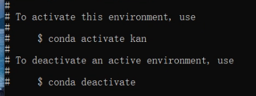

# 查看环境列表

conda env list 

conda info -e

conda info --envs


# 创建环境

conda create -n myenv_name python=x.x


# 激活环境

source activate myenv_name



# 退出环境

conda deactivate


# 注入ipykernel

1、在terminal 中进入到要添加的本地环境中

conda activate xxxx


2、 安装ipykernel

conda install ipykernel


3、本地环境注入

python -m ipykernel install --user --name 自己的环境名 --display-name "在jupyter 中显示的名字"

https://blog.csdn.net/weixin_43561913/article/details/121014957


# 换源

home/.condarc


修改文件内容：

```bash
show_channel_urls: true
default_channels:
  - https://mirrors.tuna.tsinghua.edu.cn/anaconda/pkgs/main
  - https://mirrors.tuna.tsinghua.edu.cn/anaconda/pkgs/r
  - https://mirrors.tuna.tsinghua.edu.cn/anaconda/pkgs/msys2
channels:
  - https://mirrors.tuna.tsinghua.edu.cn/anaconda/pkgs/free/
  - defaults
```


# 安装环境

在切换到自己的conda环境后，使用以下命令可以直接根据文本中的信息安装指定版本的包

pip install -r requirements.txt


txt中写的格式是：

numpy==1.24.4
