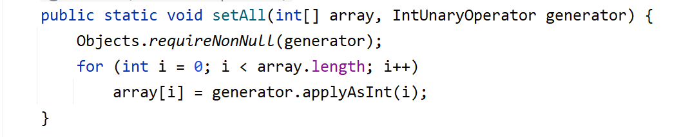
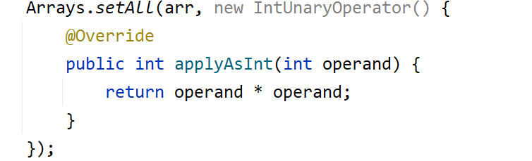
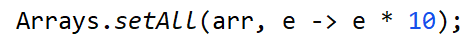
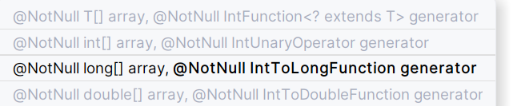

# Comparison method violates its general contract!

https://blog.csdn.net/zhangqi6627/article/details/107818070


解决方法：

​	可以调用Integer.compare() 来进行比较


# 数组转换

## List 转int[]

### 1. 列表的toArray() 方法 --> 这里是二维数组

[406. 根据身高重建队列](https://leetcode.cn/problems/queue-reconstruction-by-height/ "\406. 根据身高重建队列")

```java
class Solution {
    public int[][] reconstructQueue(int[][] people) {
        Arrays.sort(people, (int[] a, int[] b) -> { //按身高排序
            if(a[0] == b[0]) {
                return a[1] - b[1]; //升序
            }
            return b[0] - a[0]; //降序
        });

        //数组是一个对象， 而int不是对象
        LinkedList<int[]> ans = new LinkedList<>();

        for(int[] x : people) {
            ans.add(x[1], x); //在x[1] 这个位置放上这个x 人
        }
        return ans.toArray(new int[people.length][]);
    }
}
```

方法 toArray() 是接口List 中的

实现List 的所有类都可以使用

### 2.列表有stream()方法 ---> 这个是一维数组

```
list.stream().mapToInt(Integer::intValue).toArray()
```


```
list.stream().mapToInt(i -> i).toArray()
```


## int[] 转 List

```
List<Integer> list1 = Arrays.stream(arr).boxed().collect(Collectors.toList());
```


## int[] 转 Integer[] 

在Arrays.sort中，如果想使用new Comparator来指定排序规则的话，是不能直接使用基本数据类型int来完成

​			基本数据类型并**不能泛型化**

因此需要将这个基本类型的数组转化成Integer 数组

```java
Integer[] newNums = Arrays.stream(nums).boxed().toArray(Integer[]::new);
```


#  字符串和数字

```java
Integer.parseInt(stringNum);

Integer.toString(number);
```


# 排序不等式

正序相乘相加是最大的

正序和倒序相乘相加是最小的

乱序介于两者之间


# 流求和

```java
Arrays.stream(nums).sum();
```


# 使用lambda排序（Collections.sort排Entry)

```java
// 1.8使用lambda表达式
List<Map.Entry<String, Integer>> list2 = new ArrayList<>();
list2.addAll(smap.entrySet());
Collections.sort(list2, (o1, o2) -> o1.getValue()-o2.getValue());
list2.forEach(entry -> {
    System.out.println("key:" + entry.getKey() + ",value:" + entry.getValue());
});
```


# Foreach()方法


# Map.entrySet() 转List

使用List 的addAll 方法，将map.entrySet() 直接添加到了List中

```
1.
List<Map.Entry<Object, Object>> mapToList = new ArrayList<>(map.entrySet());

2.
List<Map.Entry<Object, Object>> mapToList = new ArrayList<>();
mapToList.addAll(map.entrySet());
```


# ArrayDeque

凡是想用Stack 栈这个数据结构，都统一使用ArrayDeque来模拟栈

Stack 栈这个类实现的效率很低


队列： 尾入头出

栈：头入头出

**都是头出**


而且这个类还可以模拟链表， 它有

|模拟的数据结构|方法|
|-----|-----|
||isEmpty, size|
|栈|pop, push, peek|
||push = addFirst|
|| peek = getFirst                                              |
|队列|add(no capacity restriction), remove(exception), element(exception)<br />offer(capacity restriction), poll(null), peek(null)|
||add = addLast|
||remove = removeFirst|
|||
|双向链表|addFirst, addLast, offerFirst, offerLast<br />removeFirst, removeLast, pollFirst, pollLast<br />getFirst, getLast, peekFirst, peekLast|

**双向链表的头** 是 栈头 和 队头

​				栈头 = 栈尾


# 二分答案

最大化最小值 和 最小化最大值


# 分组循环

找abababa这样的数组序列

**核心思想**：

- 外层循环负责遍历组之前的准备工作（记录开始位置），和遍历组之后的统计工作（更新答案最大值）。
- 内层循环负责遍历组，找出这一组最远在哪结束。

```
n = len(nums)
i = 0
while i < n:
    start = i
    while i < n and ...:
        i += 1
    # 从 start 到 i-1 是一组
    # 下一组从 i 开始，无需 i += 1

```


# 背包问题


# 0-1 背包

- [纯 0 - 1 背包 (opens new window)](https://programmercarl.com/背包理论基础01背包-2.html)是求 给定背包容量 装满背包 的最大价值是多少。
- [416. 分割等和子集 (opens new window)](https://programmercarl.com/0416.分割等和子集.html)是求 给定背包容量，能不能装满这个背包。
- [1049. 最后一块石头的重量 II (opens new window)](https://programmercarl.com/1049.最后一块石头的重量II.html)是求 给定背包容量，尽可能装，最多能装多少
- [494. 目标和 (opens new window)](https://programmercarl.com/0494.目标和.html)是求 给定背包容量，装满背包有多少种方法。
- [474.一和零 (opens new window)](https://leetcode.cn/problems/ones-and-zeroes/submissions/497905729/是求) 给定背包容量，装满背包最多有多少个物品。


# ::

“::”是Java 8 引入的新特性之一，常常被称作为方法引用，提供了一种不执行方法的方法。

进一步简化一些使用了lambda 表达式的代码，让代码更加简洁。


# computeIfAbsent

在HashMap 中，没有key 时，就添加一个新的k-v

```java
map.compueIfAbsent(key, function);
```

方法会返回这个key 对应的value 值

说白了就是一个get 方法的增强

​	有就取出， 没有就添加（将function 中的值赋给这个key的value）

例：

```java
int shirtPrice = prices.computeIfAbsent("Shirt", key -> 280);
```


# 前缀和

**连续子数组的元素和**转换成两个**前缀和的差**

假设前缀和数组为sum[n + 1] ====> sum[0] = 0	这样可以计算是前缀连续数组的和

原数组为array[n]
$$
\sum_{i=left}^{right} array[i] = \sum_{i=0}^{right} array[i] -  \sum_{i=0}^{left-1} array[i] = sum[right+1] - sum[left]
$$
就是减去left 之前的元素和


# Collections

Collections.reverse(list) ----  可以反转列表元素


# 优先队列

PriorityQueue 默认是**小根堆**

大根堆的表示方式：

```java
// 1
PriorityQueue<Integer> pq = new PriorityQueue<>((a, b) -> b - a);

// 2
PriorityQueue<Integer> pq = new PriorityQueue<>((a, b) -> Integer.compare(b, a));
```


如果是Long 类型， 使用方法1 会出现类型错误

这个时候要用方法2


# Arrays.setAll

默认调用函数是：



依次取出array 数组中的每一个下标，在每个位置赋上他的下标值

将下标i 作为一个参数传入applyAsInt进行运算中，将数组array[i] 的值更新为applyAsInt() 方法计算后的结果



如果使用lambda 表达式，e 是重写applyAsInt()时的operand 参数，也就是setAll() 中的下标i




## 和Arrays.fill()对比

Arrays.setAll() 用法更灵活

fill 只能全部填充为一个值，而setAll可以根据不同的下标来进行设置

fill 中是使用的一个对象填入的，修改其中一个，会发生别名现象，所有的都会发生改变


setAll 可以用来填充Long.MAX_VALUE, 可以支持int, long, double, T 等类型的数据填充




# 换根DP

https://leetcode.cn/problems/sum-of-distances-in-tree/solutions/


# 初始化List 的方法

1、 new 后使用add

2、 {{}} 只能初始化非变量

​	外层的 {} 定义了一个 LinkedList 的匿名内部类。内层的 {} 的定义了一个实例初始化代码块。 

​	这个代码块在初始化内部类时执行。

​	

3、 Arrays.asList

​	不支持增删元素。

​	只能用于初始化 List 类型了。

​	Returns a fixed-size list backed by the specified array.
​	

​	在只用于返回结果时很方便


4、 stream

​	`Stream.of("a", "b", "c").collect(Collectors.toList());`

5、 Lists.newArrayList


# 取模

可以随意地对代码中的加法和乘法的结果取模


分别取模，运算（加/乘）后再整体取模

```
(a + b) mod c = ((a mod c) + (b mod c)) mod c
(a * b) mod c = ((a mod c) * (b mod c)) mod c
```


# List.remove()

移除下标 list.remove(idx)

移除整数元素 list.remove((Integer)num)


# StringBuilder方法

reverse

append

deleteCharAt

delete(start, end)

replace(start, end, str)

insert(offset, content) 		offset 是添加的内容要放的第一个位置，原来的内容会跑到添加的内容整体的后面


# 同余

两个数x, y

（x - y) % k == 0 则x 与y 对k 同余


如果两个数对k 不同余，必然无法相差k


# LinkedList

remove = removeFirst

add = addLast


# ST表

感觉ST表的本质就是二进制拆分，只要满足传递性，可加性即可，和线段树，树状数组，二分查找的底层数学模型是一致的

ST表（Sparse Table）是一种用于高效处理区间查询的数据结构。

它可以在O(1)的时间复杂度内回答某一区间的最值查询（最小值、最大值等）。

ST表使用动态规划的思想，通过预处理的方式来快速计算出各个区间的最值。


# binary lifting

倍增法

以翻倍的速度增长
