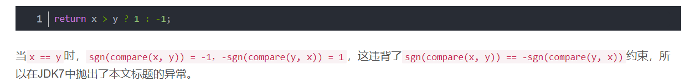

# Comparison method violates its general contract!

https://blog.csdn.net/zhangqi6627/article/details/107818070




解决方法：

​	可以调用Integer.compare() 来进行比较


# List 转数组[]

## 1. 列表的toArray() 方法 --> 这里是二维数组

[406. 根据身高重建队列](https://leetcode.cn/problems/queue-reconstruction-by-height/ "\406. 根据身高重建队列")

```java
class Solution {
    public int[][] reconstructQueue(int[][] people) {
        Arrays.sort(people, (int[] a, int[] b) -> { //按身高排序
            if(a[0] == b[0]) {
                return a[1] - b[1]; //升序
            }
            return b[0] - a[0]; //降序
        });

        //数组是一个对象， 而int不是对象
        LinkedList<int[]> ans = new LinkedList<>();

        for(int[] x : people) {
            ans.add(x[1], x); //在x[1] 这个位置放上这个x 人
        }
        return ans.toArray(new int[people.length][]);
    }
}
```

方法 toArray() 是接口List 中的

实现List 的所有类都可以使用

## 2.列表有stream()方法 ---> 这个是一维数组

```
list.stream().mapToInt(Integer::intValue).toArray()
```


#  字符串和数字

```java
Integer.parseInt(stringNum);

Integer.toString(number);
```


# 排序不等式

正序相乘相加是最大的

正序和倒序相乘相加是最小的

乱序介于两者之间


# int[] 转 Integer[] 

在Arrays.sort中，如果想使用new Comparator来指定排序规则的话，是不能直接使用基本数据类型int来完成

​			基本数据类型并**不能泛型化**

因此需要将这个基本类型的数组转化成Integer 数组

```java
Integer[] newNums = Arrays.stream(nums).boxed().toArray(Integer[]::new);
```


# 流求和

```java
Arrays.stream(nums).sum();
```


# 使用lambda排序（Collections.sort排Entry)

```java
// 1.8使用lambda表达式
List<Map.Entry<String, Integer>> list2 = new ArrayList<>();
list2.addAll(smap.entrySet());
Collections.sort(list2, (o1, o2) -> o1.getValue()-o2.getValue());
list2.forEach(entry -> {
    System.out.println("key:" + entry.getKey() + ",value:" + entry.getValue());
});
```


# Foreach()方法


# Map.entrySet() 转List

使用List 的addAll 方法，将map.entrySet() 直接添加到了List中

```
1.
List<Map.Entry<Object, Object>> mapToList = new ArrayList<>(map.entrySet());

2.
List<Map.Entry<Object, Object>> mapToList = new ArrayList<>();
mapToList.addAll(map.entrySet());
```


# ArrayDeque

凡是想用Stack 栈这个数据结构，都统一使用ArrayDeque来模拟栈

Stack 栈这个类实现的效率很低


而且这个类还可以模拟链表， 它有

|模拟的数据结构|方法|
|-----|-----|
||isEmpty, size|
|栈|pop, push, peek|
|队列|add(no capacity restriction), remove(exception), element(exception)<br />offer(capacity restriction), poll(null), peek(null)|
|双向链表|addFirst, addLast, offerFirst, offerLast<br />removeFirst, removeLast, pollFirst, pollLast<br />getFirst, getLast, peekFirst, peekLast|


# 二分答案

最大化最小值 和 最小化最大值


# 分组循环

找abababa这样的数组序列

**核心思想**：

- 外层循环负责遍历组之前的准备工作（记录开始位置），和遍历组之后的统计工作（更新答案最大值）。
- 内层循环负责遍历组，找出这一组最远在哪结束。

```
n = len(nums)
i = 0
while i < n:
    start = i
    while i < n and ...:
        i += 1
    # 从 start 到 i-1 是一组
    # 下一组从 i 开始，无需 i += 1

```


# 背包问题


# 0-1 背包

- [纯 0 - 1 背包 (opens new window)](https://programmercarl.com/背包理论基础01背包-2.html)是求 给定背包容量 装满背包 的最大价值是多少。
- [416. 分割等和子集 (opens new window)](https://programmercarl.com/0416.分割等和子集.html)是求 给定背包容量，能不能装满这个背包。
- [1049. 最后一块石头的重量 II (opens new window)](https://programmercarl.com/1049.最后一块石头的重量II.html)是求 给定背包容量，尽可能装，最多能装多少
- [494. 目标和 (opens new window)](https://programmercarl.com/0494.目标和.html)是求 给定背包容量，装满背包有多少种方法。
- [474.一和零 (opens new window)](https://leetcode.cn/problems/ones-and-zeroes/submissions/497905729/是求) 给定背包容量，装满背包最多有多少个物品。
