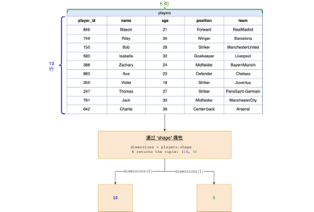

pandas 库是一个用来进行数据操作和分析的工具

# 创建二维列表

根据二维列表创建一个pandas 中的DataFrame 结构的数据

DataFrame 是pandas 中的二维标记数据结构

pd.DataFrame(二维列表) === 会将这个二维列表转成一个默认列名为从0 开始的列表

使用colomns 参数，可以自定义列表的列名

这个参数需要接收一个列表，列表中存放自定义的列名

pd.DataFrame(二维列表，columns=新的列名列表)

# 获取DataFrame的大小

DataFrame 有**属性shape**，会以元组的形式返回DataFrame 的维度

shape 属性还可以返回Series的维度

