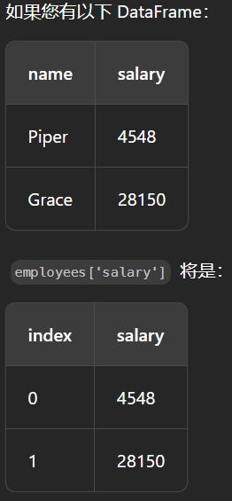

pandas 库是一个用来进行数据操作和分析的工具

def 后面跟的-> 指的是返回值类型

参数列表中

​	参数名: 参数类型

# 创建二维列表

根据二维列表创建一个pandas 中的DataFrame 结构的数据

DataFrame 是pandas 中的二维标记数据结构

pd.DataFrame(二维列表) === 会将这个二维列表转成一个默认列名为从0 开始的列表

DataFrame 中，每一行代表一个单独的记录，每一列代表一个不同的属性

使用colomns 参数，可以自定义列表的列名

这个参数需要接收一个列表，列表中存放自定义的列名

pd.DataFrame(二维列表，columns=新的列名列表)

# 获取DataFrame的大小

DataFrame 有**属性shape**，会以元组的形式返回DataFrame 的维度

shape 属性还可以返回Series的维度

# 返回前n行数据

head()

dataFrame.head(n) 返回前n行数据

# 获取数据

loc 属性 -- 基于标签名

iloc 属性  --- 基于索引

得到的是一个DataFrame 类型的数据

dataFrame.loc[dataFrame["索引列名称"] == 索引值, ["要返回的列名1", "要返回的列名2", ...]]

第一个索引值部分相当于是找到对应的数据行， 后面是返回的数据行的列名

# 创建新列

Series 是pandas 库提供的一维数据结构，DataFrame 中的一列数据

Series 中的所有元素是相同的数据类型

DataFrame 是以列形式显示Series

可以对DataFrame Series 中的每个单独元素执行操作

如果用一个系列剩一个标量，会将系列中的每个元素乘以该标量

employees['salary'] * 2 ： 会将原来的值都乘2

然后将这个结果分配给指定列

​	如果列存在就是修改，如果列不存在就会新建

​	employees['一个列名'] = employees['salary'] * 2

# 删重复行

drop_duplicates(subset, keep, inplace)

subset: 要去重的列（默认是所有列）

keep: 保留的重复行

​	first : 保留第一次出现的（默认）

​	last: 保留删除最后一次出现的

​	False: 删除所有的重复项

inplace: False: 去重后放在一个新的对象中（默认）

​		True: 在原对象中进行去重，不返回对象

# 删除丢失的数据

dataFrame.dropna(axis=0, how='any', thresh=None, subset=None, inplace=False)

- axis 
  - 可以是0(默认), 1
    - 0: 丢弃包含缺失值的行
    - 1: 丢弃包含缺失值的列
- how
  - 当值为NA 时，是否从dataFrame 中删除行或列
    - any（默认）: 只要有NA值，就删除
    - all:只有当这一行（或列）中全部为NA 时，才从删除
- thresh
  - 满足多少个NA时，删除该行（或列）
- subset
  - 指定标签值
    - 在这个标签上值为NA时，进行删除
- 

# 创建或修改列

dataFrame['列名'] = 值

如果该列名存在，就会修改这一列上的数据

如果不存在，就会创建新列

# 重命名列

dataFrame.rename(mapper=None, index=None, columns=None, axis=None, copy=True, inplace=False, level=None, errors='raise')

- mapper, index, columns ：可以传递以重命名索引或列的**词典**

  - {'oldname':'newname'}
- axis： 可以是'index' 或 'columns'，确定重命名索引还是重命名列

  - 当提供columns 参数时，默认是重命名列
- copy

  - True： 创建一个新的dataFrame
  - False：修改原来的
- level：有多级索引的dataFrame，重命名标签的级别
- errors

  - raise: 重命名不存在的项，会抛错
  - ignore: 失败时会忽略

# 改数据类型

dataFrame.astype(dtype, copy=True, errors='raise')

- dtype
  - **数据类型**
  - 列名 -> 数据类型的**字典**
- copy
  - 总是返回新分配的对象
  - 即使设置为False，也只有在旧对象无法强转为所需的类型时才会创建新的对象
  - 无效数据会引起异常

可以将对象强转为任何dtype

不会就地修改原始的dataFrame -- 会返回一个新的修改后的dataFrame 对象 

# 填充缺失值

dataFrame.fillna()

按指定的方法填充NA

- value
  - 可以是标量，字典，Series 或DataFrame
- method  ？？？
  - 填充重新索引Series 中的空洞的方法
  - 默认是None
- axis
  - 0 行
  - 1 列
- inplace 

# 连结

将两个dataFrame 连成一个dataFrame

pd.concat()

- axis
  - 0 按行连接  ---  更宽  -- 水平
  - 1 按列连接  ---  更高  -- 垂直
- objs
  - 要连接的Series 或 DataFrame对象 

例：

pd.concat([df1, df2], axis=1)

# 透视

处理数据

将长格式表转为宽格式表

dataFrame.pivot()

- index 
  - 新dataFrame 中的行
- columns
  - 新dataFrame 中的列
- values
  - 指定重塑表格时使用的值  ？？
  - 新的表格中，每个单元格中的值使用的是原来的哪个列的值

# 融合

宽格式转为长格式

dataFrame.melt()

返回的是一个新的DataFrame对象， 需要一个对象来接收这个新对象 

-  id_vars
  - 指定保持不变的列
- value_vars
  - 指定融合的列
  - 想要整成行的列
    - quarter1, quarter2, quarter3...
- var_name
  - 存储来自value_vars的标头名称的新列的名称（新列名）
    - quarter
- value_name
  - 存储value_vars 中的值的新列的名称（新列名）
    - 每个季度的销售额

dataFrame.melt(id_vars='products', value_vars=["quarter_1", "quarter_2", "quarter_3", "quarter_4"], var_name="quarter", value_name='sales')

# 方法链

在dataFrame 上执行操作，不需要将每个操作拆分成单独的行或创建多个临时变量

