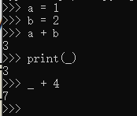

在python 的编译器中，上一个表达式的输出会保存到 _ 这个变量中

# 输出格式化

print("%.2f" %num)

print("{1}, {0}".format("索引为0 的值", "索引为1 的值"))

花括号中的数字表示format 中的索引

print("字符串中的其他信息 {name1}, {name2}".format(name2="值1", name1="值2"))

会按照名字进行填充

print("{:.2f}".format(123.2222))

控制小数位数

print(str.upper())	大写

print(str.lower())	小写	

print(str.title())	首字母大写

print(str.strip())	去掉字符串两边的空白符

print(str * 10)		可以重复输出10 次字符串

print(str[0:10])		取前10 个字符 （0 ~ 9）

# 数据类型

int, float, bool, complex

int(输入的字符串, base=进制数)

进制数默认为10

int() 可以将括号内的数据进行强转

## 列表

remove("删除指定的元素")

append("追加元素")

+号会进行列表的拼接

*会重复列表

