Dialog 可弹出的对话框，在对话框中可以添加组件

Frame 窗口

之后扩展出的 ： JDialog 

​				JFrame

JComponent 组件

- Jpanel 面板
- JButton 按钮
- JLabel 标签 
- JTextField 文本框
- JList 列表框

获取窗体容器，然后在容器中添加组件

界面类继承JFrame窗体类， 在构造器中设置窗体的一些属性，在main 函数中创建一个新的界面类

窗体设置setVisible 是在最后一步

[体系课程 (mingrisoft.com)](https://www.mingrisoft.com/systemCatalog/115.html)

# JFrame 窗体 

有最小化， 最大化， 关闭三个按钮

JDialog 只有关闭按钮 

JPannel 面板 只是一个容器，不能单独显示， 只有放入Dialog 或Frame中才能显示出来

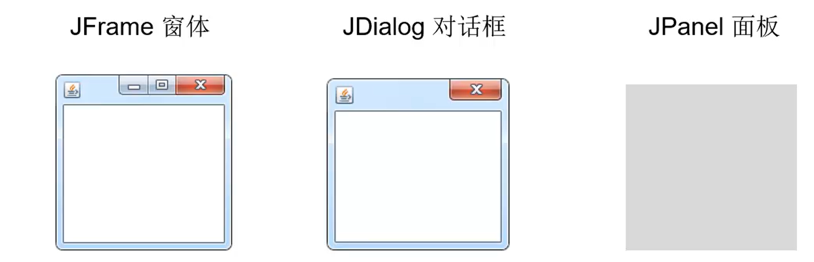

组件：

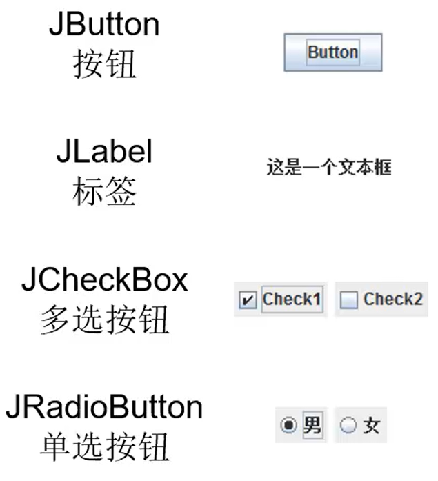

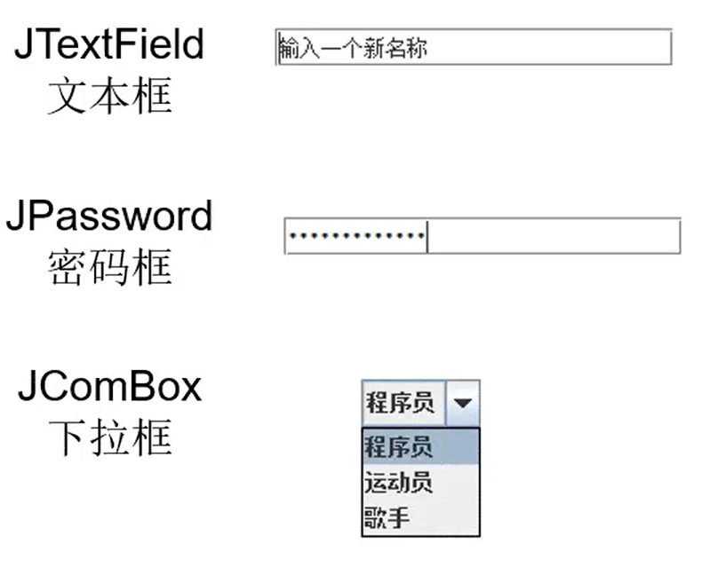

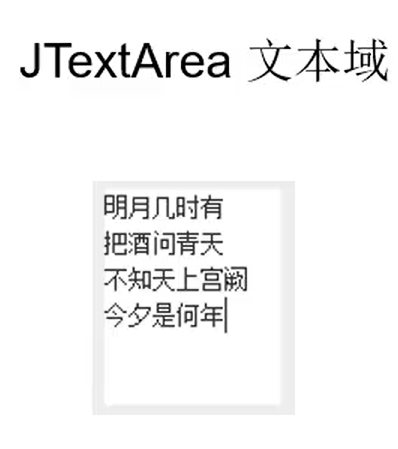

文本域是一个多行的

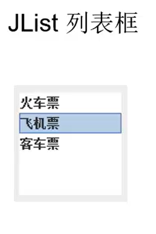

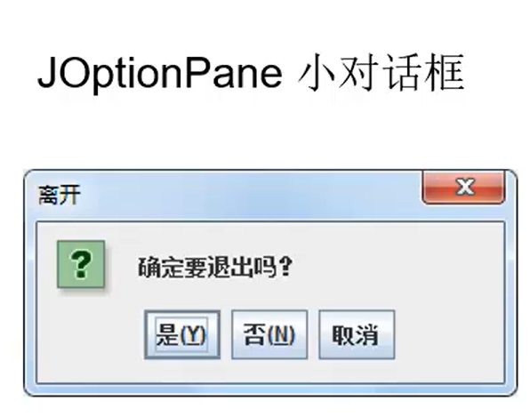

也可以弹出文本框

窗体JFrame 是最外部的一个容器

`new Frame("窗体标签 ")` 之后需要使用其他的方式将这个窗体展示出来

`frame.setVisible() `设置窗体可见

默认关闭是不会停止程序 `setDefaultCloseOperation(JFrame.EXIT_ON_CLOSE);` 可以关闭

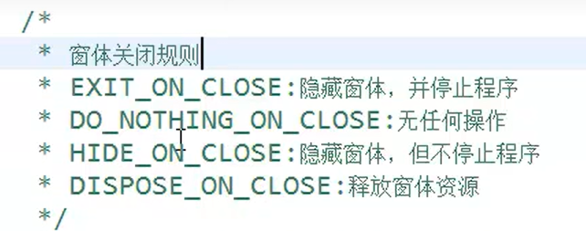

`f.setSize(800, 600);` 设置启动时窗体的默认大小

`f.setLocation()` 设置坐标

`f.setBouds(x, y, 宽， 高)`

窗体是一个容器，窗体之中还有容器

Container c = f.getContentPane() 获取窗体容器

c.setBackground(Color.WHITE)  设置窗体的颜色

JLabel l = new JLabel("标签文本")

c.add(l)  将标签组件添加到窗体容器中

c.remove(l) 删除组件

c.validate() 验证容器中的组件， 相当于刷新了容器

f.setContentPane(c)  重新载入容器， 相当于刷新了容器

f.setResizable(False) 设置窗体不可改变大小

f.getX() 获取窗体的x 坐标

继承JFrame()，放到构造器中，就不用再写new JFrame() 了，之后就不用再写f.了，直接可以用

在main 中创建这个窗体

setTitle("窗体标题")

# JDialog 对话框

弹出对话框后，后面的内容不能再点击了

阻塞其他的窗体操作

**extends JDialog**

public dialog(JFrame frame) {

​	super(frame, "对话框标签", true)  //对话框是从frame 这个父窗体中弹出的，设置为true表示阻塞父窗体

}

Container c = getContentPane() 获取窗体容器

c.add(new Jlabel("标签标题"))

setVisible(true)

setBounds(坐标， 大小)

f = new JFrame("父窗体")

f.setBounds()

f.getContentPane();获取容器

JButton btn = new JButton("按钮名")

c.add(btn)

f.setVisible(true)

setDefaultCloseOperation(JFrame.EXIT_ON_CLOSE);

f.setLayout(new FlowLayout())  设置为流布局

# JButton按钮

**给按钮添加事件**

btn.addActionlistener(new ActionListener() {

​	public void actionPerformed(ActionEvent e) {

​		d = new dialog();  // 在点击这个按钮的时候就会创建一个对话框对象 

​		d.setVisible(true); // 在这里将窗体设置为可见

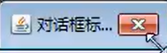

​		如果不设置窗体可见，则默认情况下会只有一个标签栏

​	}

}); 添加动作监听

# JLabel标签

**extends JFrame**

c = getContentPane();

setVisible(true)

JLabel l = new JLabel("标签文本 ")

c.add(l) 添加到容器中

l.setText("更改标签的文本内容")

l.getText()  获取标签文本内容

l.setFont(new Font("微软雅黑", Font.BOLD, 字号))  设置字体的类型， 加粗和字号

l.setForeground(Color.RED) 设置字体的颜色

# 图片

**extends JFrame**

使用标签来添加图片

l = new JLabel("标签名")

url = Demo.class.getResourse("")  获取图片url路径

Icon icon = new ImageIcon("指定图片的路径")

或： icon = new ImageIcon("src/java.png") 在当前项目目录下寻找文件

l.setIcon(icon)  添加图片

c.add(l)

设置标签大小，并不会改变图片的大小

调整窗口的大小，也不会改变图片的大小

# null 绝对布局

null 布局 

c.setLayout(null)  -- 设置布局为绝对布局

添加布局时传入的是null 

窗口是固定大小的，组件的位置和形状不会随着窗体的改变而改变

JButton b = new JButton("按钮标题")

b.setBounds(坐标，大小)  设置的是在容器内的大小和坐标， 设置方法是绝对的位置和大小，不会随窗口一起变化

# FlowLayout 流布局

FlowLayout

从左到右排列，默认是居中对齐

extends JFrame

c = getContentPane()

c.setLayout(new FlowLayout()) 给容器设置流布局

修改对齐：new FlowLayout(FlowLayout.LEFT， 水平间距，垂直间距)  左对齐

如果窗口过小，就不能显示全

# BorderLayout 边界布局

BorderLayout

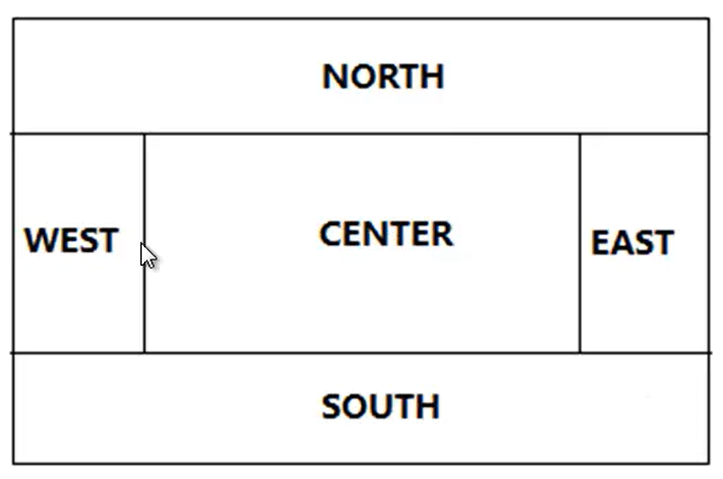

添加组件时，需要指定区域， 默认是添加到CENTER区

同一个区域的组件会相互覆盖

c = getContentPane()

c.setLayout(new BorderLayout())

b = new JButton("标题")

c.add(b, BorderLayout.CENTER) 在中间添加

# GridLayout 网格布局

1. new GridLayout(int 列， int 行)
2. new GridLayout(int 列， int 行，int 水平间距，int 垂直间距)

c.setLayout(new GridLayout(3, 3, 5, 5))

组件的大小会随着窗体一起发生变化，一定会有指定数量的网格 

当添加的组件数量大于网格的数量，就会自动调整网格的数量

# GridBagLayout 网格布局管理器

GridBagLayout

可以自由设计网格布局

grid = new GridBagLayout()

c.setLayout(grid Bag)

设置组件的约束

c.add(组件对象，约束对象)

gbc = new GridBagConstraints()

创建一个约束对象

GridBagConstraints 常用属性： 

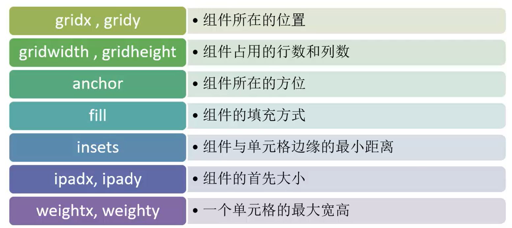

gridx 是在横向的平移

gridy 是在纵向的平移

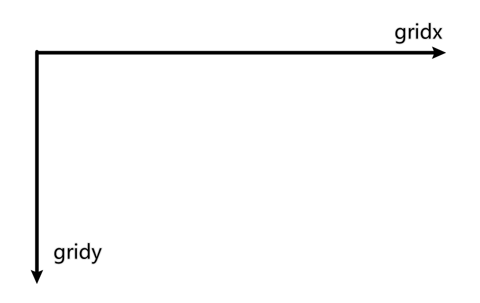

frame.setSize(大小)

设置完大小之后再使用frame.setLocationRelativeTo(null) 设置为居中

gbc.fill=GridBagConstraints.BOTH

fill 是在组件大小不足单元格的总大小时，采用的填充方式

fill = NONE 大小不足单元格，就会居中放置

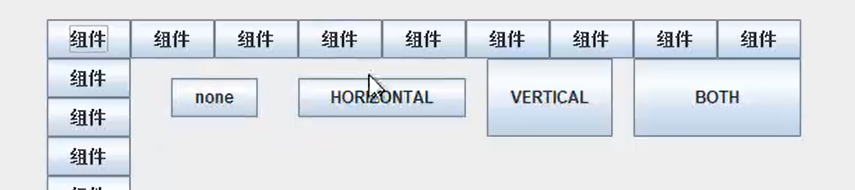

anchor:

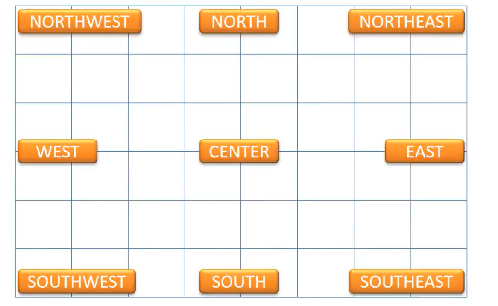

gbc.anchor = GridBagConstraints.CENTER

放在SOUTH 单元格位置，默认是居中 

insets 属性 ： 组件在内部距单元格的边距

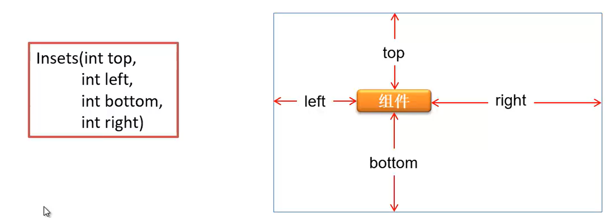

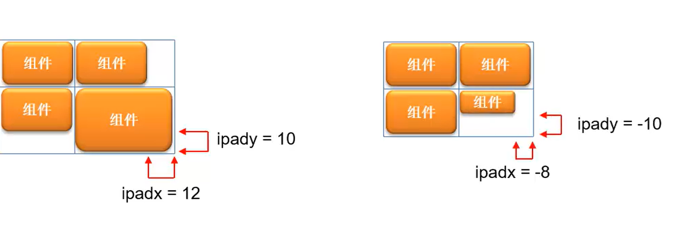

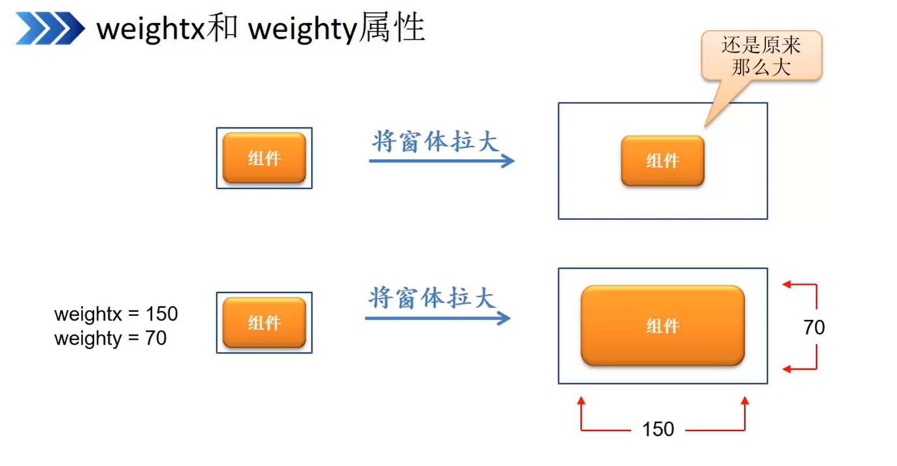

空间充足时的最大大小

c = getContentPane()

c.ste

# JComboBox 下拉框

new JComboBox<>() 

可以保存泛型

指定这个下拉列表中的元素是什么类型的数据

## 创建方法

### 1. 使用addItem 方法添加 

combo.addItem("身份证")

combo.addItem（"学生证")

combo.setBounds(坐标， 大小)

### 2. new 时传入数组

可以在new 时，放入一个**数组**，就可以使用数组内容填充下拉列表中的内容 

### 3. 使用下拉列表模型

ComboBoxModel cm = new DefaultComboBoxModel<>(数组); 创建一个下拉列表模型

combo.setModel(cm)  向下拉列表中添加数据模型

## 获取选择的选项

索引值：combo.getSelectionIndex()

内容：combo.getSelectionItem() 

conbo.setEditable(true) 可以编辑列表

可以获取到内容，但是索引值为-1

# JList 列表框

1、

jl = new JList<>(数组)

2、

DefaultListModel<String> model = new DefaultListModel<>()

向数据模型中加入新的数据

再调用JList的setModel(model)， 就可以创建完成

可以对模型进行修改，即可修改JList中的数据 

`model.addElement(新元素)` 

有三种选择模式：

SINGLE_SELECTION 一次只能选中一个元素 

SINGLE_INTERVAL_SELECTION 只能连续选择相邻的元素

MULTIPLE_INTERVAL_SELECTION 任意选

获取选择的值：

jl.getSelectedValuesList();

加入滚动面板后，就不用再设置JList的大小了，只需要设置滚动面板的大小即可

# JTextField 文本框

new JTextField("初始值")

jt.setText("初始值")

setFont(new Font("字体"， 加粗， 大小))

setColumns(长度)

jt.getText() 获取文本框中的值

可以在获取文本框中的值后就清空内容

jt.setText("") 清空文本框中的内容

jt.requestFocus() 获取焦点，获取光标 -- 设置光标的显示

# JPasswordField 密码框

new JPasswordField(长度)

jp.setColumns(长度)

setFont(字体)

setEchoChar('#') 设置回显字符

char[] ch = jp.getPassword();

# JTextArea 文本域

多行文本

setRows(行数)

setColumns(列数)

append("添加新内容")

 

insert(插入的内容， 插入的位置[1])  在第一个字符后插入

# JPanel

p = new JPanel();

p.setBackground(Color.green)

c.add(p, gbc)  将面板按照约束条件放置

[JFrame的面板结构和JPanel的使用 - Ventus - 博客园 (cnblogs.com)](https://www.cnblogs.com/Ventus/p/12169370.html)

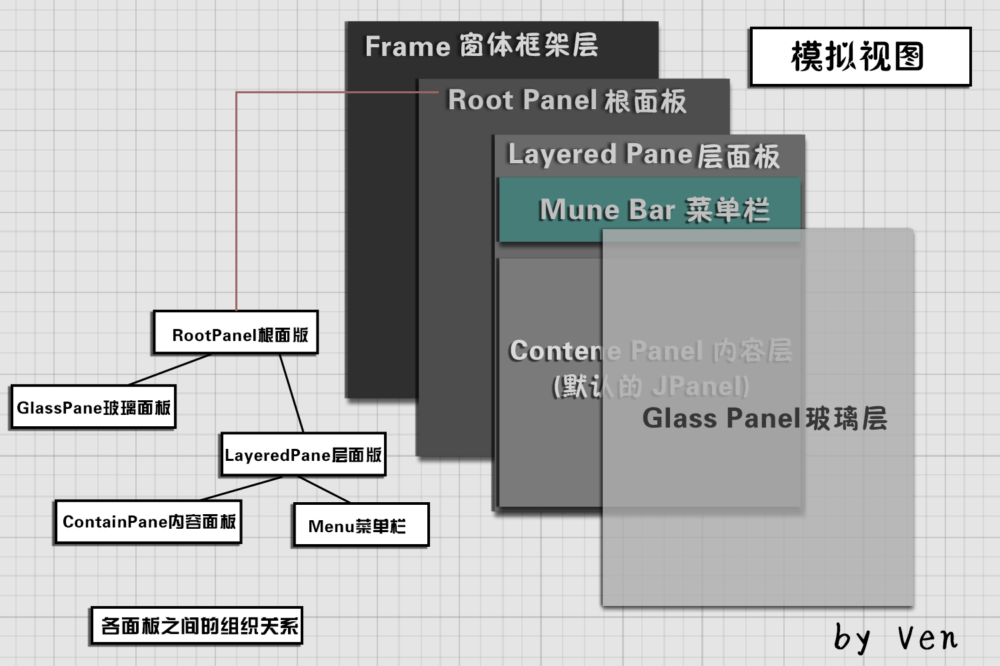

# JScrollPane 滚动面板

jsp = new JScrollPane()

JList 列表加入后就可以滚动了

加入什么组件，什么组件就会实现滚动的效果

# 事件

监听 + 事件

Listener + Event

KeyListener  KeyEvent 

WindowListener WindowEvent

ActionListener ActionEvent 动作

## ActionListener 动作事件监听器

ActionListener

组件.addActionListener() 给组件添加监听器

acitonPerformed(ActionEvent e)

组件发生操作时调用的方法

文本框中使用**回车**会触发Action 事件

按钮，多选框，单选框，  **点击**后触发

下拉列表 **选择选项**后会触发

动作事件可以使用e.getSource() 获取到一个Object对象 

Object对象可以强转为相应的组件类型

利用组件的相应方法可以获取到其中的值

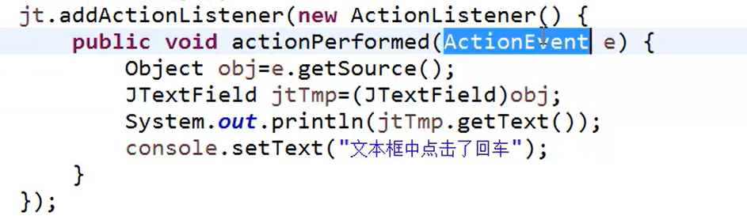

## FocusListener 焦点事件监听器

组件.addFocusListener(new FocusListener() {
});

void focusGained(FocusEvent e) 组件获取焦点时调用的方法

void focusLost(FocusEvent e)  失去焦点时调用的方法

可以得到焦点事件是由谁触发的？？？？

t = e.getSource(); 获取触发事件的组件

t.setBorder(BorderFactory.createLinerBorder(Color.green)); 给获取焦点的文本框设置绿色的边框

可以给监听类创建一个新的类，这个类实现FocusListener，之后就可以在添加监听器时传入相应的新类对象，就可以实现自定义的功能 --- 多个事件只需要写一次事件处理方法即可

jt1.addFocusListener(new MyFocusListener())

jt2.addFocusListener(new MyFocusListener())

# JSplitPane 分割面板

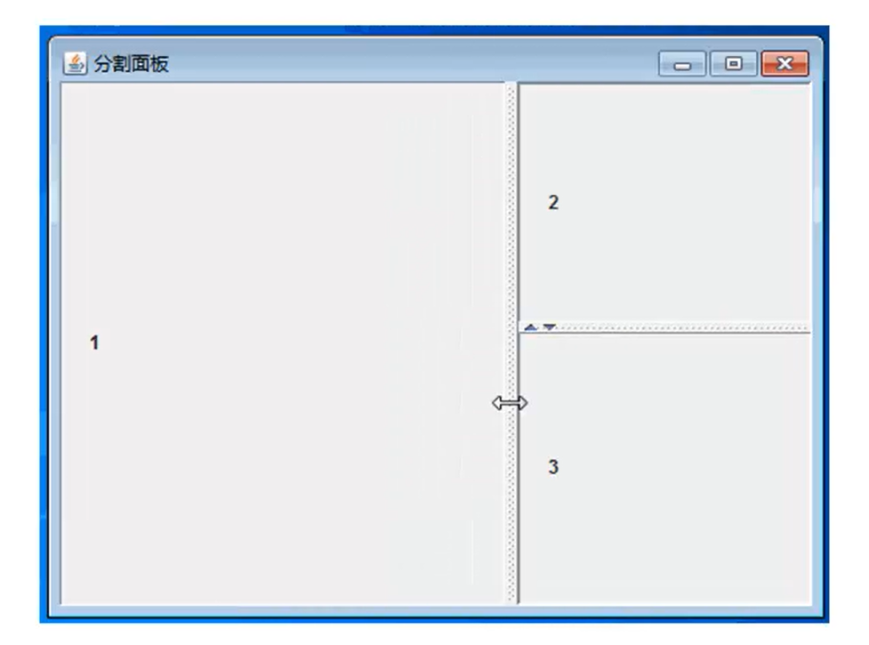

有三个构造器

1、无参 （ 默认是水平的分割条 ）

2、指定分割的方向 （小平 或 垂直）

水平： JSplitPane.HORIZONTAL_SPLIT

垂直： JSplitPane.VERTICAL_SPLIT

3、 除了指定分割的方向，还可以指定是否重绘

随着拖动这个分割条， 两边的组件是否会同时发生变化

true: 

重绘分割条

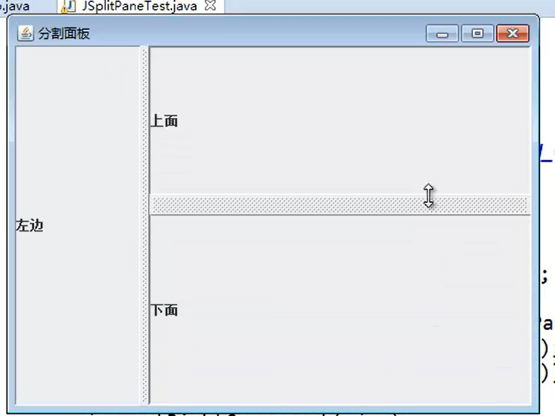

false:

拖动时拖动的是一个影子 

分割条还没有动

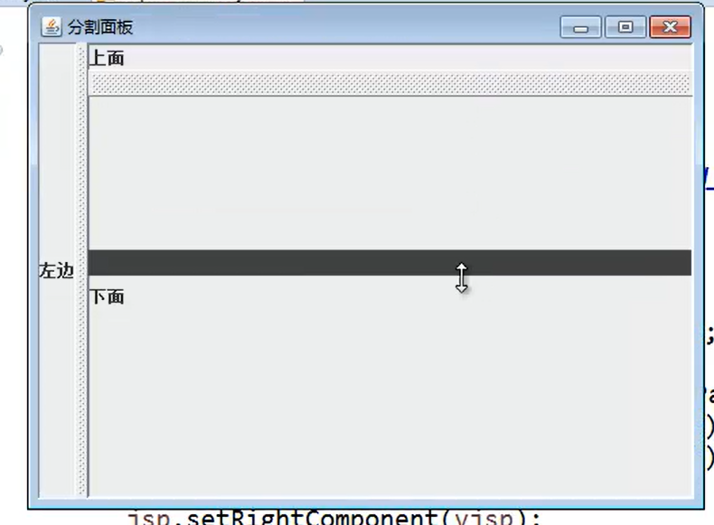

jsp.setLeftComponent(new JLabel("左"))    在分割条的左边添加一个标签组件 

jsp.setRightComponent()   在分割条的右边添加一个组件 

在垂直分割条的情况下，left 就是上面， right 是下面

jsp.setDiveiderSize(像素值)   设置分割条的宽度

jsp.setOneTouchExpandable(true)  设置UI 小部件

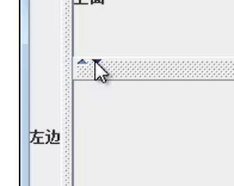

​		点击后可以隐藏某一个部分

jsp.setDividerLocation(30像素) 分割条分割的一个部分的初始大小

# JMenuBar 菜单栏

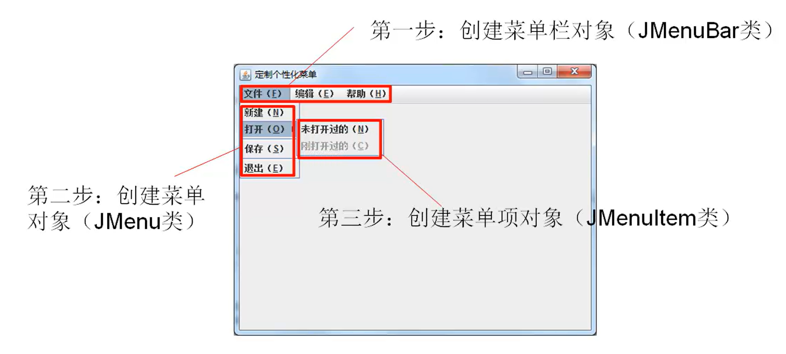

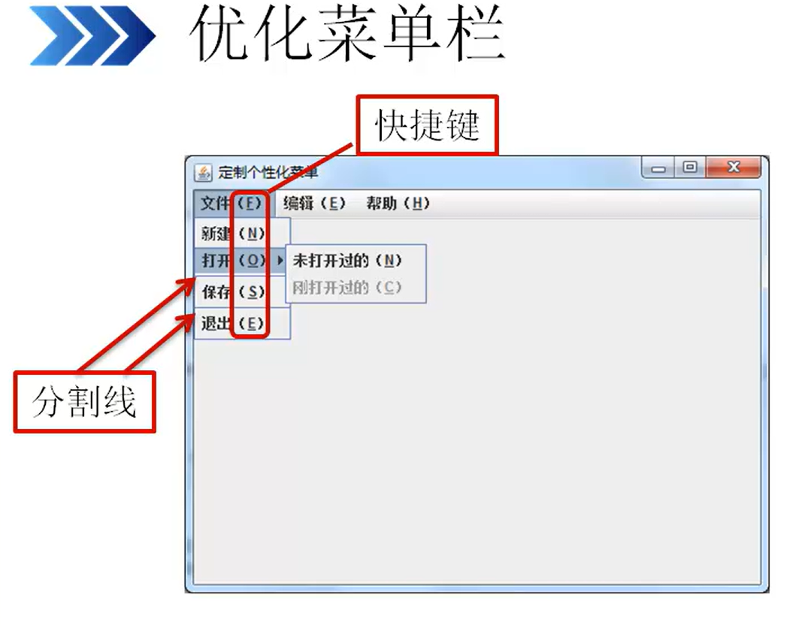

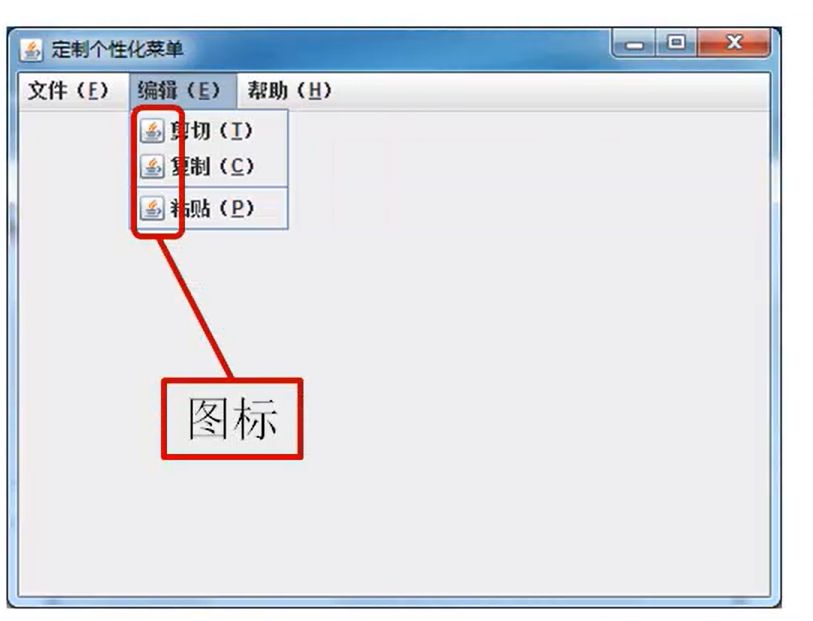

菜单栏：

menubar = new JMenuBar()  创建一个新的菜单栏

添加菜单栏的方法： setJMenuBar(menubar)

菜单：

menu = new JMenu("显示的文本")

menubar.add(menu)

菜单项：

JMenuItem item = new JMenuItem("菜单项")

menu.add(item)

子菜单：

child = new JMenu("子")

menu.add(child)  在菜单中添加新的菜单

childItem = new JMenuItem("子菜单中的菜单项")

child.add(childItem)

menu.addSeparator()   添加一个分隔符

item.setEnabled(false)   设置菜单项不可用

图标：

Icon ico = new ImageIcon("路径")

item.addIcon(ico)

点击菜单项后有动作：

使用内部类 实现ActionListener

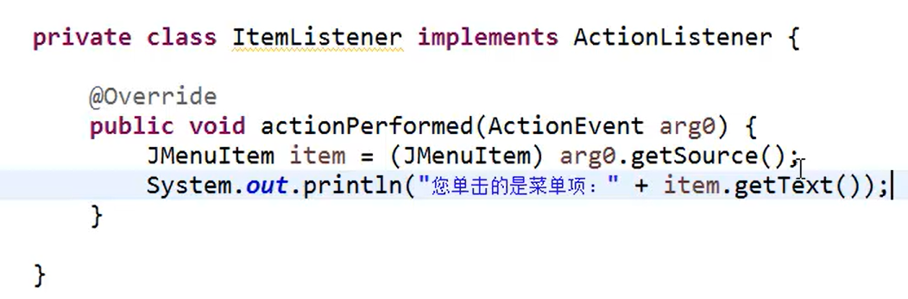

快捷键：

menu.setMnemonic(KeyEvent.VK_F)  添加F 为快捷键 （ 菜单栏中使用方法为 ALT + F， 菜单项是直接F ）

# JFileChooser 文件选择器

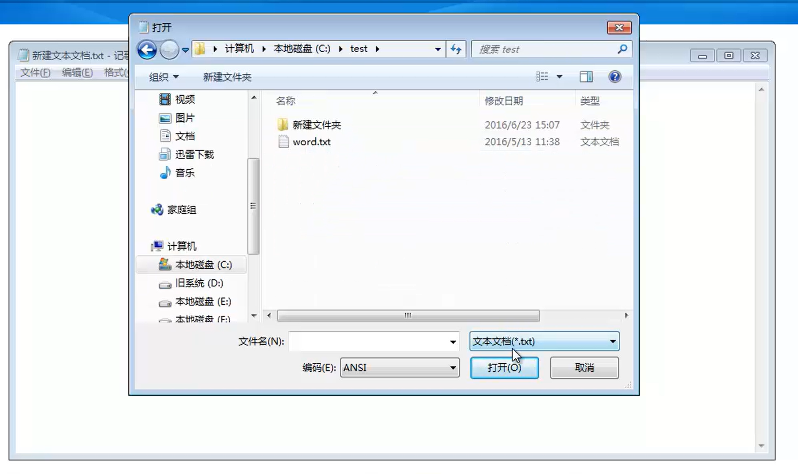

1. 创建JFileChooser对象 
2. 设置选择模式（默认是可以选择文件和文件夹）
3. 单选或多选
4. 显示对话框

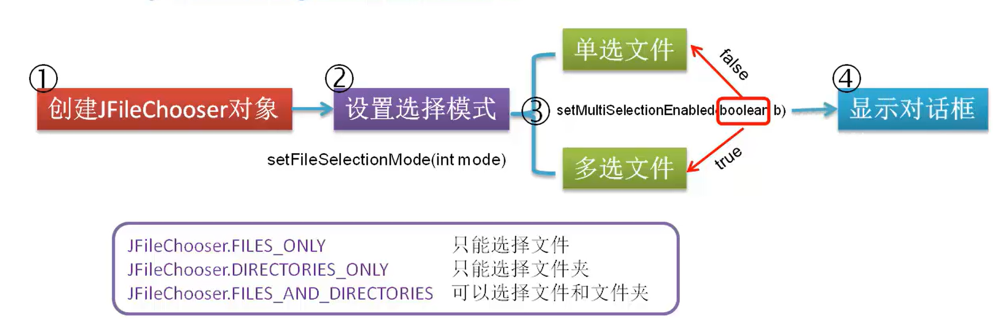

过滤文件：

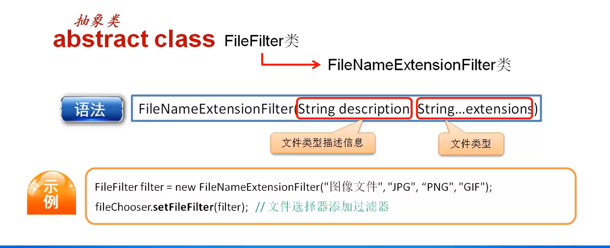

java 仅支持三个类型的图片格式

弹出选择文件事件： 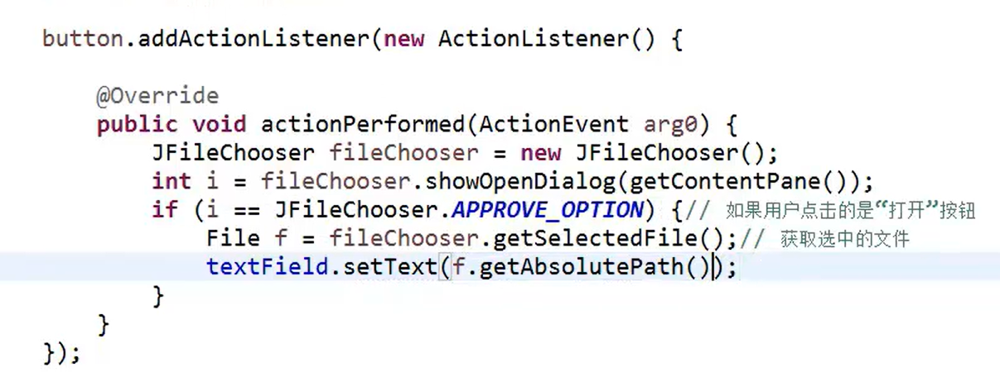

文件过滤器：

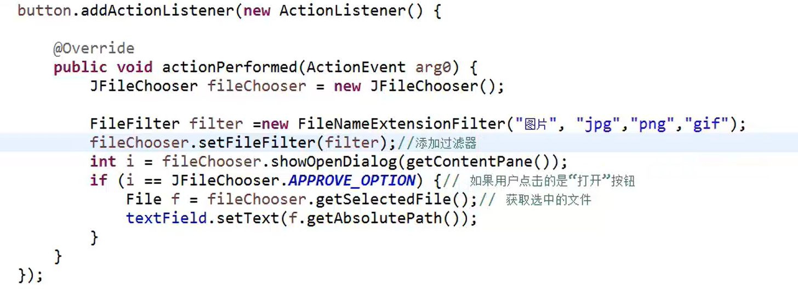

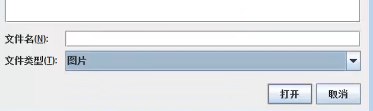

# JProgressBar 进度条

pro = new JProGressBar() 

不确定进度条

确定进度条

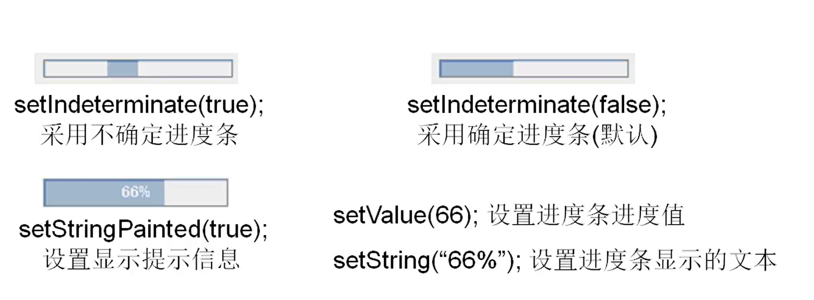

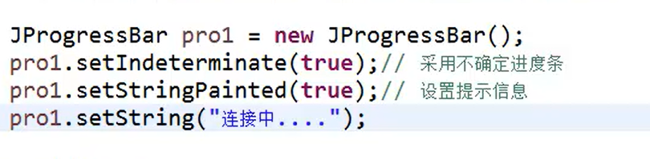

创建一个线程让确定型进度条滑动

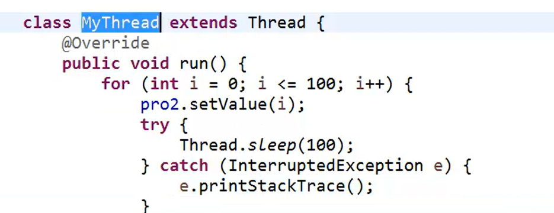

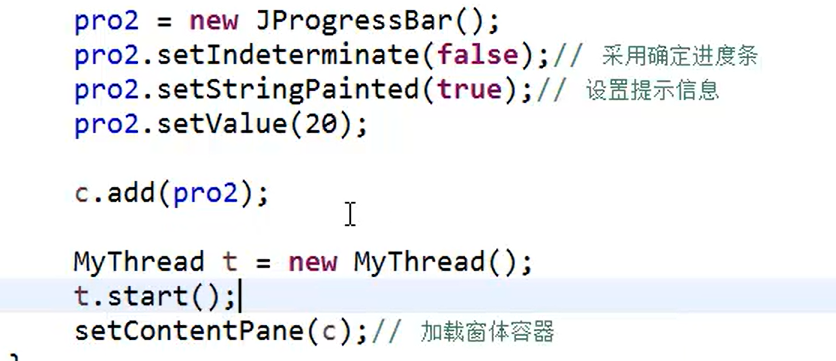

