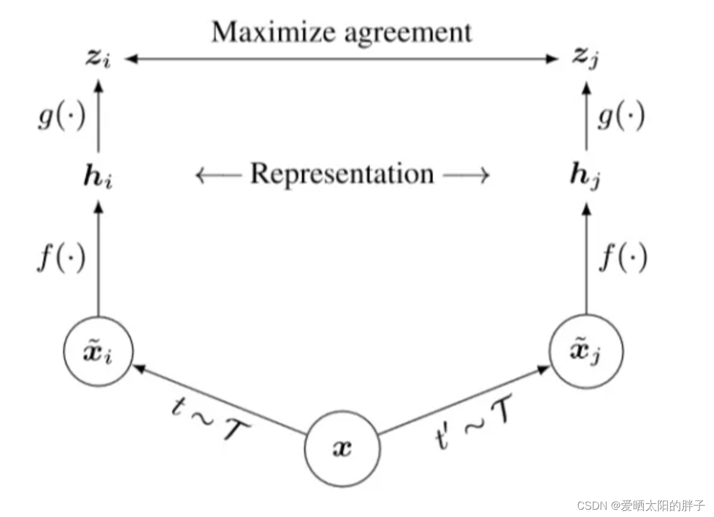
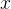
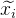
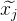
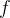
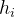
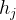

又称为自监督学习

可以用来解决下游任务中的标签数据少的问题 

自监督学习(Self-supervised learning)可以避免对数据集进行大量的标签标注。把自己定义的伪标签当作训练的信号，然后把学习到的表示(representation)用作下游任务里。

目的：学习一个**编码器**，此编码器**对同类数据进行相似的编码**，并使**不同类的数据的编码结果尽可能的不同**（通过代理任务引入更多的外部信息，以获得更通用（general）的表征）。

可以用不带标签的数据进行对比学习的一个初始编码器，此编码器已经掌握了数据中的一部分特性，可以实现聚类功能，然后在用带标签数据进行**微调**

**代理任务+目标函数**

数据增强（代理任务）

对于同一样本，经过数据增强生成和两个样本

例如图片的随机裁剪、随机颜色失真、随机高斯模糊。和就称为一个正样本对。

特征提取编码器。(⋅)就是一个编码器，用什么编码器不做限制。和可理解为embedding向量。

在一个batch 中选择正负样本对

对于一个batch的N个样本，通过数据增强的得到N对正样本对，此时共有2N个样本

对于一个给定的正样本对，剩下的2(N-1)个样本都是负样本，也就是负样本都基于这个batch的数据生成

