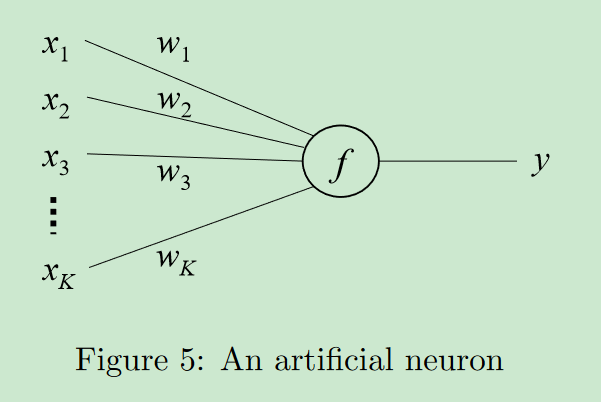

目的是为了使同义词具有非常接近的嵌入

训练使嵌入成为类别的有用表征

embeding向量可以唯一表示为嵌入空间中的一个点

# Word2Vec

对比的是LSA LDA

单词的分布式表示 distributed representations of words

preserving linesar regularities among words

首先将计算复杂度定义为完全训练模型所需访问的参数数量

使用随机梯度下降和反向传播进行训练

epochs = 3 ~ 50 

training set number up to one billion

NNLM(Feedforward Neural Net Language Model)

之前提出的一种将单词转为连续向量的模型

input + projection + hidden + output layer

hierarchical softmax  -- 词汇表可表示为一个哈夫曼树

单词的频率 对于获取类型非常有效

哈夫曼树为频繁出现的单词分配短的二进制码

RNN 有input + hidden + output layer， 没有projection layer

RNN 在表示复杂的模式时会比shallow neural netword 更有效

n-gram 连续n 个词的序列

# 2.

skip-gram 是根据中心词来预测上下文

[skip-gram]([【图文并茂】通过实例理解word2vec之Skip-gram - 知乎 (zhihu.com)](https://zhuanlan.zhihu.com/p/215797088))

CBOW 是根据上下文来预测当前词

# 3.word2vec Parameter

bigram model

最简单的情况是：给定一个语境词，预测一个目标词

全连接: 每个输出节点和每个输入节点都有连接

更新权重，因此需要找到权重的梯度的变化情况

因此要对权重求导

随机梯度下降就是old - 学习率 * 关于权重的梯度

## Appendix A

### back propagation basics

learning algorithms for a single unit

$f$ 的输入是 $\sum_{i} w_ix_i$

使用向量表示：$\boldsymbol{w}^T\boldsymbol{x}$

$f$ 连接函数，y 是感知器 ---  $f$ 是将所有的输入连接到一起，组成一个scalar（整合输入为一个新的输入）

​							$y$ 是处理输入，生成输出

​	连接函数后面的是感知器

感知器的学习算法就是感知算法，也就是y 使用的学习方法

​		$\boldsymbol{w}^(new) = \boldsymbol{w}^(old) - \eta \cdot (y - t) \cdot \boldsymbol{x}$

​	这是一个**线性**的学习算法，$\eta$ 是学习率，t 为标签 

​	即：根据输出y 来调整自己下一次学习时的权重矩阵 $\boldsymbol {w}$

​	线性的感知器算法需要模型使用非线性模型才能处理更复杂的情况

两种常用的连接函数$y$ 是阶跃函数ReLU 和logistic function(sigmoid)

由于logistic 是光滑可微的，因此可以使用随机梯度下降法来进行更新

使用该方法更新需要定义一个误差函数来确定更新的条件

更新参数的时候，就可以使用误差函数对权重的梯度来替换ReLU 更新时的参考量

​	$\boldsymbol{w}^{new}=\boldsymbol{w}^{old}-\eta \cdot (y - t) \cdot y(1 - y) \cdot \boldsymbol{x}$

###  back-propagation with multi-layer network

从右侧（输出层）开始计算导数

每一层分别计算输出、净输入和权重的导数

**P19 有问题**

wevi

