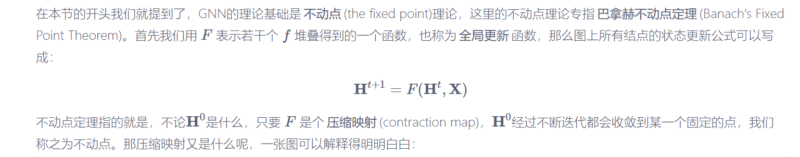

[从图(Graph)到图卷积(Graph Convolution)：漫谈图神经网络模型 (一) - SivilTaram - 博客园 (cnblogs.com)](https://www.cnblogs.com/SivilTaram/p/graph_neural_network_1.html)

# GNN

一个图中， 每一个节点有自己的特征，每一条边有自己的特征

GNN 的学习目标是获得每个节点的图感知的隐藏状态

​	每个节点，它的隐藏状态包含了来自邻居节点的信息

迭代式更新 所有节点的隐藏状态： 让每个节点感知到其他的节点

利用神经网络拟合这个状态更新函数 --- 也叫 局部转移函数 

​		$𝐡^{t+1}_𝑣=𝑓(𝐱_𝑣,𝐱_𝑐𝑜[𝑣],𝐡^{t}_𝑛𝑒[𝑣] ,𝐱_𝑛𝑒[𝑣]),$

不断地利用当前时刻邻居结点的隐藏状态作为部分输入来生成下一时刻中心结点的隐藏状态，直到每个结点的隐藏状态变化幅度很小，整个图的信息流动趋于平稳

另一个函数g 来适应下游任务 --- 也叫 局部输出函数 

$𝐨_𝑣=𝑔(𝐡_𝑣,𝐱_𝑣)$

两个函数都是全局共享的函数 

直到 𝑇𝑛 时刻，各个结点隐藏状态收敛，每个结点后面接一个 𝑔 即可得到该结点的输出 𝑜

不动点理论：

可以通过限制f 对H的偏导数矩阵的大小来保证是一个压缩映射

用雅可比矩阵的惩罚项实现

通过节点信息的传播使整张图收敛

预测是在收敛之后才进行的

缺点：

GNN 只将边作为一种传播的手段，而没有区分出不同边的功能，没有为边设置独立的可学习参数，无法通过模型学习边的某些特征 

基于不动点的收敛会导致节点之间的隐藏状态间存在较多的信息共享，因此节点的状态太光滑，**属于自身的特征匮乏**

​	不易根据最终的隐藏状态区分节点

## GNN与RNN

GNN是沿时间展开的长度是动态的， 要根据收敛条件来确定 

RNN沿时间展开的长度是序列本身的长度

|                    | GNN                                 | RNN                                |
| ------------------ | ----------------------------------- | ---------------------------------- |
| 沿时间展开的长度   | 动态的，根据收敛条件来确定          | 长度等于序列本身的长度             |
| 输入               | 每个时间步的输入都是所有节点v的特征 | 每个时间步的输入是该时刻对应的输入 |
| 时间步之间的信息流 | 由边决定                            | 由序列的读入顺序决定               |
| 优化               | 对收敛性有要求                      | 无要求                             |
| 输出时刻           | 只有在隐藏状态收敛后才能输出        | 每个时间步都可以输出               |
|                    |                                     |                                    |

# GGNN

用类似RNN 的方法定义GNN

不以不动点理论为基础

迭代不需要等到收敛才能输出

可以迭代固定步长

