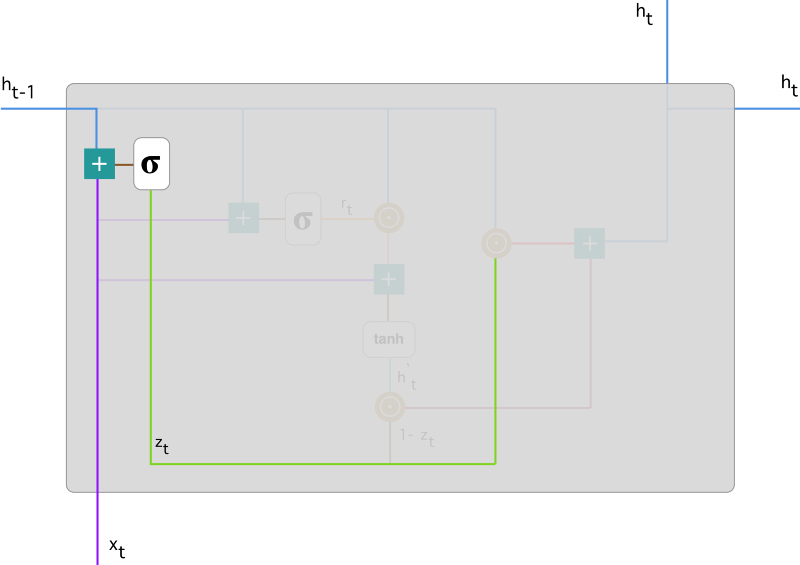
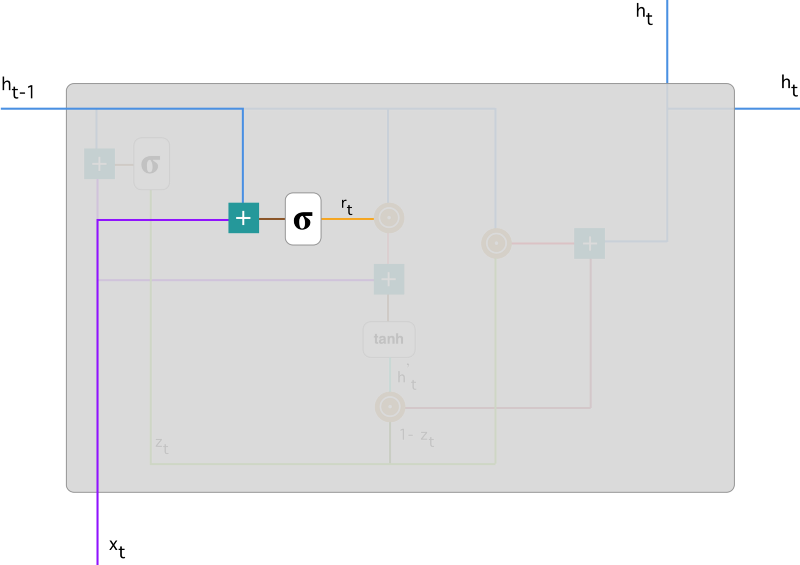
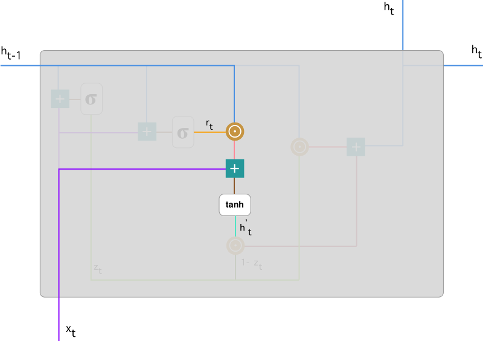
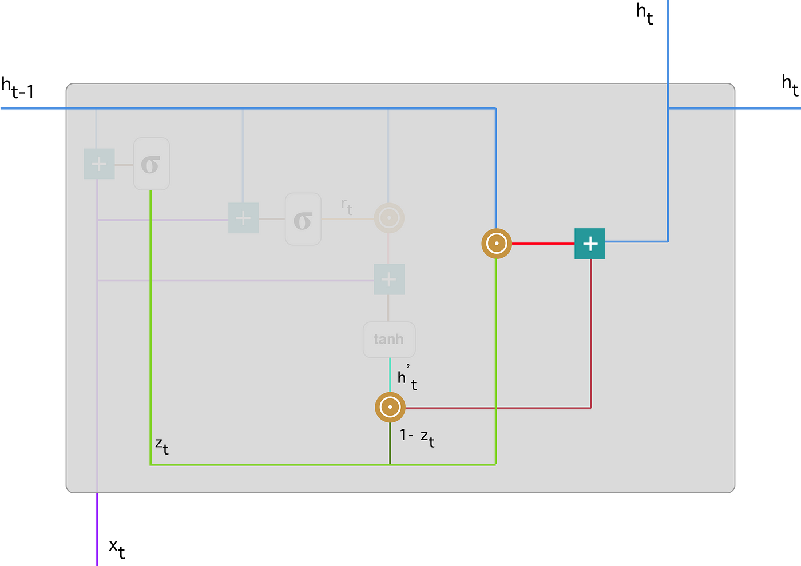

[GRU](https://towardsdatascience.com/understanding-gru-networks-2ef37df6c9be)

GRU 是为了解决RNN 中的**梯度消失**的问题

GRU  有两个门， 这两个门是两个向量

重置门 --- 决定要遗忘多少过去的信息

更新门 --- 定义过去有多少信息需要去传递到后面

1 ， 0 是 RNN

两个门控向量决定了哪些信息最终能作为门控循环单元的输出

能够保存长期序列中的信息，不会随时间而清除或因为与预测不相关而移除

LSTM 有三个门（输入门、遗忘门和输出门）

GRU 并不会控制并保留内部记忆（c_t），且没有 LSTM 中的输出门

计算输出时并不应用二阶非线性。

LSTM 中的输入与遗忘门对应于 GRU 的更新门

重置门直接作用于前面的隐藏状态

# 更新门

将输入x_t 和 前面时间步的信息h_t-1 进行组合

对组合结果求出激活函数值 

更新门帮助模型决定到底要将多少过去的信息传递到未来，或到底前一时间步和当前时间步的信息有多少是需要继续传递的。

# 重置门

主要决定了到底有多少过去的信息需要遗忘， 等价于要保存多少过去的信息

与更新门相近，将输入 和 过去信息进行组合

参数矩阵值与更新门中的不同

输出的r_t 是指的保存过去信息的百分率（保存率），衡量门控开启的大小

如果门控值为0， 代表过去的信息全部遗忘掉

# 当前记忆内容

使用重置门保存过去相关的信息

将两个方面的输入分别乘一个系数矩阵进行线性变换 

第二个Hadamard乘积表达式表示有多少信息是要被遗忘掉的

# 当前时间步的最终记忆

GRU 的输出是一个向量， 里面保存有当前单元的信息，并将这个向量向下传递

为了得到输出向量，需要一个更新门，由该门决定从当前记忆内容中收集（h_t, h_t-1中的) 什么信息

z_t 大，代表使用过去的信息多，因此使用当前节点信息就少一些，故采用1 - z_t

