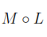

point-wise:在集合或域中，按点来操作属性 -- 函数与函数之间的计算 

element-wise: 在维度完全相同的两个矩阵或列表中，进行对应元素计算

中间的圆圈运算符：

1. 多层复合映射
   1. y = M(x)
   2. z = L(y)
   3. 则 M৹L = M(L(x))
2. 基本积（Hadamard product)
   1. 两个同阶矩阵中的每个对应位置的元素相乘
   2.  M৹L = $a_{i,j} \cdot b_{i,j}$

spline: 

不再将训练集看成一个整体，而将其划分为一个个连续的区间，然后使用单独的模型进行拟合

样条是指一种分段的低阶逼近函数

对各区间内使用多项式拟合有以下问题：

​	节点之间是不连续的 -- 节点函数值相等

​	曲线不平滑 -- 节点一阶导数相等则会使曲线更平滑（如果二阶导数能相等会更平滑）

​	

prune:

剪枝

affine：

仿射

IR

Intermediate Representation

|| 

denotes the concatenation operation.

pipeline:

管道（Pipeline）是一种工具，用于将数据预处理、特征选择、模型构建等一系列步骤封装成为一个整体流程。

可以简化代码，避免数据泄露，并使模型的训练和预测过程更加高效和可重复。

众包（crowdsourced):

利用大量的网络用户来获取需要的服务和想法

