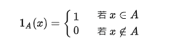

**point-wise**:在集合或域中，按点来操作属性 -- 函数与函数之间的计算 

**element-wise**: 在维度完全相同的两个矩阵或列表中，进行对应元素计算

**中间的圆圈运算符**：

1. 多层复合映射
   1. y = M(x)
   2. z = L(y)
   3. 则 M৹L = M(L(x))
2. 基本积（Hadamard product)
   1. 两个同阶矩阵中的每个对应位置的元素相乘
   2.  M৹L = $a_{i,j} \cdot b_{i,j}$

**spline**: 

不再将训练集看成一个整体，而将其划分为一个个连续的区间，然后使用单独的模型进行拟合

样条是指一种分段的低阶逼近函数

对各区间内使用多项式拟合有以下问题：

​	节点之间是不连续的 -- 节点函数值相等

​	曲线不平滑 -- 节点一阶导数相等则会使曲线更平滑（如果二阶导数能相等会更平滑）

​	

**prune**:

剪枝

**affine**：

仿射

**IR**

Intermediate Representation

**||** 

denotes the concatenation operation.

**pipeline**:

管道（Pipeline）是一种工具，用于将数据预处理、特征选择、模型构建等一系列步骤封装成为一个整体流程。

可以简化代码，避免数据泄露，并使模型的训练和预测过程更加高效和可重复。

**众包**（crowdsourced):

利用大量的网络用户来获取需要的服务和想法

**指示函数**： 定义在某集合*X*上的函数，表示其中有哪些元素属于某一子集A。

It equals 1 if the condition is satisfied else it equals 0.

**表征学习**：

将原始数据转换成为能够被机器学习来有效开发的一种形式。

它避免了手动提取特征的麻烦，允许计算机学习使用特征的同时，也学习如何提取特征：学习如何学习。

**语法图**：抽象语法树

**语义图**：控制流，数据流，程序依赖，定义-使用链

**CoT**（Chain of Thought）：

COT通过要求模型在输出最终答案之前，**显式输出中间逐步的推理步骤**这一方法来增强大模型的算数、常识和推理能力。

**思维链就是一系列中间的推理步骤**，通过让大模型逐步参与将一个复杂问题分解为一步一步的子问题并依次进行求解的过程可以显著提升大模型的性能

区别于传统的 Prompt 从输入直接到输出的映射 <input——>output> 的方式，CoT 完成了从输入到思维链再到输出的映射，即 <input——>reasoning chain——>output>

