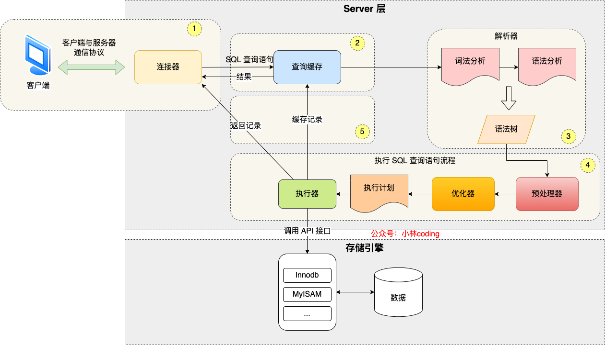
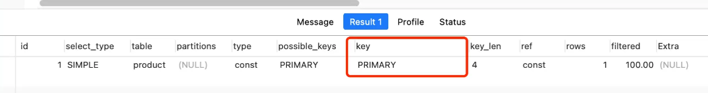

# 架构

MySQL 架构有两层：

- Server 层

​	**负责建立连接、分析和执行SQL**

​	大多数的核心功能模块

​	连接器，查询缓存，解析器，预处理器，优化器，执行器

- 存储引擎层

​	可以有多种存储引擎，不同的存储引擎会有不同的索引数据结构

​	不同的存储引擎共用一个Server层

​	InnoDB 是MySQL 5.5 版本之后的默认存储引擎

​		其使用的是B+ 树索引





# 扫描类型


all : 全表扫描的方式进行查询

index：全索引扫描（不需要对数据进行排序）

range：索引范围扫描（在where 子句中使用< > between ）

ref：非唯一索引扫描（采用非唯一索引，或唯一索引的非唯一性前缀）

eq_ref：唯一索引扫描（用于 **多表联查**，而条件两张表的唯一索引相等）

const ： 结果只有一条的**主键或唯一索引**扫描（与常量进行对比）


尽量使用range 及以上级别的扫描


# 连接器

使用MySQL前，需要先连接MqSQL服务


连接的过程会有三次握手 ---- MySQL 是基于TCP 协议传输

当TCP 连接建立成功后，连接器会验证用户名和密码

​	若用户名或密码不对，就会收到"Access denied for user"的错误，客户端程序会结束执行

​	若输入正确，连接器会获取并保存用户的权限

​		当用户执行操作的时候，就会检查保存的用户权限

​		故，当用户建立连接后，管理员修改用户的权限不会影响已经存在的连接的权限，只有等用户重新连接后才会生效


## 查看连接MqSQL服务的客户端数量

​	`show processlist`

MqSQL会记录每个用户登录后的用户名 和 状态

若用户连接后没有再执行任何命令，就会成为sleep 状态，同时记录空闲时间

​	MqSQL默认的最大空闲时长为8 小时，可以由wait_timeout 参数来设置

​	当空闲时间大于该值时，连接器就会断开该用户的连接

手动断开连接： `kill connection + 用户的id`

断开连接并不会有提示信息，只有当该用户再次发起下一个请求的时候，才会收到一个报错


MqSQL最大连接数由max_connection 参数控制

​	当数量大于该值时，MqSQL就会拒绝新的连接，并发出报错


## 长连接 和 短连接

连接sql 服务会进行三次握手，而断开sql连接会进行四次挥手

短连接 在执行完每一个sql 语句后，就会断开sql服务

长连接 在执行完每一个sql 语句后，会一直保持该连接，直到断开


长连接 会增加内存的消耗：

在执行sql查询的时候，**连接对象**临时使用内存来进行管理，这些连接对象只会在连接断开的时候才会释放

如果长连接数量过多，就会导致MqSQL服务占用内存太多 --- 系统会强制杀掉 ---- MqSQL服务异常重启


### 解决长连接占用内存

- 定期断开长连接
- 客户端主动重置连接

MqSQL 5.7 	`mysql_reset_connection()` 接口可以将连接恢复到刚刚创建完时的状态，而不需要重连和权限验证
	是接口函数，而不是命令，需要在代码中调用


# 查询缓存

MqSQL收到 sql 语句后，会根据sql语句的第一个字段来判断是什么类型的语句


## select 语句

先去查询缓存里查找缓存数据

​	缓存中是以k-v 形式保存

​	k ：sql查询语句

​	v ： 查询的结果

若命中查询缓存，就会直接返回value值

若没有命中，就会往下继续执行，当执行完成后，还会将查询结果放到查询缓存中

​	

当表有更新时，表的缓存就会清空

因此，若更新比较频繁的表，查询缓存的命中是很低的


MqSQL 8.0 删除了查询缓存功能

对于8.0 之前的版本，将参数`query_cache_type` 设置为DEMAND即可

移除的是**server** 层的查询缓存，而非Innodb 存储引擎中的buffer pool


# 解析器

在执行sql 查询语句之前，MqSQL会先对sql 语句做解析


1、 词法分析

MqSQL会根据输入的字符串识别出关键字


2、语法分析 

根据词法分析的结果，语法解析器会根据语法规则，判断语句是否语法正确

若语法正确，就会构建一棵语法树


# 执行SQL 

## 1、 prepare 阶段

预处理阶段(预处理器)

- 检查SQL语句中的表或字段是否存在 （不是在解析器中）

- 将select * 中的 * 符号，扩展为表上的所有列

MqSQL 8.0 


表不存在的错误是在get_table_share() 函数里报错的，而这个函数是在 prepare 阶段调用的。

MqSQL 5.7 判断是在语法分析之后，prepare之前进行的


## 2、optimize 阶段

优化阶段（优化器）

负责确定sql 查询语句的执行方案

​	当表中有多个索引时，优化器会基于查询成本，来决定使用哪个索引

在查询语句最前面加上`explain` 关键字，可以输出发SQL 语句的执行方案

​	

`key` 列中的值表示此次查询**使用的是什么索引**

`possible_keys`表明可以选择的索引

如果key 列的值为null， 说明没有使用索引，而是进行了全表扫描（type属性列(type=ALL)） -- 效率是最低的查询


**覆盖索引？？**

二级索引 的 B+ 树的叶子节点，保存的值是主键值

因此，如果二级索引可以查询，效率会比直接进行主键查询要高


## 3、execute 阶段

执行阶段（执行器）

执行器会和存储引擎进行交互


有三种执行方式 

### 主键索引查询


```mysql
select * from product where id = 1;
```


#### 执行流程

执行器第一次查询，会调用read_first_record 函数指针指向的函数

​	当访问类型为const 时，函数指针指向为InnoDB 引擎索引查询的接口，把条件id = 1 交给存储引擎，存储引擎会定位**符合条件的第一条记录**

存储引擎通过主键索引的B+树结构定位到id = 1 的第一条记录

​	如果记录是不存在的，就会向执行器上报记录找不到的错误，然后查询结束 

​	如果记录存在，就会将记录返回给执行器

执行器从存储引擎读到记录后，会判断记录是否符合查询条件

​	如果符合条件就会将结果返回给客户端

​	如果不符合就会跳过这个记录

执行器查询是一个while 循环，再上一步的查询结束后还会再查一次

​	因为不是第一次查询了，就会在调用read_record函数指针指向的函数

​	read_record 指针根据访问类型const，指向一个返回值永远为1 的函数

​	当调用该函数的时候，执行器就会退出循环，即结束查询


虽然是一个主键查询，但查询会分为两次

1、 第一次会真正得去根据条件查找记录

2、 不管第一次查找是否成功，第二次查询的时候，都会返回 -1 


### 全表扫描

没有使用索引的时候，就会进行全表扫描


```mysql
select * from product where name = 'iphone';
```

#### 执行流程

执行器第一次查询，会调用read_first_record 函数指针指向的函数

​	根据访问类型all，函数指针指向的是InnoDB引擎全扫描接口，然后存储引擎读取表中的第一条记录

执行器会判断该条记录的name 是否是iphone

​	如果不是就跳过

​	如果是则将记录发送给客户

​		即：Server层每从存储引擎中读到一条符合条件的记录就会发送给客户端，而客户端会等查询语句全部完成后，再显示出所有的记录

执行器在while循环中，再次进行一次查询，这个时候，已经不是第一次查询了，因此，就会调用read_record 函数指针指向的函数

​	访问类型为all 时，read_record 函数指针还是指向的InnoDB存储引擎全扫描接口

​	因此，存储引擎会接着读下一条记录，存储引擎在将下一条记录取出后就将其返回给执行器，由执行器判断该条记录是否符合条件

​	同上，如果不符合就跳过该记录

​	如果符合就会将该记录返回给客户端

重复while 循环，直到执行器收到存储引擎报告的查询完毕，才会退出循环，结束查询


### 索引下推

索引下推能**减少二级索引在查询时的回表操作**，提高查询效率

​	将Server层部分负责的事情，交由存储引擎层去处理

```mysql
select * from t_user  where age > 20 and reward = 100000;
```


回表：

每次查询二级索引时，会将整条完整记录返回给Server层，再由Server判断是否符合条件，如果符合条件就发送给客户端，如果不符合就会跳过这个记录


(age, reward) 联合索引

```mysql
select * from t_user  where age > 20 and reward = 100000;
```

联合索引在遇到范围查询时就会停止匹配

​	age字段可以使用联合索引，而reward字段不能利用索引 

> [联合索引](./索引.md) 中的第


将判断reward = 100000的过程交给了存储引擎层

#### 执行流程

Server层首先调存储引擎的接口定位到满足查询条件的第一条二级索引记录，也就是定位到age>20 的第一条记录

定位到二级索引后，不执行回表操作，而是先判断该索引中，reward列是否满足条件

​	如果条件成立，就会执行回表操作，将记录返回给Server层

​	如果条件不成立，就会跳过该记录

 Server层在接收到记录后，会判断其他的查询条件是否成立

​	如果成立就会将该记录返回给客户端

​	如果不成立，会跳过该记录，让存储引擎查下一条记录


当有索引中的列不能使用联合索引时，可以直接在存储引擎层过滤出满足条件的记录之后，再去执行回表操作获取整个记录

​	如果并不能满足条件，就会跳过这条记录


## 流程大框

每次查询时，会区分第一次查询和其他查询

第一次查询时，会去调用read_first_record 指针所指的函数

之后的每一次查询，会调用read_record 指针所指的函数

---函数指向的是InnoDB存储引擎的具体接口


两个指针所指的具体函数，与优化器中设置的访问类型有关，根据不同的访问类型，InnoDB存储引擎会指向不同的接口


read_first_record 永远指向的是记录表（如果是主键会是符合条件的记录）中的第一条记录


如果是const类型，在调用read_record 指针的时候，就会永远返回-1，使得查询结束

如果是all 类型，在调用read_record 指针的时候，会去继续调用原来的存储引擎接口，读取下一条记录


调用记录后，在无下推时，会将一条完整的记录回传给Server层，交由Server层判断该记录是否可以传给客户端进行显示


两个指针

不同的访问类型

Server判断

下推

读取的下一条记录方式


