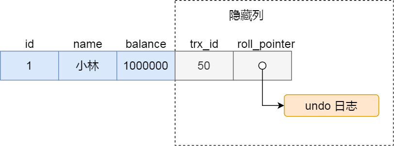
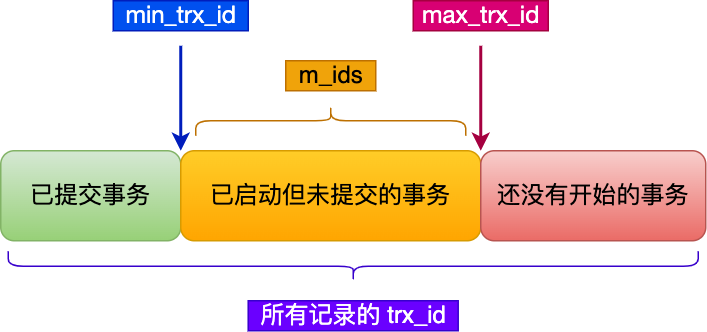

保证业务里的所有数据库操作是不可分割的，要么全部执行成功，要么全部失败，不允许出现中间状态的数据

对于已经提交的事务，该事务对数据库所做的修改将永久生效，如果中途发生中断，那么
该事务期间对数据库所做的所有修改都会被回滚到没有执行该事务之前的状态

事务由引擎来实现

并不是所有的引擎都能支持事务 ---  MyISAM不支持

InnoDB支持事务 

# 事务的4 个特性

1、 原子性：一个事务中的所有操作，要么全部完成， 要么全部不完成，不会结束在中间某个状态。 在事务执行过程中发生错误，会被回滚到事务开始之前的状态

2、 一致性：事务操作前和操作后，数据满足完整性约束，数据库保持一致性状态

3、 隔离性：数据库允许多个并发事务同时对其数据进行读写和修改，隔离性可以防止多个事务并发执行时由于交叉执行而导致数据的不一致

​	每个事务都有一个完整的数据空间，对其他并发事务是隔离的

4、 持久性：事务处理结束后，对数据的修改是永久的，即使系统出现故障也不会丢失

# InnoDB 实现事务特性的方法

原子性： undo log （回滚日志）

持久性： redo log （重做日志）

隔离性： MVCC (多版本并发控制)

一致性： 通过原子性，持久性 和 隔离性 三个一起保证的

# 并发事务带来的问题

脏读， 不可重复读，幻读

脏读 > 不可重复读 > 幻读

## 脏读

一个事务读到另一个**未提交事务修改**过的数据

由于还没有提交事务，事务随时可能会发生回滚操作

如果发生回滚，那么读到的数据就是过期的数据

## 不可重复读

**在一个事务内**多次读取到同一个数据，出现前后两次读到的**数据**不一致的情况

## 幻读

**在一个事务内**多次查询某个符合查询条件的**记录数量**， 出现两次查询到的记录数量不一样的情况

同一个查询在不同的时间产生了不同的结果集

# 隔离级别

串行化 > 可重复读 > 读已提交 > 读未提交

## 读未提交

一个事务未提交时，它做的变更就能被其他事务看到

可能会发生**脏读，不可重复读 和 幻读**

## 读提交

一个事务提交之后，它做的变更才能被其他事务看到

可能会发生**不可重复读和幻读**

## 可重复读

一个事务执行过程中看到的数据，一直跟这个事务启动时看到的数据一致（InnoDB 默认的隔离级别）

可能会发生**幻读**

只有当本次的事务提交后，才会去更新其他事务进行的操作

## 串行化

对记录**加读写锁**，在多个事务对这条记录进行读写事件时，如果发生了读写冲突，后访问的事务必须等前一个事务执行完成后才能继续执行

要解决幻读**不建议**将隔离级别升到 串行化

MySQL 在 不可重复读 级别可以有效避免幻读的解决方案：

- 快照读（普通的Select 语句），通过MVCC 方式解决了幻读

- 当前读（Select ... for update 等语句），通过next-key lock(记录锁 +　间隙锁)　方式解决幻读

​	执行语句时会加上锁，如果有其他事务在锁的范围内插入一条记录，就会阻塞这条语句，无法成功插入

### 快照读

开启事务且执行第一条Select语句后，创建一个Read View，之后的所有Select 语句都是基于此Read View进行查询的

根据undo log 版本链找到事务开始时的数据

### 当前读

除了Select语句，其他的语句都是当前读

update, delete, insert 语句执行前都会查询最新版本的数据，近再做进一步操作

select .. for update 是当前读，会读取最新的数据

间隙锁：会在修改的记录范围上，加上一个锁

后面想要再执行插入语句时，遇到间隙锁就会进入等待状态，等到之前的事务提交后，再去执行

### 可重复读出现幻读场景

对于当前读：

事务开启后，并没有执行当前读，而是先快照读

如果在快照读之后，当前读之前其他事务执行了插入语句，再执行当前读就会出现幻读

对于快照读：

事务A会更新事务B插入的记录，从而使这个记录的trx_id 变为事务A的事务id，这个时候就可以在下一次的Select语句中查询到这条新记录了

尽量在开启事务后，马上执行select ... for update 这类当前读的语句。**执行后就会对记录加上next-key lock**，从而避免其他事务插入一条新记录

## 不同隔离级别的实现方式

读未提交: 直接读取最新的数据

串行化：加读写锁

读提交　和　可重复读：通过Read View实现 --- 对数据做一个快照，固定住某一时刻的数据信息

读提交：在 每个语句执行前 重新生成一个Read View

可重复读：启动事务 时生成，在整个事务期间都是这个Read View

开始事务 不等于 启动事务

MySQL 有两种开启事务的命令：

- begin/start transaction

执行命令后，只有执行第一条Select语句后才会启动事务

- start transaction with consistent snapshot

马上启动事务 

# Read View 在MVCC里是如何工作的

Read View 中有四个字段：

- m_ids : 在创建Read View时，当前数据库中活跃事务（启动但**没有进行提交过**的事务） 的事务id 列表
- min_trx_id: 创建Read View 时，当前数据库中 活跃事务 中id 最小的事务[min(m_ids)]
- max_trx_id:创建 Read View时当前数据库中应该**给下一个事务的id值**，全局事务中最大事务的id值 + 1
- creator_trx_id: 创建该Read View事务的事务id

聚簇索引记录中的两个隐藏列：

trx_id: 当一个事务对某条**聚簇索引**记录进行改动时，就会把该事务的事务id记录下来

roll_pointer: 每次对某条**聚簇索引**记录进行改动时，都会把旧版本的记录写入到undo日志中

​	这个隐藏列是一个指针，指向**每个旧版本记录** -- 根据该列可以找到修改前的记录

trx_id 有三种情况：

已提交事务

已启动但未提交的事务

还没有开始的事务

MVCC（多版本控制）：通过 [版本链] 来控制并发事务访问同一个记录时的行为

版本链 ： 当一个事务去访问记录的时候，除自己的更新记录总是可见外，

- 若记录的trx_id 值小于Read View 中的min_trx_id，表示这个版本的记录是在创建Read View前已经提交的事务生成的，所以该版本的记录对当前事务可见
- 若trx_id 值大于等于Read View 中的max_trx_id，表示这个版本的记录是在创建Read View 之后才启动的事务生成的，所以不可见
- 若大于等于min 小于等于max
    - 若trx_id 在m_id 列表中，则该事务还没有提交，当前事务不应可见
    - 若trx_id 不在m_id 列表中，则该事务已经提交了，应该对当前事务可见

## 可重复读的工作方式

在启动事务时生成一个Read View，然后整个事务期间都是使用该Read View(里面的4 个字段)

当更新一条记录时，会把记录连成一个版本链，每一个版本的记录有不同的trx_id值，表示是由哪个事务修改的

当读到一条记录时，会去看该记录的trx_id 是否在m_ids 中，

如果不在，就会直接读入该记录的数据

如果在，就会顺着roll_pointer 找到历史的版本信息，直到找到trx_id不在m_ids的版本，才读入该记录的信息

## 读提交的工作方式

B每次读取数据时，会生成一个新的Read View

在这个新的Read View 中，会把当前活跃事务列表进行更新

如果在此次读之前，有事务A进行了提交，A就会退出活跃事务列表，更新后，A 修改后的数据就是可见的状态了 -- 因此会出现两次读取数据不一致的情况

而如果A未进行提交操作，那么A 还是会在活跃列表中，B是无法读位于活跃列表中的记录的，因此会去寻找历史版本

而在可重复读的情况下，不管事务A是不是进行了提交，Read View中的活跃事务列表都不会发生改变，因此，看不到A修改后的记录

修改记录时，会更新trx_id 值

修改事务而未提交 --- 处于活跃列表中，不可见

修改事务且已提交 --- 在新的Selecct 语句查询时，生成新的Read View， 而在新的Read View里，trx_id不在活跃列表中，可见

隔离级别越高，性能越差

