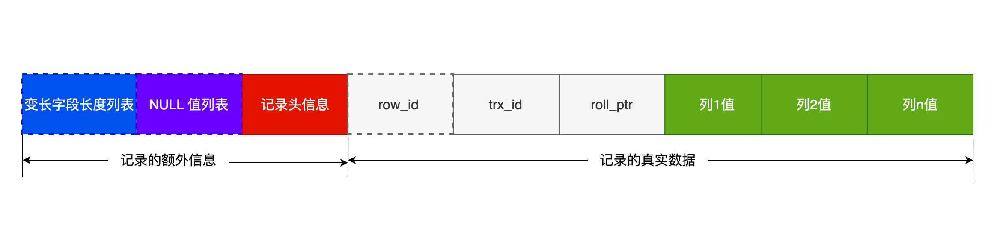
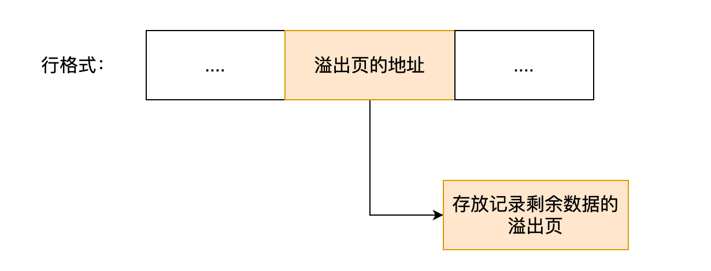

MqSQL 存储数据是由存储引擎实现的，不同的存储引擎会保存到不同的文件中

InnoDB 引擎：

每创建一个数据库（database)，就会在/var/lib/mysql/ 目录里创建一个以database 为名的目录，在这个目录下有保存表结构和表数据文件

在每一个database 为名的目录下，有db.opt, t_order.frm, t_order.ibd 三个文件

db.opt： 用于存储当前数据库的默认字符集和字符检验规则

t_order.frm：保存表结构。每创建一个表，就会生成一个.frm 文件

​			在.frm 文件中保存着每个表的元数据信息

t_order.ibd：保存表数据。

​	表数据既可以保存在共享表空间文件里（ibdata1文件）

​	也可以保存在独占表空间文件里（表名.ibd文件）

​		当参数innodb_file_per_table = 1，就会保存在一个单独的文件中

​		MqSQL 5.6.6 后，默认值为 1 ===== **每张表都会保存在一个独立的.ibd 文件中**

​			文件名为   表名.ibd  ====> 独占表空间文件

# 表空间文件的结构

由段，区， 页，行 组成

​	

## 行

数据库中，记录是用 行 保存

每行记录根据不同的行格式，有不同的存储结构

行记录 是以 数据页 来进行管理

## 页

数据库的**读取以 页 为单位** 

每一次读取就会进行一次的I/O

默认每页的大小是 16KB

页是InnoDB 引擎进行磁盘管理的最小单位 

一次最少从磁盘中读入16KB 内容到内存中

一次最少把16KB 的内容保存到磁盘中

## 区

B+ 树中每一层都是通过双向链表连接起来的

如果以页为单位分配存储空间，会导致链表中相邻的两个页之间的物理位置并不是连续的，从磁盘中读数据就会出现随机I/O  从而降低读取速度

当表中数据量很大的时候，为索引分配空间时会按照区单单位进行分配

每个区的大小是1MB， 会将连续的64个页放入一个区中 ---- 从而实现顺序I/O

## 段

表空间由各个段组成

段由多个区组成

段一般分为数据段、索引段和回滚段

数据段：

​	存放B+树的非叶子节点的区的集合

索引段：

​	存放B+树的叶子节点的区的集合

回滚段：

​	存放的是回滚数据的区的集合

# InnoDB行格式

行： 一条记录是一行

行格式：一条记录的存储结构

Redundant, Compact, Dynamic, Compressed 

Redundant： 基本不再使用

Compact：紧凑的行格式，可以在一个数据页中存放更多的行记录（5.1 版本默认格式）

Dynamic：（5.7版本后的默认格式）

## Compact 格式

记录的真实数据 + 记录的额外信息

### 记录的额外信息

1、变长字段长度列表

varchar 在存储数据的时候，会同时把数据占用的大小存起来

读取数据的时候会根据 “变长字段长度列表” 来读取对应长度的数据

多个变长字段的占用的字节数会按照列的顺序逆序存放

值为NULL的变长字段的长度是不会保存在这个列表中

逆序存放：

记录头信息中指向下一个记录的指针，指向的是下一条记录的 “记录头信息” 和 “真实数据”之间的位置　 ----  **向左读是记录头信息，向右读是真实数据**

原因：使得位置靠前的记录的真实数据和数据对应的字段长度信息可以同时位于一个CPU Cache Line中，**提高Cache的命中率**

变长字段长度占用字节：

- 若变长字段允许存储的最大字节数小于等于255字节，用1字节表示
- 若变长字段允许存储的最大字节数大于255字节，用2字节表示

2、 NULL 值列表

Compact 行格式会将值为NULL 的列保存在NULL 值列表中 --- 如果将NULL 值都保存到记录的真实数据中会很浪费空间

如果存在允许NULL 值的列，则每个列对应一个二进制位 -- 二进制位按照列的顺序逆序保存（提高Cache命中率）

二进制位为1： 该列的值为NULL

二进制位为0：该列的值不为NULL

NULL值列表必须用整数个字节的位表示， 若使用的二进制位个数不足整数个字节，则在字节的高位补0

当创建表时，所有的字段都定义为NOT NULL时，表中的行格式中就不会有NULL值列表了

3、记录头信息

- delete_mask： 标识该条数据是否被删除了

​			执行delete 删除记录的时候，并不会真正的删除记录，只是在这个记录的delete_mask 位上标识为1

- next_record：下一条记录的位置

​			记录之间是使用链表连接的

- record_type：表示当前记录的类型　

​			0：普通记录

​			1：B+树非叶子节点记录

​			2：最小记录

​			3：最大记录

## 记录的真实数据

除了创建表时定义的字段，还有三个隐藏字段：row_id，trx_id，roll_pointer

row_id: 指定了主键或唯一约束列后，就不会有该字段

​		否则会使用6 个字节添加该字段

​		row_id 不是必需的

trx_id: 事务id， 表示该数据是由哪个事务生成的

​		trx_id 是必需的

​		占用6 个字节

​		trx_id 是必需的

roll_pointer: 记录上一个版本的指针

​		占用7 个字节

​		必需的

# varchar(n) 中n的最大取值

MySQL 除了TEXT，BLOBs 这种大对象类型之外（以及隐藏列和记录头信息），一行占用的字节长度最大不超过65535字节（不管有多少列，最大就是65535字节）

n 表示的是最多存储的**字符数量**，而非字节大小

不同的字符集中1 个字符占用的字节数是不一样的，因此n 的大小和字符集有关

## 单字段情况

一行的大小包含“变长字段长度列表”和“NULL 值列表”所占用的字节数（storage overhead)

因此，计算n 的最大值时，需要减去这两个部分的字节数

真实数据 + 真实数据占用的字节数（变长字段长度） + NULL 标识

若为ASCII字符集：变长字段长度 = 1 个变长字段长度占用的字节数（2字节）

Max（n） = 65535 - 2 - 1 = 65532 个字符

若为UTF-8 字符集：1 个字符最多用3 字节，Max（n） = 65532 / 3 = 21844字符

## 多字段情况

所有字段的长度 + 变长字节列表占用的字节 + NULL 值列表所占用的字节数 <= 65535

# 行溢出后，MySQL 是怎么处理的

1 页一般是16KB = 16384字节

varchar(n) 最多存储65535字节

对于大对象TEXT, BLOB 一页可能会存不下一条记录，就会发生 行溢出，多的数据会存到另外的溢出页中

一般情况下，InnoDB的数据是保存在“数据页” 中，而发生行溢出后，溢出的数据会保存到  “溢出页” 中

发生行溢出时，在记录的真实数据处只会保存该列的一部分数据（768字节），而把剩余的数据保存到 “溢出页”中 ，然后真实数据处用**20字节**存储溢出页的地址

Compact格式：

​		

Compressed 和 Dynamic 两种格式与Compact区别在于处理行溢出数据时有区别。

这两种格式采用完全的行溢出方式，记录的真实数据处不会存储该列的一部分数据，只存储20字节的指针来指向溢出页，而实际的数据都保存在溢出页中。

MySQL 想让一个数据页中能存放更多的数据行，至少也要存放两行数据，否则B+Tree 就会退化成一个低效的链表

当往数据页中写入数据时，即使大到超过了数据页的极限，但通过行溢出机制，仍能保证下一条数据可以写到这个数据页中，保证一个数据页中至少有两条数据

溢出页可以由多个页组成，**多个页之间采用链表**来连接起来

