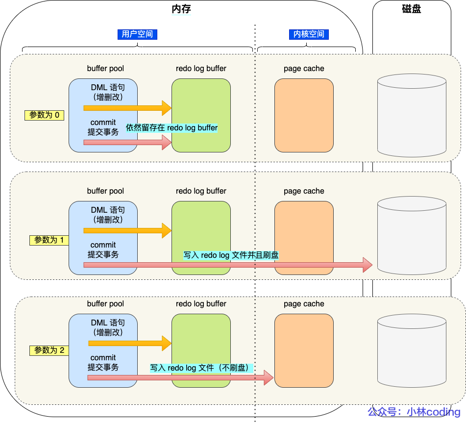

update语句的执行（会包含查询语句的过程）：

`UPDATE t_user SET name = "xmai" WHERE id = 1`

1、 客户端先通过**连接器建立连接**，连接器会**判断用户身份**

2、 update 语句不需要经过查询缓存，但是表上有更新语句，是会把整个表的查询缓存清空

3、 **解析器**会通过**词法分析**识别出关键字update，表名等，构建出语法树，接着继续做**语法分析**，判断输入的语句是否符合MySQL 语法

4、 **预处理器**会判断**表和字段**是否存在

5、 **优化器**确定**执行计划** （由于where 条件中的id 是主键索引，因此决定使用id这个索引）

6、 **执行器**负责具体执行，**找到这一行，然后更新**

更新语句会涉及undo log(回滚日志)，redo log(重做日志)，binlog(归档日志)

undo log : InnoDB存储引擎层生成的日志，实现事务中的原子性，主要用于事务回滚 和 MVCC

redo log : InnoDB存储引擎层生成的日志，实现事务中的持久性，主要用于掉电等故障恢复

binlog ： Server层生成的日志，主要用于数据备份和主从复制

# undo log 

在执行增删改语句的时候，即使没有输入 begin 开启事务 和 commit 提交事务，但MySQL 会隐式开启事务来执行

执行完后自动提交事务

执行一条语句自动提交事务，可以由参数`autocommit`决定（默认是开启的）

每次事务执行过程中，都记录下回滚时需要的信息到日志中，在没有提交事务之前，如果MySQL 发生了崩溃，就可以根据这个日志回滚到事务之前的事务

undo log 是一种用于撤销回退的日志

在事务没提交之前，MySQL 会先将记录更新前的数据保存到undo log里，当事务回滚时，可以利用undo log 进行回滚

当InnoDB引擎对一条记录进行更改时，要把回滚时需要的信息都记录到undo log 中

插入记录时，把新记录的主键值记下，回滚时将主键值对应的记录删掉

删除记录时，把记录的内容都记下来，回滚时，将这些记录的内容重新插入到表中

更新记录时，把被更新的列的旧值记下来，回滚时再将这些列改回旧值即可

 一条记录的每一次更新操作产生的undo log 格式中都有一个roll_pointer 指针和一个trx_id 事务id

- 通过trx_id 可以知道该记录由哪个事务修改的
- 通过roll_pointer 指针可以将这些undo log串成一个链表 ---- 版本链

Read View + undo log == MVCC 多版本并发控制

# Buffer Pool

缓冲池

更新一条记录时，先从磁盘中读入记录，在内存中进行修改，然后将记录保存到缓冲池中（若下次查询语句命中该记录，可以减少读盘）

如果修改的数据在Buffer Pool 中，可以直接修改Buffer Pool 中数据所在的页，然后将该页设为脏页，等到后台线程选择一个合适的时机再将脏页写到磁盘中

InnoDB会将数据划分为若干个 "页"

以页作为磁盘和内存交互的基本单位

一个页的默认大小是16KB

Buffer Pool中也是按照 页 进行划分的

MySQL 启动的时候，InnoDB会为Buffer Pool申请一片连续的内存空间，然后按照默认的16KB 大小划分出一个一个的页，Buffer Pool中的页就是缓存页

刚开始缓存页都是空闲的，之后随着程序的运行，才会有磁盘上的页被缓存到Buffer Pool中

在MySQL 刚启动的时候，使用的虚拟内存空间很大，而使用的物理内存空间却很小 --- 只有这些虚拟内存被访问后，操作系统才会触发缺页中断，申请物理内存，接着将虚拟地址和物理地址建立映射关系

Buffer Pool中除了缓存索引页和数据页，还会缓存Undo 页，插入缓存，自适应哈希索引，锁信息等

Undo页：

开启事务后，InnoDB层更新记录前，首先要记录相应的undo log，如果是更新事件，需要把被更新的列的旧值记下来，也就是要生成一条undo log, undo log 会写入Buffer Pool中的Undo页面 

查询一条记录，InnoDB 会将整个页的数据加载到Buffer Pool中，将页加载到Buffer Pool后，再通过页里的 “ 页目录 ” 去定位到某条具体的记录 

# redo log

实现事务的持久性 + 顺序写

buffer pool 是放在内存中的，断电后会丢失数据

因此，每当有记录需要更新时，InnoDB引擎就会先更新内存(同时标记为脏页)。然后将本次对这个页的修改以redo log 的形式记录下来，这个时候更新才算完成

WAL 技术：MySQL 的写操作并不是立刻写到磁盘上，而是先写日志，然后在合适的时候才会写到磁盘上

InnoDB引擎会在适当的时候，由后台线程将缓存在buffer pool 的脏页刷新到磁盘里

redo log 是物理日志，记录了物理空间上做了什么更新

每执行一个事务就会产生这一条或多条物理日志

事务提交时，只要将redo log 持久化到磁盘中，不需要等到buffer pool 中的脏页持久化到磁盘

当系统崩溃时，虽然脏页数据还未持久化，但是redo log 已经持久化了，MySQL 重启后，可以根据redo log 中的内容，将所有数据恢复到最新的状态

更新操作会将被更新列的旧值记下来，生成一条undo log, 写入到buffer pool 的undo 页面，当内存修改该undo 页面后，需要记录对应的redo log（undo log 和 redo log 都需要修改）

undo log 记录了事务开始前的数据状态，

redo log 记录了事务完成后的数据状态

当事务提交前发生崩溃，重启后会根据undo log 回滚事务

当事务提交后发生崩溃，重启后会根据redo log 恢复事务

redo log 使用追加操作，是顺序写，写入数据是随机写，顺序写的效率要比随机写的效率高

redo log 也有自己的缓存 redo log buffer，每当产生一条redo log，会生写入到redo log buffer，之后再持久化到磁盘

buffer默认是16MB 

`innodb_log_Buffer_size`可以调整buffer 大小

buffer 刷盘（落盘）的时间：

- MySQL 正常关闭
- redo log buffer 中记录的写入量大于redo log buffer 内存的一半时
- InnoDB的后台线程每隔一秒，持久化
- 每次事务提交都会落盘(由innodo_fluch_log_at_trx_commit)

innodo_fluch_log_at_trx_commit：

0 : 每次提交事务时，将redo log 留在redo log buffer 中

​	每隔1秒，都会通过write() 写到操作系统的Page Cache，然后调用fsync() 持久化到磁盘

​	MySQL 崩溃时会**丢失上1 秒**所有事务的数据

1 : 每次提交事务，都会将redo log buffer　中的redo log 持久化到磁盘（默认）

​	

2 : 每次提交事务时，将缓存在redo log buffer 里的redo log 写到redo log 文件（写到了操作系统的文件缓存）

​	每隔1秒，调用fsync 将操作系统中的Page Cache 持久化到磁盘

​	MySQL 崩溃不会丢失数据，只有在操作系统崩溃或系统断电才会丢失上1秒的数据

redo log 文件写满：

默认情况下，InnoDB 有一个重做日志文件组 --- 有2 个redo log 文件组成 (ib_logfile0, ib_logfile1)

组中的每个redo log file 的大小是固定且一致的

重做日志文件组以循环写的方式工作，从头开始写，写到末尾回到开头（从0 开始）

用write pos 表示redo log 当前记录写到的位置

用checkpoint 表示当前要擦除的位置

当write pos 追上checkpoint，就意味着redo log 文件满了，这时MySQL 就不能再执行更新事件（MySQL 会被阻塞）

# binlog

记录了所有数据库表结构变更和表数据修改的日志，不会记录查询操作

完成一条更新操作后，Server层会生成一条binlog，等之后事务提交的时候，会将该事务执行过程中产生的所有binlog 统一写入binlog 文件

| binlog                                                       | redo log                                                     |
| ------------------------------------------------------------ | ------------------------------------------------------------ |
| Server层实现的日志，所有存储引擎都可以使用                   | InnoDB引擎实现的日志                                         |
| 追加写，写满一个文件，就创建一个新的文件继续写，不会覆盖之前的日志 | 循环写，日志空间大小是固定的，全部写满就从头开始，保存未刷新的脏页日志 |
| 保存的是全量的日志，只要在binlog 上的数据，都可以恢复        | 边写边擦日志，只记录未被刷入磁盘的数据的物理日志，刷入到磁盘的数据会从redo log文件中删除 |

主从复制：

将binlog 中的数据从主库传输到从库上

记录MySQL 上的所有变化并以二进制的形式保存在磁盘上。

复制的过程一般是异步的，主库上执行事务操作的线程不会等待复制binlog 的线程同步完成

1、 写入binlog： 主库写binlog 日志，提交事务，并更新本地存储数据

2、 同步binlog: 把binlog 复制到所有从库上，每个从库把binlog 写到relay log中

3、 回放binlog：读relay log，并更新存储引擎中的数据

在主库上写，在从库上读

从库数量增加，从库连接上来的I/O线程也会比较多。主库也要创建同样多的log dump 线程来处理复制的请求，对主库资源消耗比较高

主从复制模型：

- 同步复制
    - 主库的提交事务的线程要等待所有从库的复制成功的响应后才给客户端返回结果
- 异步复制（默认）
    - 一旦主库宕机，数据就会发生丢失
- 半同步复制
    - 只要一部分复制成功，主库的事务线程就可以返回给客户端

# 刷盘

事务执行过程中，先把日志写到binlog cache(Server 层)

事务提交的时候，将binlog cache 写到binlog 文件中（一个事务的binlog 不能拆开），并清空binlog cache 

每个线程会有独立的binlog cache，但最后是写到一个binlog 文件中

write 到文件系统的page cache 中

fsync 到磁盘上

sync_binlog:

0： 每次提交事务只write，由操作系统决定何时将数据持久化到磁盘(默认)

1： 每次提交事务会立刻执行fsync

N： 每次提交事务都write， 累积N个事务后fsync

 

# 两阶段提交

由于redo log 和 binlog 刷盘时机都是在事务提交后进行

​		--- 可能会出现半成功状态，导致会出现主从库数据不一致

两阶段提交可以保证多个逻辑操作要么都成功，要么都失败

提交 == 准备阶段 + 提交阶段 

每个阶段都由协调者和参与者共同完成

维护binlog 和 redo log 一致，MySQL 使用了内部XA 事务 

内部XA事务由BINLOG 作为协调者，存储引擎是参与者

事务的提交过程有两个阶段，就是**将 redo log 的写入拆成了两个步骤：prepare 和 commit，中间再穿插写入binlog**

1. 将XID 写入到redo log (追加写？)
2. 将redo log对应的事务状态设置为prepare
3. 将redo log 持久化到磁盘
4. 将XID 写到binlog (追加写？)
5. 将binlog 持久化到磁盘
6. 调用引擎的提交事务接口，将redo log 状态设置为commit（commit 状态不需要持久化到磁盘，只用write 到文件系统的page cache 中。只要binlog 写磁盘成功，就算redo log 状态为prepare 也会认为事务执行成功）

只要在binlog 中找到了与redo log 相同的XID，就会认为这个事务已经可以提交了

以binlog 写成功为事务提交成功的标识

从库会从binlog 中读入记录使用，因此，为了保证主从库一致，就得以binlog 为标识

事务没提交时，redo log 中的记录会每隔1 秒写到磁盘上，如果MySQL 崩溃，虽然redo log 会有记录，但由于事务未提交，binlog 中没有匹配的记录，因此会发生回滚（binlog 只有在事务提交后才会持久化到磁盘上）

## 两阶段提交的问题

### 磁盘I/O 次数高

如果配置都是1， 那么每个事务提交都会进行两次fsync（刷盘）

redo log 一次，binlog 一次

redo log 和binlog 在内存中有自己独立的缓存空间

因此，刷盘时，会进行两次刷盘

### 锁竞争激烈

两阶段提交在多事务的情况下，不能保证两次提交的顺序一致，因此，需要加一个锁来保证提交的原子性，来保证两个日志的提交顺序一致

一个事务只有获取到锁才能进入prepare 阶段，一直到commit 阶段结束才释放锁，下个事务才可以继续进行prepare

## 组提交

当有多个事务提交的时候。会将**多个binlog 刷盘**操作合并为一个

prepare 阶段不变，将commit 阶段拆为3 从过程

1. flush阶段:多个事务按进入的顺序将binlog 从cache 写入文件(不刷盘) 写到文件系统中
2. sync阶段: 对binlog 文件做fsync (多个事务的binlog 进行一次刷盘)
3. commit 阶段:各个事务按顺序做InnoDB commit 操作

每个阶段有一个队列,每个阶段有锁进行保护,不再锁住提交事务的整个过程

5.7 有redo log 组提交

不再让事务各自执行redo log 的刷盘操作,推迟到组提交的flush 阶段

flush 阶段的队列是用来支持redo log 的组提交

sync 阶段的队列是用来支持binlog 的组提交

​	当文件写入到binlog 文件后,会由两个方面共同决定是否进行刷盘

​			1、是否到达了等待时间

​			2、是否到达了最大事务数

​		满足其一就会进行刷盘

# 优先磁盘的I/O

可以延迟binlog 和 redo log 的刷盘时机

