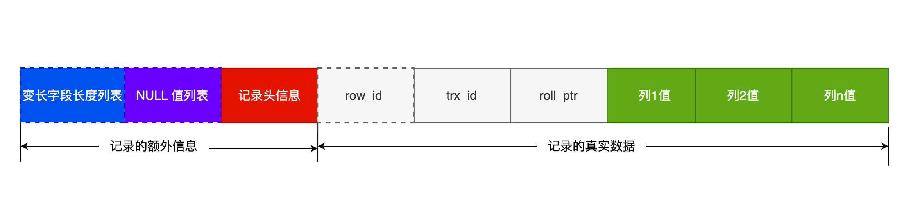

先从索引的基本原理----> 索引的使用场景


索引 是数据的目录，帮助存储引擎快速获取数据的一种数据结构


存储引擎 -- > 如何存储数据、如何为存储的数据建立索引 和 如何更新、查询数据的实现方法


MyISAM  InnoDB  Memory 三种存储引擎


# 分类

数据结构： B+tree 索引， Hash索引， Full-text 索引

物理存储： 聚簇索引（主键索引）， 二级索引（辅助索引）

字段特性： 主键索引， 唯一索引， 普通索引， 前缀索引

字段个数： 单列索引，联合索引


## 数据结构

InnoDB 引擎根据不同的场景选择不同的列作为索引：

​	B+tree 索引， Hash索引， Full-text 索引


| 索引类型  | InnoDB   | MyISAM | Memory |
| --------- | -------- | ------ | ------ |
| B+Tree    | Y        | Y      | Y      |
| HASH      | N        | N      | Y      |
| Full-Text | Y(5.6后) | Y      | N      |
|           |          |        |        |


1、如果有主键，默认会使用**主键**作为聚簇索引的索引键

2、如果没有主键，会选择**第一个不包含NULL 值的唯一列***（UNIQUE)作为聚簇索引的索引键

3、两个都没有，引擎会自动生成一个**隐式自增的id列**作为聚簇索引的索引键


其余的索引都是辅助索引

创建的主键索引和二级索引默认使用B+tree索引 


### B+Tree

B+Tree 在叶子节点才存放数据，而**非叶子节点只存放索引**

​	每个节点内的数据按**主键**顺序存放

每一层父节点的索引值都会出现在下层的子节点中

​	**叶子节点中包含了所有的索引值信息**

每个叶子节点有两个指针，分别指向了上一个叶子节点 和 下一个叶子节点 ----  所有的叶子构成了一个双向链表


数据库中的索引和数据都是存储在硬盘中，每一次的读取节点都是一次磁盘I/O

​	经过的节点的数量就是I/O 的次数


每次查询时，会由B+Tree自顶向下地进行查找


B+Tree的优势在于查询效率很高

​	在数据量很大的时候，I/O次数也可以控制在3 ~ 4 次


#### 主键索引和二级索引的B+Tree

主键索引 构成的树中，叶子节点内保存的是实际数据，所有完整的用户数据都存放在叶子节点中

二级索引 构成的树中，叶子节点中只保存主键值，而不保存实际的数据


在查询的时候，先从二级索引树中，找到对应的叶子节点，获取主键值之后再通过主键索引中的B+Tree 树查询到对应的叶子节点，获取整行的数据

​		<font color="red">整个过程是回表</font>

查找两个B+Tree才能查到数据


覆盖索引： 在二级索引的B+Tree中就能查询到结果的过程

​	只需要查一个B+Tree


 B 树的每个节点都包含数据（索引+记录），而用户的记录数据的大小很有可能远远超过了索引数据，这就需要花费更多的磁盘 I/O 操作次数来读到「有用的索引数据」。

查询位于底层的某个节点（比如 A 记录）过程中，「非 A 记录节点」里的记录数据会从磁盘加载到内存，但是这些记录数据是没用的，我们只是想读取这些节点的索引数据来做比较查询，而「非 A 记录节点」里的记录数据对我们是没用的，这样不仅增多磁盘 I/O 操作次数，也占用内存资源。

​	而且这些数据可能会很大，I/O次数可能因此变多

**相比存储即存索引又存记录的 B 树，B+树的非叶子节点可以存放更多的索引，因此 B+ 树可以比 B 树更「矮胖」，查询底层节点的磁盘 I/O次数会更少**。


B+Tree 叶子节点采用的是双链表连接，适合 MySQL 中常见的基于范围的顺序查找，而 B 树无法做到这一点。


Hash适合于等值查询，O(1），但不适合用在范围查询


## 物理存储

聚簇索引， 二级索引


聚簇索引会在叶子节点中存放实际的数据，所有完整的用户记录都会存放在叶子节点中

而二级索引中，叶子节点只会保存住主键值，根据主键值再去聚簇索引树中查找完整的记录（回表）

​	如果在二级索引树中就可以查到数据，就不需要回表（覆盖索引）


## 字段特性

主键索引， 唯一索引，普通索引，前缀索引


### 主键索引

一张表最多只能有一个主键索引

索引列不允许有空值


创建表时，创建唯一索引的命令

```mysql
CREATE TABLE table_name (
	UNIQUE KEY(col1, col2,...)
);
```


表创建完成后，创建唯一索引方法：

```mysql
CREATE UNIQUE INDEX idx_name
ON table_(column1, column2,...);
```


### 普通索引

在普通字段上建立索引

既不要求字段为主键，也不要求字段为UNIQUE


创建表时，创建普通索引的方法：

```mysql 
CREATE TABLE table_name (
	INDEX(col1, col2,...)
);
```


表创建完成后，创建普通索引的方法：

```mysql
CREATE INDEX idx_name
ON table_(col1, col2,...);
```


### 前缀索引

对字符类型字段的前几个字符建立索引，而不是在整个字段上建立索引

前缀索引可以建立的字段类型有：char, varchar, binary, varbinary类型上


作用： 减少索引占用的存储空间，提升查询效率


创建表时：

```mysql
CREATE TABLE table_name(
    INDEX(column_name(length))
);
```


创建表后：

```mysql
CREATE INDEX index_name
ON table_name(column_name(length));
```


## 字段个数

单列索引， 联合索引


### 联合索引

将多个字段组合成一个索引


创建表：

```mysql
CREATE INDEX idx_name ON table_nam(col1, col2);
```


联合索引存在**最左匹配原则**


`(a, b, c)` 联合索引，是先按 a 排序，在 a 相同的情况再按 b 排序，在 b 相同的情况再按 c 排序。所以，**b 和 c 是全局无序，局部相对有序的**，这样在没有遵循最左匹配原则的情况下，是无法利用到索引的。


范围查询：

部分字段用到联合索引的B+Tree，部分字段没有用到联合索引的B+tree

最左匹配会一直向右匹配直到遇到 **范围查询** 就会停止匹配

​	范围匹配 字段之后的字段是无法用到联合索引的

**在符合 a > 1 条件的二级索引记录的范围里，b 字段的值是无序的**。

​	不能利用b 字段的条件进一步减少需要扫描的记录数量

​	也就是无法利用联合索引进行索引查询


执行计划中的key_len 显示了该查询语句使用了几个字段进行查询


停止匹配 只会在 不包含边界值的情况下（> < )

而只要包含边界值的范围匹配，都是可以使用联合索引的(like, >=, <=, between)

​	between 在MqSQL中是包含两个边界值


key_len 是执行计划，是在Server层生成的，而行格式是由InnoDB 引擎来实现的

​	在可变字段的类型中，直接使用2字节表示这个字段是可变的


## 索引下推

第一条件满足的情况下，第二个直接在联合索引中判断，而不用回主键索引去判断

可以减少回表次数


在建立联合索引时，要把区分度大的字段排在前面，这样区分度大的字段越有可能 被更多的SQL 使用到


区分度 = 字段的不同值的个数   /   表的总行数


查询优化器会在某个值出现在表的数据从此中的百分比很高的时候（常用的30%),会忽略掉索引而进行全表扫描

性别 不适合 作为索引 


### 联合索引进行排序

```sql
select * from order where status = 1 order by create_time asc
```

在建立索引的时候，可以建立(status, create_time) 索引

根据status 筛选之后的数据就是按照create_time 排好序的

否则，如果只对status列建立索引，那么在执行SQL 时，还会进行文件排序


# 判断要不要创建索引

优点：可以提高查询速度

缺点：占用额外的物理空间

​	创建和维护索引需要耗费时间，数据量越大，时间越长

​	降低表的增删改的效率（每次进行修改操作的时候，都会重新维护索引的有序性）


适用情况：

- 字段有唯一性

- 经常用于WHERE 中作为条件

- 经常用于GROUP BY 和ORDER BY（建立索引之后就不用再去做一次排序了，建立在B+Tree中的记录是排好序的）


不适合的情况：

- WHERE，ORDER BY，GROUP BY 用不到

- 大量重复数据
- 表数据量很小
- 经常更新的字段


# 优化索引

前缀索引优化，覆盖索引优化，主键索引最好自增，索引最好设置为NOT NULL，防止索引失效


## 前缀索引优化

使用字段中字符串中的前几个字符来建立索引 


使用前缀索引可以有效减少索引字段大小，可以增加一个索引页中存储的索引值 -- 减少索引页的数量，就会减少读入索引页的次数 --- 提高查询速度


缺点：

- ORDER BY 无法使用前缀索引 
- 无法把前缀索引用于覆盖索引


## 覆盖索引优化

从二级索引的B+Tree 的叶子节点中可以找到结果，减少回表操作


不需要查询出包含整行记录的所有信息


查询商品的名称、价格

可以考虑建立联合索引 （商品ID，名称，价格）

​	这样就可以不用再去查找主键索引，减少回表


## 主键索引最好是自增的

每次插入新数据的时候，会按顺序添加到当前索引节点的位置，不需要移动已有的数据

当页面写满的时候，只需要再后面开辟新的页面


如果插入到数据的中间，就会发生页分裂

- 造成大量的内存碎片，空间利用率下降

- 复制数据到新的页面上会有性能消耗


## 索引最好设置为NOT NULL

索引列存在NULL 时，会导致优化器在做索引选择的时候更加复杂

​	在使用count 进行统计的时候，会省略值为NULL 的行


NULL 是一个没有意义的值，但是这个值会占用真实的物理空间

​	如果表中允许存在NULL值，那么就需要在行格式中增加1 字节的空间来保存这个NULL 值列表（InnoDB)




## 防止索引失效

索引会失效的情况：

- 使用**左或左右模糊匹配**   `like %xxx` 或 `like %xx%`
- 在查询条件中对索引列进行了**计算、函数、类型转换**操作
- 联合索引要正确使用需要遵循**最左匹配**原则
- 在WHERE 子句中，如果在OR 前的条件列是索引列，而在OR 后面的条件列不是索引列，四索引会失效 （前是索引后不是索引）


### 左模糊

索引B+树是按照 索引值 有序排列存储的（从左往右进行排列），只能根据前缀进行比较 

而如果是左模糊，就会丢失索引顺序


select * from user where name = x;

如果表中只有主键和普通索引字段，即使有左模糊也会走索引查询index（因为主键和普通索引都会在二级索引树中，只需要全扫描一遍二级索引树即可）, 而不是改用all 进行全盘扫描

而如果表中除了主键和索引字段，还有其他非索引字段，就会转用all 进行全盘扫描（否则会全盘扫描二级索引树之后，还要根据主键去查找主键索引树，成本很高）


### 对索引使用函数

索引保存的是索引字段的原始值，而不是经过函数计算后的值

MySQL 8.0之后增加了函数索引，可以针对函数计算后的值建立一个索引

因此可以使用索引进行查询


### 对索引进行表达式计算

没有使用索引

````mysql
select * from t_user where id + 1 = 10;
````

使用了索引

```mysql
select * from t_user where id = 10 - 1;
```


原因同使用函数


### 对索引隐式类型转换

1、索引字段是字符串类型，但是在条件查询中，输入的参数是整型 --- 失效

2、索引字段是整型，相输入参数是字符串 --- 不会失效


MySQL 在遇到字符串和数字进行比较的时候，会**自动把字符串转为数字**，然后再进行比较 

第1 种情况时，由于输入的参数是整型，而索引是字符串，此时会对索引进行类型转换，相当于对索引使用了函数 --- 因此会失效的


### 联合索引非最左匹配

索引截断：索引为(a, b, c) 而查询条件是 where a = 1 and c = 1;

​	a后没有写b 而只写了c


在MySQL 5.6后有索引下推功能后，可以在存储引擎层进行c 的判断，减少回表


如果表中所有的字段都是索引字段，索引查询也不会失效（走全盘扫描二级索引树）


### where 中的or

or 前是索引 而or 后不是索引列，索引会失效

or的含义是只要有一个满足即可，当只有一个条件列是索引列时是没有意义的，只要有条件列不是索引列，就会进行全盘扫描


两个条件列都是索引列时是生效的


### 执行计划中的extra

Using fiilesort: 查询语句包含group by 且 无法使用索引进行排序

​					这个时候就会使用到排序算法

Using temporary： 使用临时表保存中间结果

​				常见于排序order by 和分组查询group by

Using index： 所需数据只用在索引即可全部获得，不需要回表 --- 覆盖索引

 


