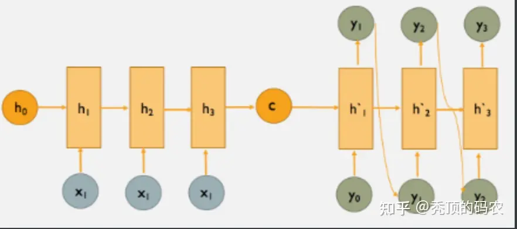
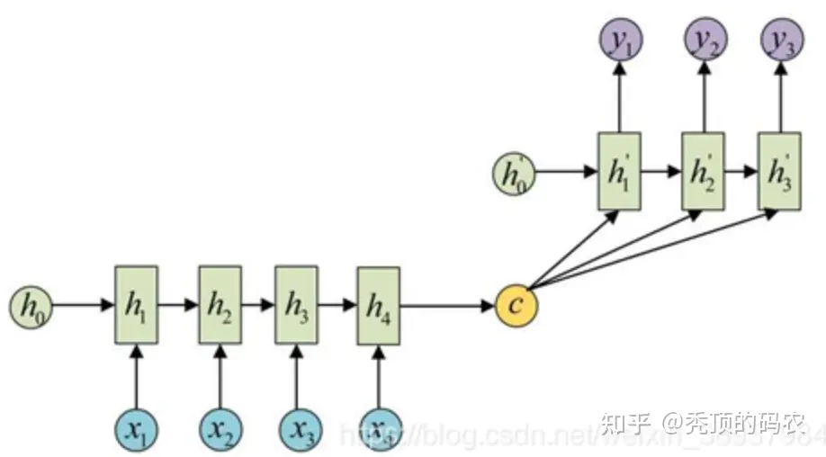
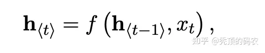
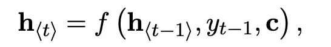

Seq2Seq <==> Encoder-Decoder

​	Seq2Seq 是抽象的理论 ====  满足输入序列生成输出序列的模式

​	Encoder-Decoder 是实现 ==== 使用RNN, LSTM, GRU 等进行实现的过程

模型突破了传统的**固定大小输入**问题的框架

Encoder 将可变长度的输入序列编码成一个固定长度的向量（编码： 可变 -> 固定）

Encoder  输出可以当作是输入序列的语义 --  语义向量（固定长度的向量）

- 最后一个输出的隐状态
- 对最后一个隐状态作一个变换
- 将输入序列的所有隐含状态作一个变换 

Decoder将固定长度的向量解码成一个**可变长度**的输出序列（解码： 固定 -> 可变）

根据Encoder部分输出的语义向量做解码

两种解码方式：

1. 第一层是以Encoder的输出作为输入，之后的解码输入是上一层解码的输出 

2. 将Encoder的输出作为每一层的输入 

编码-解码方式可以是CNN, RNN, LSTM, GRU 等 --- 可用的方式很多

# Encoder

按顺序读取输入序列的每个符号

在读取每个符号时，RNN 的隐藏状态会发生变化

当读取到序列的末尾后，RNN 的隐藏状态就是整个输入序列的汇总

# Decoder

训练的结果是：通过预测给定隐藏状态h 的下一个符号yt 生成输出序列

