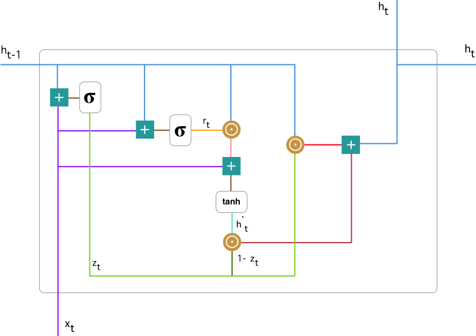

GRU 是为了解决RNN 中的梯度消失的问题

GRU  有两个门

重置门 --- 决定了如何将新的输入信息与前面的记忆相结合（计算当下的）

更新门 --- 定义了前面记忆保存到当前时间步的量（保存之前的）

1 ， 0 是 RNN

两个门控向量决定了哪些信息最终能作为门控循环单元的输出

能够保存长期序列中的信息，且不会随时间而清除或因为与预测不相关而移除

LSTM 有三个门（输入门、遗忘门和输出门）

GRU 并不会控制并保留内部记忆（c_t），且没有 LSTM 中的输出门

计算输出时并不应用二阶非线性。

LSTM 中的输入与遗忘门对应于 GRU 的更新门

重置门直接作用于前面的隐藏状态

