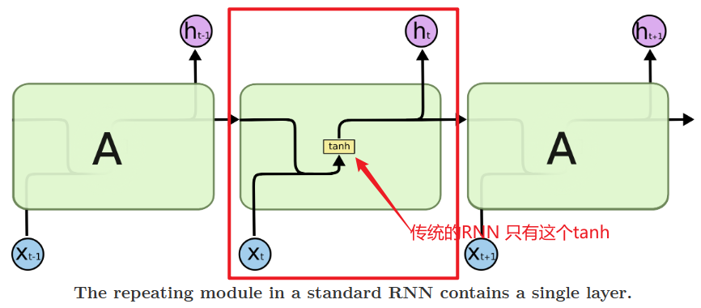
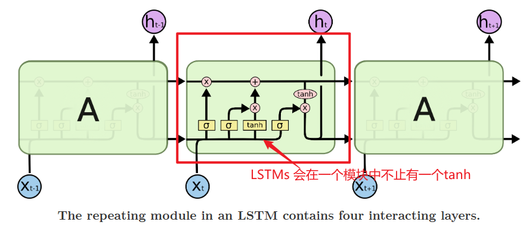
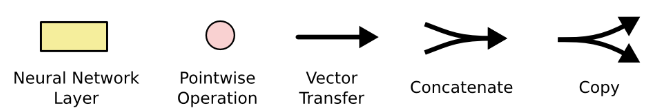
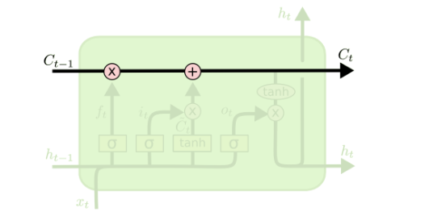

[Understanding LSTM Networks -- colah's blog](https://colah.github.io/posts/2015-08-Understanding-LSTMs/)

# RNN

人会根据以往的知识来理解现有的知识

而以往的神经网络并不能使用以前的知识

RNN 可以做到根据以前的知识继续向下学习 （有一个环）

这个环可以让知识可以向下传递

RNN 可以看作是相同的网络的多个复制

自己循环可以当作是这个有多个

每一个网络向后面传递信息

RNN 与序列和列表有很密切的关系

LSTM 是一种RNN 的一种特殊种类

当相关信息距离很远的时候，RNN 就无法将这些信息联系起来

而LSTMs 可以学习到远处的信息依赖

所有的RNN 都会有一串的重复模块 

但是LSTMs 会在重复的模块中有一些区别 

图标含义：神经网络层、函数计算、向量传递、连接、复制

cell state：the horizontal line running through the top of the diagram

几乎保持不变得向下传递

Gates 是让数据选择性通过

每一个gate 会使用sigmoid 函数表示让多少数据通过

0 代表不让任何数据通过

forget gate lyaer: 输出0 代表完全丢掉以前旧的数据

在cell state 里保留什么数据

input gate layer: 新的值

tanh layer: 新的值的比例数

根据新的cell state 来决定输出是什么值

考虑要使用哪些cell states --- A

将生成的新的cell state值放入一个tanh layer，产生一个-1到1 的值 --- B

用A 乘B 可以得到设计的部分

