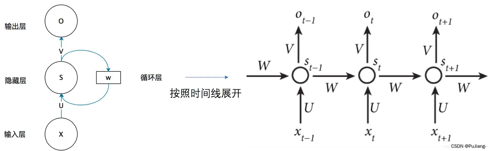
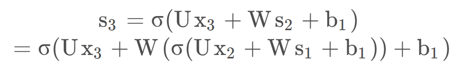

循环层 中共享参数W, U, V

不论在什么时刻，权重矩阵都是相同的

s3=σ(Ux3+Ws2+b1)

其中，Ws2 就代表了计算当前节点会考虑到过去节点的信息

o3=g(Vs3+b2)

L3=21(o3−y3)^2

在第3 个节点的损失函数L3 对W 和U求偏导的时候，会依次对o3, s3, s2, ... 进行连续求导，故梯度计算会受到过去节点的影响

在计算时代入s2, s1

时间序列越长，出现连乘的部分会越集中在后面

梯度消失：（梯度小于1 时出现）

每一项一项进行相加，可以发现距离拉的越长，连乘的项就越多，**远距离的梯度会趋于0的**，**近距离的梯度不会消失**。

梯度爆炸：（梯度大于1 时出现）

网络层之间的梯度（值大于 1.0）重复相乘导致的指数级增长会产生梯度爆炸