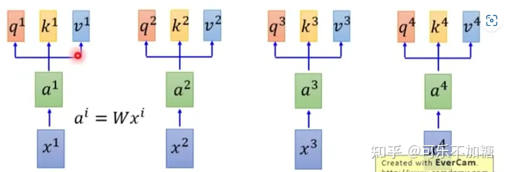
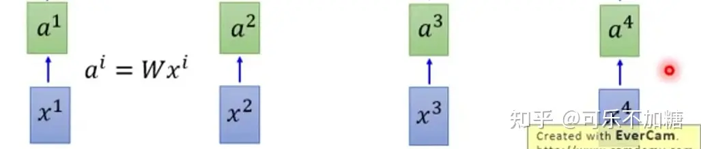
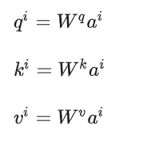
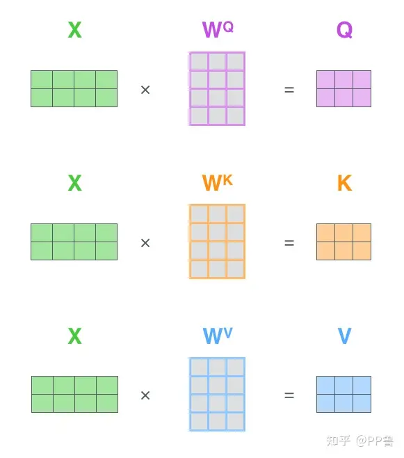
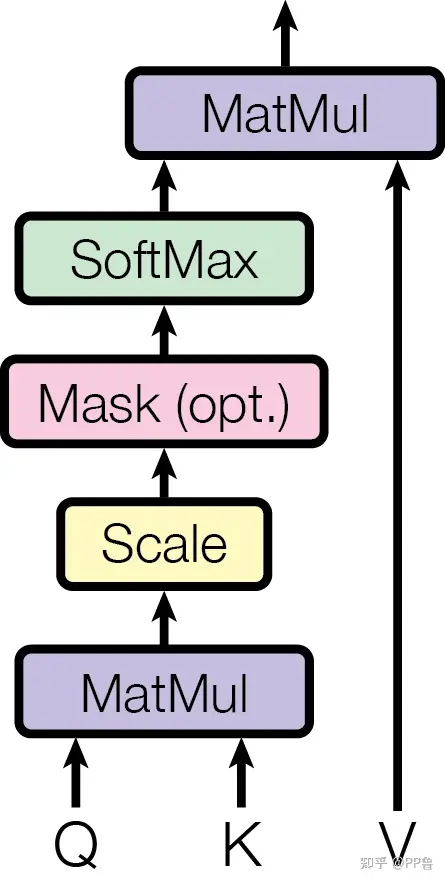
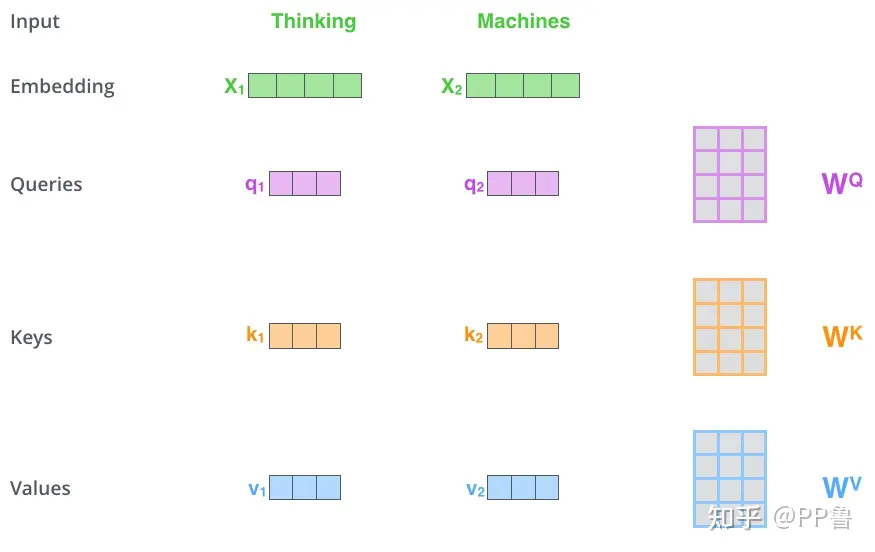
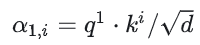

注意力机制是一种模仿人类视觉和认知系统的方法

允许神经网络在处理输入数据时集中注意力到相关的部分

神经网络能自动学习并选择性关注输入中的重要信息，提高模型的性能和泛化能力

与人类的选择性注意力机制类似

核心目标是从众多信息中选出对当前任务目标更加关键的信息

人在看到一个图片时，会**分配自己有限的注意力资源**（红色表示注意力更多的部分）

# 自注意力机制

在处理序列数据时，每个元素都可以与序列中的其他元素建立关联

不仅仅依赖相邻位置的元素

计算元素之间的相对重要性来自适应地捕捉元素之间的长程依赖关系

对于序列中的每个元素，自注意力机制计算其与其他元素之间的相似度，并将这些相似度归一化为注意力权重

之后，通过将每个元素与对应的注意力权重进行加权求和，可以得到自注意力机制的输出

以"你好机车" 为例

## embedding 

可以使用Word2Vec 方法进行Embedding，得到新的向量$a^i$

W 是参数矩阵

得到的向量$a^i$会作为注意力机制的输入数据

每个向量$a^i$ 都会乘三个矩阵 --- $W^q, W^k, W^v$（这三个矩阵在整个过程中是不变的）

之后每个向量都会得到三个向量$q^i, k^i, v^i$ 

## q, k, v

> [注意力机制到底在做什么，Q/K/V怎么来的？一文读懂Attention注意力机制 (zhihu.com)](https://www.zhihu.com/tardis/zm/art/414084879?source_id=1005)

[向量点乘](./向量点乘.md)

Q, K, V 三个矩阵是由输入矩阵X 通过线性变换得到的

输入词向量矩阵X中，每一行是一个单词 ----  每个单词向量可以通过Word2Vec 等方法求出

$Q = XW^Q$

$W^Q$ 是一个可训练的参数矩阵

类似：

$K = XW^K$

$V = XW^V$

Attention不直接使用X

使用三个可训练的参数矩阵，可增强模型的拟合能力

输入X 是2 * 4

权重矩阵W 是 4 * 3

Q, K, V 均是2 * 3 的矩阵 

$QK^T$ 得到相似度矩阵是2 * 3 X 3 * 2 == 2 * 2

softmax 处理相似度矩阵后是 2 * 2 ===> S

SV，加权求和 2 * 2 X 2 * 3 == 2 * 3

### q，k操作

计算序列中不同位置之间的相关性

q：用来计算当前单词与其他的单词之间的关联或关系

k：用来和q 进行匹配 ---- 单词中的关键信息

​		？？？有k 这个内容，就指向一个单词 （k 与单词进行一一对应）

例：计算$a^1$ 与$a^2, a^3, a^4$ 之间的关系，使用$q^1$ 与$k^2, k^3, k^4$ 进行匹配计算（匹配计算的方法是任意的）

例如：

d 表示q 和k 矩阵维度(self-attention 中，q和k 的维度是一样的)

​	 这里的q 和k 矩阵是什么，是上面的W^q 还是输出的q^i

​		应该是公式中的q^1 和k^i， 也就是输出的，不是W

点乘后，得到向量$a^1$ 和所有向量之间的关系 $\alpha_{1,1}, \alpha_{1,2},\alpha_{1,3},\alpha_{1,4}$

然后将关系结果使用softmax进行运算，得到$\widetilde{\alpha}_{1,i}$

这个$\widetilde{\alpha}_{1,i}$ 就代表了位置1 和位置i 之间相关性

### v操作

对序列进行加权求和

v 是当前单词的重要特征

将softmax 之后的结果与$v^1..$ 进行相乘，得到$b^1, b^2, b^3, b^4$

$b^1 = \sum_{i}\widetilde{\alpha}_{1,i}v^i$

