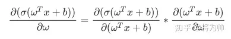
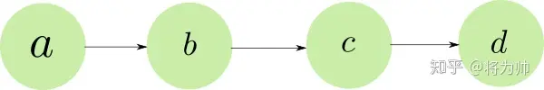
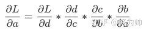
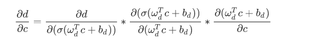
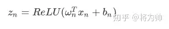
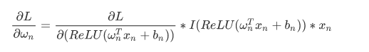
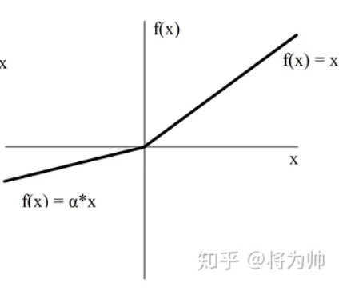
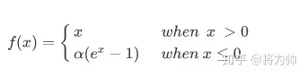
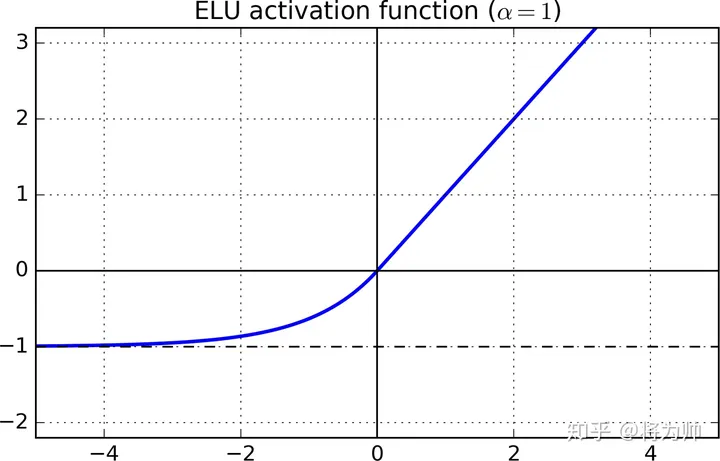

> [一文搞懂激活函数(Sigmoid/ReLU/LeakyReLU/PReLU/ELU) - 知乎 (zhihu.com)](https://zhuanlan.zhihu.com/p/172254089)

理想的激活函数的特点：

1. 输出的分布是零均值的 -- 可加快**训练速度**
2. 激活函数是单侧饱和的 -- 可更好**收敛**

# sigmoid

梯度消失：

sigmoid 函数的梯度取值范围大概是[0, 0.25]

上式中的乘号右侧的乘法因子是sigmoid 函数的梯度

当有多个神经元时，

损失函数L 对起始神经元a的求梯度的表达式：

每一个神经元都是一个复合函数，因此每一个乘法因子都是可以展开的

展开d/c：

中间的第二项就是梯度计算式

每经过一个神经元，都要乘上一次梯度，而梯度的取值是[0, 0.25]

当神经元的数量比较大时，多个梯度的乘积会得到一个很小的值

梯度下降法更新参数依赖于梯度值，梯度值很小时无法进行有效更新参数（或有很小的更新，浅层和深层的更新速率差距巨大） ---- 梯度消失

饱和神经元会使得梯度消失问题加重

- 饱和：导数趋向于0 

- 右饱和：当x 趋向于正无穷时，函数的导数趋向于0
- 左饱和：当x 趋向于负无穷时，函数的导数趋向于0

边缘检测：识别界限

解决方法：

ReLU，LSTMs(可解决RNN 模型的梯度消失问题)

# ReLU

ReLU：当x 小于0时，梯度为0； x 大于0时，梯度为1

梯度连乘只会取0 或1 

- 如果结果为1，梯度保持值不变进行向前传播

- 如果值为0，梯度从该位置停止向前传播

sigmoid 函数是双侧饱和

ReLU 函数是单侧饱和

单侧饱和的优点：

若神经元 -- 负责检测某种特定特征的开关

高层神经元负责检测高级的/抽象的特征（有更丰富的语义信息）

低层神经元负责检测低级的/具体的特征（边缘）

当开关开启时，说明在输入范围内检测到了对应的特征，且正值越大代表特征越明显

负值可以代表检测特征是缺失的，但缺失没有程度的区别，因此，负值的大小没有什么意义

==== 可以使用0 来代表没有检测到特征

负值的大小引入了背景噪声或其他特征的信息，给后续的神经元带来了无用的干扰信息

导致神经元之间的相关性

为网络引入了稀疏性

缺点：

激活函数的输入值有一项偏置项bias，如果bias 变得大小，就会使得输入激活函数的值恒为负，那么反向传播过程中，经过该处的梯度恒为0，对应的权重和偏置参数无法得到更新

如果所有的样本输入 ，该激活函数的输入都是负的，则神经元再也无法学习 --- 神经元死亡

ReLU的输出是非负的

中间的I 因子是就是ReLU的梯度（值为0或1）

对于该层的所有w 参数，梯度的符号都是一样的

梯度的符号决定了参数的更新方向

在一次更新中，由于所有的w 符号都是一样的，那么这次更新中，该层的w 参数要么一起增大，要么一起减小

（而理想的情况是：w 参数中一部分增大，一部分减小）

更新方向的锯齿路径：

由于符号相同，一次迭代时，要么一起增大，要么一起减小

然后在下一次迭代时，朝着与上次迭代相反的方向，w 再来一次同增或同减

> 假设训练过程中的某一时刻：一部分参数w1需要减小，以到达理想的参数范围内；而另一部分参数w2却需要增大。然而此次迭代计算得到的梯度符号一致，参数更新后都将减小(满足w1不满足w2)；下次迭代时，计算得到的梯度符号仍然一致但方向相反，参数更新后都将增大(满足w2不满足w1)。这将导致参数更新过程中，方向的锯齿问题
>
> 以下图理解更直观：从原地到达最优点，一部分参数需要减小(w1,以y轴表示)，另一部分参数需要增大(w2,以x轴表示)，但每次更新时，w1/w2 必须同时增大或减小，造成了更新方向的锯齿问题，减缓了训练过程。

# LeakyReLU

可以解决神经元死亡问题

在输入小于0的部分，值为负，有很小的梯度

在反向传播的过程中，对于输入小于0 的部分，也可以计算得到梯度（$\alpha 可以随机取，也可以给定特定的值$)

当随机取时，可以引入随机性，从而帮助参数取值跳出局部最优和鞍点

# PReLU

不再进行随机取$\alpha$, 将$\alpha$ 作为需要学习的参数 

# ELU

可同时满足激活函数的特点

输入大于0 的部分梯度为1，输入小于0 的部分无限趋近于-$\alpha$

超参$\alpha$的取值一般为1

# 选择激活函数

1. 首先测试ReLU 的效果

有最低的计算代价和最简单的代码实现

2. LeakyReLU 或ELU 

3. 可试着对比随机ReLU和PReLU

当有很多训练数据时，才尝试PReLU 

